# Deploying web applications using Elastic Beanstalk

AWS *Elastic Beanstalk* is a PaaS service that allows you to deploy your web applications developed in your favourite language/framework such as .NET, Java, PHP, NodeJS, Python etc on a web server without configuring the infrastructure services explicitly. Instead of creating the compute, storage, networking and identity solutions on your own, Elastic Beanstalk provides a preconfigured platform which can be used to deploy your applications from a developer machine or using a CI/CD tool.

Elastic Beanstalk offers the features such as:
    
1) Quicker deployment
2) Simplifies operations
3) Cost effectiveness
4) Support for multiple languages and frameworks
5) Autoscaling and monitoring 
    
### Components of Elastic Beanstalk
 - **Application** : An *application* is a logical collection of Elastic Beanstalk components, including environments, versions, and environment configurations. In Elastic Beanstalk an application is conceptually similar to a folder.
 - **Application version**: An *application version* refers to a specific, labeled iteration of deployable code for a web application. An application version points to an Amazon Simple Storage Service (Amazon S3) object that contains the deployable code, such as a Java WAR file. Applications can have many versions and each application version is unique. In a running environment, you can deploy any application version you already uploaded to the application, or you can upload and immediately deploy a new application version.
 - **Environment**: An *environment* is a collection of AWS resources running an application version. Each environment runs only one application version at a time, however, you can run the same application version or different application versions in many environments simultaneously. When you create an environment, Elastic Beanstalk provisions the resources needed to run the application version you specified.
 - **Environment tier**: When you launch an Elastic Beanstalk environment, you first choose an environment tier. The environment tier designates the type of application that the environment runs, and determines what resources Elastic Beanstalk provisions to support it. Tier can be *web server environment tier* for http web apps  or *worker environment tier* for background tasks.
 - **Environment Health** : Elastic beanstalk reports the health of the web server environment  depending on how the application running responds to the health checks. It uses four colors to describe the status. *Grey*- currently being updated, *Green* - Passed recent health check, *Yellow* - Failed one or more health checks, *Red* - Failed three or more checks.
 
### Elastic Beanstalk architecture
    
   

## Deploying application to Elastic Beanstalk

1) Open AWS console and click on Services menu and search for `Elastic Beanstalk`. From the search results choose `Elastic Beanstalk` and you will be navigated to the Beanstalk dashboard.
2) Click on the `Create Application` button to start creating your first `Beanstalk` application on AWS.
3) In the create application wizard, specify the name of the application as `sample-webapp` and choose the platform type as `.NET Core on Linux`. You can choose any other framework of your choice. For this demo we are selecting .NET Core. Select `Sample application` from the `Application code` section and click on `Create application` button.

    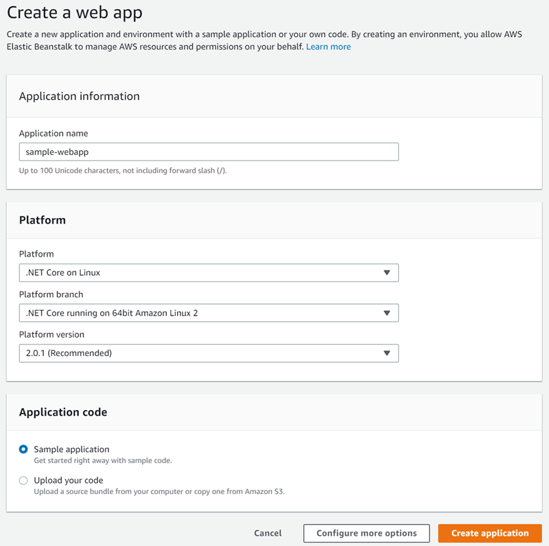

4) You application will be created in few seconds. It creates a new Beanstalk application and a default environment in the application. You can use this environment to deploy your application.Click on the application name from the list of applications.

    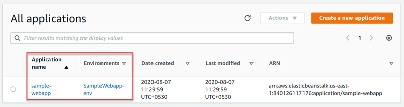

5)  You can optionally, create additional environments within the application. To launch the application click on the URL of the default environment created. 

    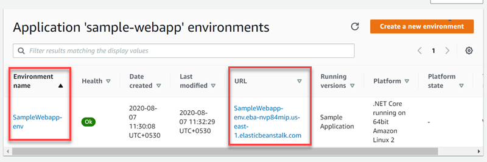

6) This will show the default page of the Elastic Beanstalk application.

    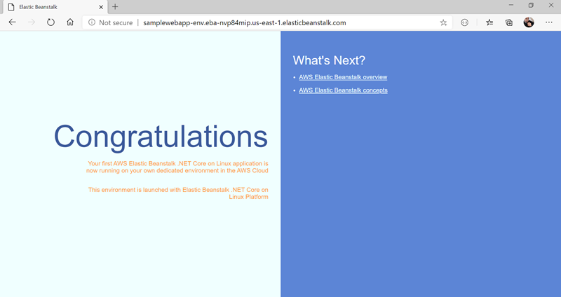

> [!NOTE]
> Your Beanstalk application will be deployed in the default VPC of the selected region. When the deployment is completed it creates a *Security Group* for the created application instance

### Publishing .NET Core application to Beanstalk environment
1) Create a new .NET Core MVC application using the .NET Core CLI command.
    > dotnet new mvc -n SampleMVC
2) Move to the application folder and compile the project. 
    > cd SampleMVC
    > dotnet build
3) Run the application and test it locally by navigating to https://localhost:5001
    > dotnet run
4) Ensure the application is running successfully and then publish the application to a folder.
    > dotnet publish -o sampleweb-dist -c release
5) Move to the `sampleweb-dist` folder  and compress the contents using any zip utility to generate `sampleweb-dist.zip` file.
6) Open the dashboard of EBS and navigate to the default environment configuration of the application. Click on the `Upload and deploy` button.
    
    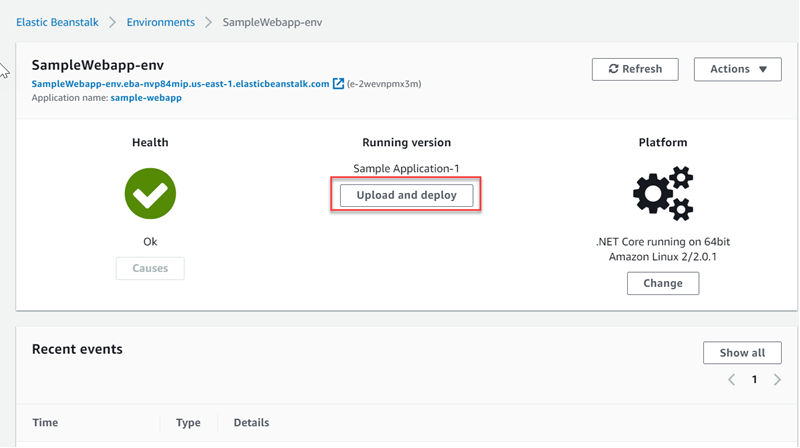

7) Click on the `Choose file` button and upload the zip file of your published application. A default version value will be displayed in the `Version Label` text box. You can update the version value if you wish. Click on the `Deploy` buttton to start deploying the application.

    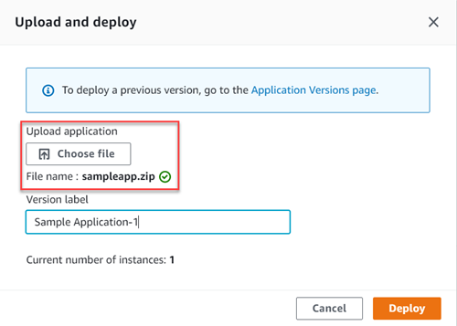

8) Once the deployment is completed, navigate to the application URL and refresh the page. You will see the application running on your EBS environment.

    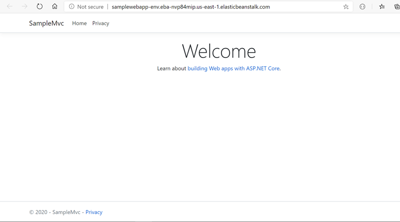

### Enable scaling for the EBS application
By default, EBS assigns a `single t2.micro` instance type to the application. If you want, you can update the instance size of the application. To enable autoscaling based on a metric you need to convert the single instance application into a `Autoscaling group (Load balanced)`.
#### Scale up (Vertical Scaling)
1) Open the EBS application dashboard, Click on the `configuration` menu. This will show a list of configurations for your application. To scale the application instance, click on the `Edit`  button for the `Capacity` configuration.
    
    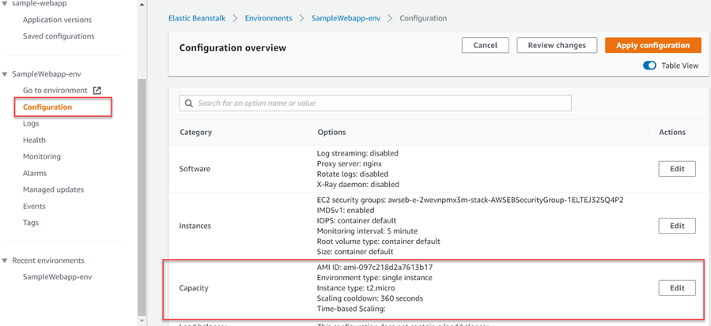

2) In the `Capacity` configuration page, scroll down to `Instance Type` configuration value and change the type of the EC2 instance from `t2.micro` to some other instance type and click on `Apply` button.

    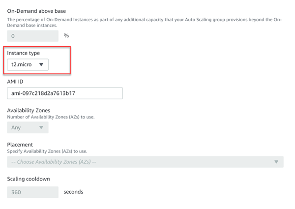

#### Scale out (Horizontal Scaling)

1) To enable autoscaling for the application, you need to move the application into `Autoscaling group`. For that you can change the `Environment Type` value to `Load balanced` in the Capacity configuration page.

    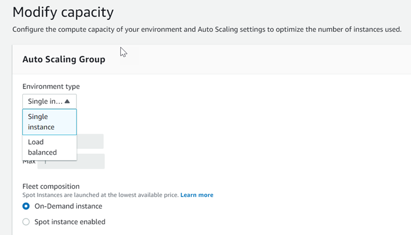

2) Configure the minimum and maximum number of instances for your application. You can configure the numbers in the `Min` and `Max` textboxes below the `Environment Type`. 
3) To configure a scaling condition, scroll down to the `Scaling Triggers` section and choose a metric type from the dropdown list. We can select `CPUUtilization` as the metric value for this demo. Set statistic value as `Average` and Unit as `Percent`. Specify the period and breach duration values as 5. Set upper threshold value for CPU utilization as `70%` and Lower threshold as `40%`. Also specify the scale up increment and scale down increment values as `1`. Click on `Apply` button to save the changes.

    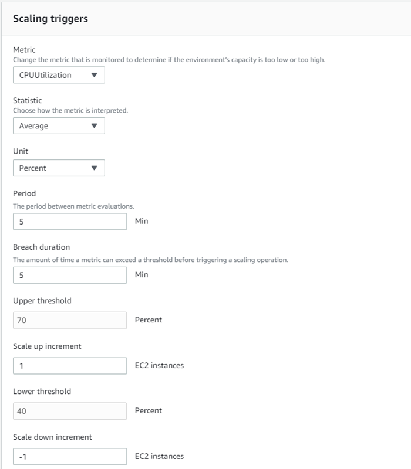

4) A confirmation page will be displayed. While configuring autoscaling with Autoscaling group your current instances will be replaced. Click on the `Confirm` button to update.

    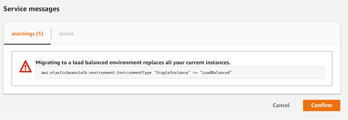

