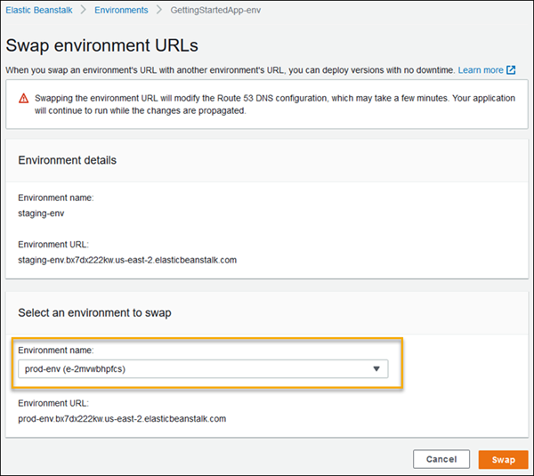

# Deploying web applications using Elastic Beanstalk

AWS *Elastic Beanstalk* is a PaaS service that allows you to deploy your web applications developed in your favourite language/framework such as .NET, Java, PHP, NodeJS, Python etc on a web server without configuring the infrastructure services explicitly. Instead of creating the compute, storage, networking and identity solutions on your own, Elastic Beanstalk provides a preconfigured platform which can be used to deploy your applications from a developer machine or using a CI/CD tool.

Elastic Beanstalk offers the features such as:
    
1) Quicker deployment
2) Simplifies operations
3) Cost effectiveness
4) Support for multiple languages and frameworks
5) Autoscaling and monitoring 
    
### Components of Elastic Beanstalk
 - **Application** : An *application* is a logical collection of Elastic Beanstalk components, including environments, versions, and environment configurations. In Elastic Beanstalk an application is conceptually similar to a folder.
 - **Application version**: An *application version* refers to a specific, labeled iteration of deployable code for a web application. An application version points to an Amazon Simple Storage Service (Amazon S3) object that contains the deployable code, such as a Java WAR file. Applications can have many versions and each application version is unique. In a running environment, you can deploy any application version you already uploaded to the application, or you can upload and immediately deploy a new application version.
 - **Environment**: An *environment* is a collection of AWS resources running an application version. Each environment runs only one application version at a time, however, you can run the same application version or different application versions in many environments simultaneously. When you create an environment, Elastic Beanstalk provisions the resources needed to run the application version you specified.
 - **Environment tier**: When you launch an Elastic Beanstalk environment, you first choose an environment tier. The environment tier designates the type of application that the environment runs, and determines what resources Elastic Beanstalk provisions to support it. Tier can be *web server environment tier* for http web apps  or *worker environment tier* for background tasks.
 - **Environment Health** : Elastic beanstalk reports the health of the web server environment  depending on how the application running responds to the health checks. It uses four colors to describe the status. *Grey*- currently being updated, *Green* - Passed recent health check, *Yellow* - Failed one or more health checks, *Red* - Failed three or more checks.
 
### Elastic Beanstalk architecture
    
   

## Deployment policies 
AWS Elastic Beanstalk provides several  deployment policies (All at once, Rolling, Rolling with additional batch, Immutable, and Traffic splitting).. By default, your environment uses *all-at-once* deployments. If you created the environment with the EB CLI and it's an automatically scaling environment (you didn't specify the --single option), it uses *rolling* deployments. 
### All At Once
As the name suggests, when you deploy your application in All At Once mode in Elastic Beanstalk; it starts the deployment on all EC2 instances at the same time. It can be useful for fast deployments but if deployment process fails then all instances will fails and your load balancer will not be able to serve traffic because of downtime. In this case, you need to deploy the previous version from application versions and wait for them to complete.


### Rolling deployments
With *rolling deployments*, Elastic Beanstalk splits the environment's Amazon EC2 instances into batches and deploys the new version of the application to one batch at a time. It leaves the rest of the instances in the environment running the old version of the application. During a rolling deployment, some instances serve requests with the old version of the application, while instances in completed batches serve other requests with the new version. When you deploy in Rolling mode, you also define the number of instances to be grouped in a batch.


* If it failed in the first batch, the first instance will be down, both other instances will continue to serve the previous version.
* If it failed in later batches, the failed instance will become unhealthy and there will be two versions served by your environment


### Rolling deployment with an additional batch
In this deployment, Elastic Beanstalk provisions a new batch of instances and starts by deploying the new version to them. Then, it will register the new instances to the load balancer and continues with the next batch of instances. After deployment is completed in all batches, it decreases the instances desired limit to the state where deployment started. In another words, it terminates the number of instances equal to the batch size it launched.


* If the deployment is failed in the first batch, it terminates the failed instances when you cancel the deployment and because deployment is done on additional batch, nothing will be effected. The number of instances will remain same.
* if the deployment is failed after the first batch, again the failed batch will be terminated, but there will be two versions of your application served like in Rolling deployments without additional batch. You need to deploy the previous version again to rollback.


### Immutable deployments
*Immutable deployments* perform an immutable update to launch a full set of new instances running the new version of the application in a separate Auto Scaling group, alongside the instances running the old version. Immutable deployments can prevent issues caused by partially completed rolling deployments. If the new instances don't pass health checks, Elastic Beanstalk terminates them, leaving the original instances untouched.


* In case of a deployment failure the new instances will be terminated without effecting your availability.


### Traffic-splitting deployments
*Traffic-splitting deployments* let you perform canary testing as part of your application deployment. In a traffic-splitting deployment, Elastic Beanstalk launches a full set of new instances just like during an immutable deployment. It then forwards a specified percentage of incoming client traffic to the new application version for a specified evaluation period. If the new instances stay healthy, Elastic Beanstalk forwards all traffic to them and terminates the old ones. If the new instances don't pass health checks, or if you choose to abort the deployment, Elastic Beanstalk moves traffic back to the old instances and terminates the new ones. There's never any service interruption.

### Blue/Green deployments
Blue/Green deployments are simply replicating your current environment (blue), deploying the new application to your new, cloned environment (green) and redirect the traffic to the new environment after deployment. If the deployment fails, you terminate the clone environment and nothing will be effected. If something goes bad after deployment, for example, your users experience a problem in the new version, you simply redirecting the traffic back to the old version. Hence, it would be wise to keep the old environment until you are sure that the deployment is successful and DNS propogation completed. Finally, you terminate the old environment and your cloned environment becomes your new blue one. 
> [!NOTE]
> Blue/Green does not exist as a deployment type on Elastic Beanstalk deployments. Because you need to duplicate the environment as a whole including Elastic Load Balancers.

1) You clone the current environment using AWS Management Console or AWS CLI or EB CLI. It will create a replica of your environment along side with Elastic Load Balancers, Autoscaling Groups and other resources and deploy the current version on the instances.
2) After your new environment is ready, you deploy the new version on this environment and verify that the deployment is successful by testing.
    
    

3) Once you are sure that everything is fine, on the environment overview page, choose `Environment actions`, and then choose `Swap environment URLs`.
4) For `Environment name`, select the current environment. Choose Swap.

    

5) After Elastic Beanstalk completes the swap operation, verify that the new environment responds when you try to connect to the old environment URL. However, do not terminate your old environment until the DNS changes are propagated and your old DNS records expire. DNS servers don't necessarily clear old records from their cache based on the time to live (TTL) you set on your DNS records.

    


## Advanced environment customization with configuration files (.ebextensions)
You can add AWS Elastic Beanstalk configuration files (.ebextensions) to your web application's source code to configure your environment and customize the AWS resources that it contains. Configuration files are YAML- or JSON-formatted documents with a .config file extension that you place in a folder named .ebextensions and deploy in your application source bundle.

**Example**: **.ebextensions/network-load-balancer.config**

This example makes a simple configuration change. It modifies a configuration option to set the type of your environment's load balancer to Network Load Balancer.
```YAML
option_settings:
  aws:elasticbeanstalk:environment:
    LoadBalancerType: network
```
We recommend using YAML for your configuration files, because it's more readable than JSON. YAML supports comments, multi-line commands, several alternatives for using quotes, and more. However, you can make any configuration change in Elastic Beanstalk configuration files identically using either YAML or JSON. The name of the file doesn’t matter as long as the extension is `.config`, but keep in mind that your EB configuration files will be processed in alphabetical order. This is why it is a good idea to use numbers when naming your `.config` files. 


## Deploying application to Elastic Beanstalk

1) Open AWS console and click on Services menu and search for `Elastic Beanstalk`. From the search results choose `Elastic Beanstalk` and you will be navigated to the Beanstalk dashboard.
2) Click on the `Create Application` button to start creating your first `Beanstalk` application on AWS.
3) In the create application wizard, specify the name of the application as `sample-webapp` and choose the platform type as `.NET Core on Linux`. You can choose any other framework of your choice. For this demo we are selecting .NET Core. Select `Sample application` from the `Application code` section and click on `Create application` button.

    

4) You application will be created in few seconds. It creates a new Beanstalk application and a default environment in the application. You can use this environment to deploy your application.Click on the application name from the list of applications.

    

5)  You can optionally, create additional environments within the application. To launch the application click on the URL of the default environment created. 

    

6) This will show the default page of the Elastic Beanstalk application.

    

> [!NOTE]
> Your Beanstalk application will be deployed in the default VPC of the selected region. When the deployment is completed it creates a *Security Group* for the created application instance

### Publishing .NET Core application to Beanstalk environment
1) Create a new .NET Core MVC application using the .NET Core CLI command.
    > dotnet new mvc -n SampleMVC
2) Move to the application folder and compile the project. 
    > cd SampleMVC
    > dotnet build
3) Run the application and test it locally by navigating to https://localhost:5001
    > dotnet run
4) Ensure the application is running successfully and then publish the application to a folder.
    > dotnet publish -o sampleweb-dist -c release
5) Move to the `sampleweb-dist` folder  and compress the contents using any zip utility to generate `sampleweb-dist.zip` file.
6) Open the dashboard of Elastic Beanstalk and navigate to the default environment configuration of the application. Click on the `Upload and deploy` button.
    
    

7) Click on the `Choose file` button and upload the zip file of your published application. A default version value will be displayed in the `Version Label` text box. You can update the version value if you wish. Click on the `Deploy` buttton to start deploying the application.

    

8) Once the deployment is completed, navigate to the application URL and refresh the page. You will see the application running on your Elastic Beanstalk environment.

    

### Enable scaling for the Elastic Beanstalk application
By default, Beanstalk assigns a `single t2.micro` instance type to the application. If you want, you can update the instance size of the application. To enable autoscaling based on a metric you need to convert the single instance application into a `Autoscaling group (Load balanced)`.
#### Scale up (Vertical Scaling)
1) Open the Elastic Beanstalk application dashboard, Click on the `configuration` menu. This will show a list of configurations for your application. To scale the application instance, click on the `Edit`  button for the `Capacity` configuration.
    
    

2) In the `Capacity` configuration page, scroll down to `Instance Type` configuration value and change the type of the EC2 instance from `t2.micro` to some other instance type and click on `Apply` button.

    

#### Scale out (Horizontal Scaling)

1) To enable autoscaling for the application, you need to move the application into `Autoscaling group`. For that you can change the `Environment Type` value to `Load balanced` in the Capacity configuration page.

    

2) Configure the minimum and maximum number of instances for your application. You can configure the numbers in the `Min` and `Max` textboxes below the `Environment Type`. 
3) To configure a scaling condition, scroll down to the `Scaling Triggers` section and choose a metric type from the dropdown list. We can select `CPUUtilization` as the metric value for this demo. Set statistic value as `Average` and Unit as `Percent`. Specify the period and breach duration values as 5. Set upper threshold value for CPU utilization as `70%` and Lower threshold as `40%`. Also specify the scale up increment and scale down increment values as `1`. Click on `Apply` button to save the changes.

    

4) A confirmation page will be displayed. While configuring autoscaling with Autoscaling group your current instances will be replaced. Click on the `Confirm` button to update.

    

### Clone the application environment
1) Open the environment dashboard and click on the `Actions` button. Select `Clone environment` from the dropdown menu.

    

2) Specify the name of the new environment. Also confirm the availability of the domain name. Click on `Clone` button to create a clone of the environment.

    

3) It will take few minutes to clone the environment. Once completed you will be able to see the list of environments in the current application including the cloned one.

    

4) You can navigate to the new application environment using the URL of the cloned environment.

### Swapping the environment URLs

AWS Beanstalk provides an option to swap the environment URLs. This is a useful feature of Elastic Beanstalk which allow you to publish an updated version of the application into the production environment withoout no downtime. You can publish the updated version into a *staging* environment and swap it with *production* environment.

1) To demonstrate this we can create a *staging* environment. For that, go to the `sample-webapp` application and click on the `Create a new environment` button.Create a `Web Server environment` and specify the name of the environment as `SampleWebapp-staging`. Also, provide a domain name as `sample-webapp-staging` and Platform type as `.NET Core on Linux`. Click `create new environment` button to create it.

    

2) After creating the new environment, navigate to the environment dashboard and deploy a new version of the application into the staging environment.

    

3) Once the deployment is completed, navigate to the new version of the application by clicking on the staging environment URL.

        

4) Click on the `Actions` button in the staging environment dashboard and select `Swap environment URLs`. 
5) In the swap environment configuration page, select the environment name from `Select an environment to swap` section to `sample-webapp-prod`.
    
    

6) After the swap operation is completed, you can navigate to the production environment URL and refresh the page. It will show the updated version of the application.

    