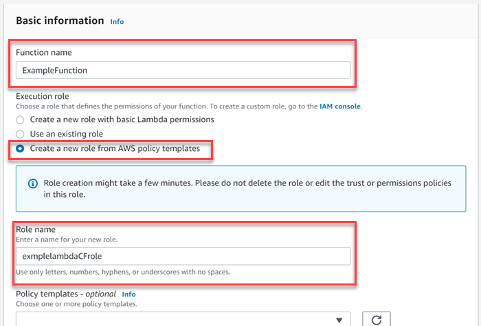
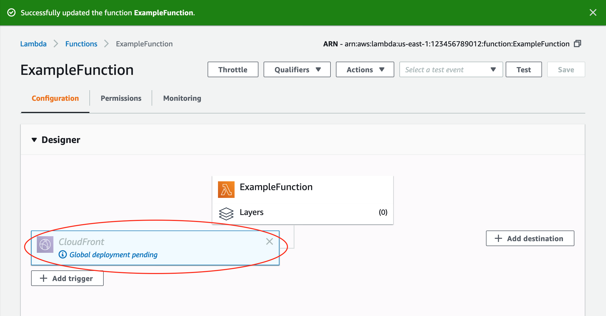

## Content delivery using AWS CloudFront
Amazon CloudFront is a web service that speeds up distribution of your static and dynamic web content, such as .html, .css, .js, and image files, to your users. CloudFront delivers your content through a worldwide network of data centers called edge locations. When a user requests content that you're serving with CloudFront, the user is routed to the edge location that provides the lowest latency (time delay), so that content is delivered with the best possible performance.
* If the content is already in the edge location with the lowest latency, CloudFront delivers it immediately.
* If the content is not in that edge location, CloudFront retrieves it from an origin that you've defined—such as an Amazon S3 bucket, a MediaPackage channel, or an HTTP server (for example, a web server) that you have identified as the source for the definitive version of your content.

CloudFront speeds up the distribution of your content by routing each user request through the AWS backbone network to the edge location that can best serve your content. Using the AWS network dramatically reduces the number of networks that your users' requests must pass through, which improves performance. You also get increased reliability and availability because copies of your files (also known as objects) are now held (or cached) in multiple edge locations around the world.


## How CloudFront delivers the content?
1) A user accesses your website or application and requests one or more files, such as an image file and an HTML file.
2) DNS routes the request to the CloudFront POP (edge location) that can best serve the request—typically the nearest CloudFront POP in terms of latency—and routes the request to that edge location.
3) In the POP, CloudFront checks its cache for the requested files. If the files are in the cache, CloudFront returns them to the user. If the files are not in the cache, it does the following:
    * CloudFront compares the request with the specifications in your distribution and forwards the request for the files to your origin server for the corresponding file type.
    * The origin servers send the files back to the edge location.
    * As soon as the first byte arrives from the origin, CloudFront begins to forward the files to the user. CloudFront also adds the files to the cache in the edge location for the next time someone requests those files.

## Regional edge caches
CloudFront *points of presence (POPs)* (edge locations) make sure that popular content can be served quickly to your viewers. CloudFront also has *regional edge caches* that bring more of your content closer to your viewers, even when the content is not popular enough to stay at a POP, to help improve performance for that content.

Regional edge caches help with all types of content, particularly content that tends to become less popular over time. Examples include user-generated content, such as video, photos, or artwork; e-commerce assets such as product photos and videos; and news and event-related content that might suddenly find new popularity.

Regional edge caches are CloudFront locations that are deployed globally, close to your viewers. They're located between your origin server and the POPs—global edge locations that serve content directly to viewers. As objects become less popular, individual POPs might remove those objects to make room for more popular content. Regional edge caches have a larger cache than an individual POP, so objects remain in the cache longer at the nearest regional edge cache location. This helps keep more of your content closer to your viewers, reducing the need for CloudFront to go back to your origin server, and improving overall performance for viewers.


## CloudFront policies
With `CloudFront policies`, you can control the values that are included in the cache key for objects that are cached at CloudFront edge locations. These values can include HTTP request `query strings`, `headers`, and `cookies`. The cache key determines whether a viewer request results in a `cache hit` (the object is served to the viewer from a CloudFront edge location).

When there’s a cache miss (the requested object is not cached at the edge location), CloudFront sends a request to the origin to retrieve the object. This is called an `origin request`. You can separately control which of these values (query strings, headers, and cookies) are included in the origin request.

You control the `cache key` with a `cache policy` and the `origin request` with an `origin request policy`. By controlling the cache key and the origin request separately, you can forward request values to your origin without duplicating cached content when the content doesn’t differ based on those values.

### Controlling Cache keys
The `cache key` is the unique identifier for every object in the cache, and it determines whether a viewer request results in a `cache hit`. You can use a **cache policy** to improve your cache hit ratio by controlling the values (URL query strings, HTTP headers, and cookies) that are included in the cache key. CloudFront provides some predefined cache policies, known as `managed policies`, for common use cases. You can use these managed policies, or you can create your own cache policy that’s specific to your needs.  A cache policy contains the following settings, which are categorized into `policy information`, `time to live (TTL) settings`, and `cache key settings`.
#### Policy information
* **Name** - A name to identify the cache policy. In the console, you use the name to attach the cache policy to a cache behavior.
* **Comment** - A comment to describe the cache policy. This is optional, but it can help you identify the purpose of the cache policy.
#### Time to live (TTL) settings
The time to live (TTL) settings work together with the Cache-Control and Expires HTTP headers to determine how long objects in the CloudFront cache remain valid.
* **Minimum TTL** - The minimum amount of time, in seconds, that you want objects to stay in the CloudFront cache before CloudFront checks with the origin to see if the object has been updated.
* **Maximum TTL** - The maximum amount of time, in seconds, that objects stay in the CloudFront cache before CloudFront checks with the origin to see if the object has been updated. CloudFront uses this setting only when the origin sends `Cache-Control` or `Expires` headers with the object. 
* **Default TTL**- The default amount of time, in seconds, that you want objects to stay in the CloudFront cache before CloudFront checks with the origin to see if the object has been updated. CloudFront uses this setting’s value as the object’s TTL only when the origin does not send `Cache-Control` or `Expires` headers with the object.
#### Cache key settings
Cache key settings specify the values in viewer requests that CloudFront includes in the cache key. The values can include URL query strings, HTTP headers, and cookies. 
* **Query strings**- The URL query strings in viewer requests that CloudFront includes in the cache key and in origin requests.
* **Headers**- The HTTP headers in viewer requests that CloudFront includes in the cache key and in origin requests. 
* **Cookies** - The cookies in viewer requests that CloudFront includes in the cache key and in origin requests.
* **Cache compressed objects (uses the Accept-Encoding header)** - This setting enables CloudFront to request and cache objects that are encoded in the gzip compression format, when the viewer supports it. Viewers indicate their support for gzip encoding by using the Accept-Encoding HTTP header.

### Controlling origin requests
When a viewer request to CloudFront results in a `cache miss` (the requested object is not cached at the edge location), CloudFront sends a request to the origin to retrieve the object. This is called an `origin request`. The `origin request` always includes the following information from the viewer request:
* The URL path (the path only, without URL query strings or the domain name)
* The request body (if there is one)
* The HTTP headers that CloudFront automatically includes in every origin request, including `Host`, `User-Agent`, and `X-Amz-Cf-Id`.

Other information from the viewer request, such as URL query strings, HTTP headers, and cookies, is not included in the origin request by default. But you might want to receive some of this other information at the origin, for example to collect data for analytics or telemetry. You can use an **origin request policy** to control the information that’s included in an origin request. All URL query strings, HTTP headers, and cookies that you include in the cache key (using a cache policy) are automatically included in origin requests. Use the origin request policy to specify the information that you want to include in origin requests, but not include in the cache key.

CloudFront provides some predefined origin request policies, known as `managed policies`, for common use cases. You can use these managed policies, or you can create your own origin request policy that’s specific to your needs. An `origin request policy` contains the following settings, which are categorized into `policy information` and `origin request settings`.
#### Policy information
* **Name** - A name to identify the origin request policy. In the console, you use the name to attach the origin request policy to a cache behavior.
* **Comment** - A comment to describe the origin request policy. This is optional.
#### Origin request settings
Origin request settings specify the values in viewer requests that are included in requests that CloudFront sends to the origin (known as origin requests). The values can include URL query strings, HTTP headers, and cookies.
* **Query strings** - The URL query strings in viewer requests that CloudFront includes in origin requests. 
* **Headers** - The HTTP headers in viewer requests that CloudFront includes in origin requests. 
* **Cookies** - The cookies in viewer requests that CloudFront includes in origin requests.

## Lambda@Edge
*Lambda@Edge8 lets you run *Node.js* and *Python* Lambda functions to customize content that CloudFront delivers, executing the functions in AWS locations closer to the viewer. *Lambda@Edge* supports a limited set of runtimes and features.  The functions run in response to CloudFront events, without provisioning or managing servers.  You can use Lambda functions to change CloudFront requests and responses at the following points:
* After CloudFront receives a request from a viewer (viewer request)
* Before CloudFront forwards the request to the origin (origin request)
* After CloudFront receives the response from the origin (origin response)
* Before CloudFront forwards the response to the viewer (viewer response)


With Lambda@Edge, you can build a variety of solutions, for example:
* Inspect cookies to rewrite URLs to different versions of a site for A/B testing.
* Send different objects to your users based on the User-Agent header, which contains information about the device that submitted the request. For example, you can send images in different resolutions to users based on their devices.
* Inspect headers or authorized tokens, inserting a corresponding header and allowing access control before forwarding a request to the origin.
* Add, delete, and modify headers, and rewrite the URL path to direct users to different objects in the cache.
* Generate new HTTP responses to do things like redirect unauthenticated users to login pages, or create and deliver static webpages right from the edge.

### How Lambda@Edge functions can be used?
Here's an overview of how to create and use Lambda functions with CloudFront:
1) In the AWS Lambda console, create a Lambda function in the US East (N. Virginia) Region. 
2) Save and publish a numbered version of the function.
3) If you want to change the function, you must edit the `$LATEST` version of the function in the US East (N. Virginia) Region. Then, before you set it up to work with CloudFront, you publish a new numbered version.
4) Choose the CloudFront distribution and cache behavior that the function applies to. Then specify one or more CloudFront events (triggers) that cause the function to execute. For example, you can create a trigger for the function to execute when CloudFront receives a request from a viewer.
5) When you create a trigger, Lambda replicates the function to AWS locations around the world.

    

## Invalidating cache
If you need to remove a file from CloudFront edge caches before it expires, you can do one of the following:
* Invalidate the file from edge caches. The next time a viewer requests the file, CloudFront returns to the origin to fetch the latest version of the file.
* Use file versioning to serve a different version of the file that has a different name.

o invalidate files, you can specify either the path for individual files or a path that ends with the * wildcard, which might apply to one file or to many, as shown in the following examples:
```
/images/image1.jpg
/images/image*
/images/*
```
You can submit a certain number of invalidation paths each month for free. If you submit more than the allotted number of invalidation paths in a month, you pay a fee for each invalidation path that you submit.
> [!NOTE]
> If you use the AWS command line interface (CLI) for invalidating files and you specify a path that includes the * wildcard, you must use quotes (") around the path.
For example: `aws cloudfront create-invalidation --distribution-id distribution_ID --paths "/*"`

## Serving Private Content with Signed URLs and Signed Cookies
Many companies that distribute content over the internet want to restrict access to documents, business data, media streams, or content that is intended for selected users, for example, users who have paid a fee. To securely serve this private content by using CloudFront, you can do the following:
* Require that your users access your private content by using special CloudFront `signed URLs` or `signed cookies`.
* Require that your users access your content by using CloudFront URLs, not URLs that access content directly on the origin server (for example, Amazon S3 or a private HTTP server). Requiring CloudFront URLs isn't necessary, but we recommend it to prevent users from bypassing the restrictions that you specify in signed URLs or signed cookies.

CloudFront signed URLs and signed cookies provide the same basic functionality: they allow you to control who can access your content. If you want to serve private content through CloudFront and you're trying to decide whether to use signed URLs or signed cookies, consider the following.

Use `signed URLs` in the following cases:
* You want to use an RTMP distribution. Signed cookies aren't supported for RTMP distributions.
* You want to restrict access to individual files, for example, an installation download for your application.
* Your users are using a client (for example, a custom HTTP client) that doesn't support cookies.

Use `signed cookies` in the following cases:
* You want to provide access to multiple restricted files, for example, all of the files for a video in HLS format or all of the files in the subscribers' area of website.
* You don't want to change your current URLs.

If you are not currently using signed URLs, and if your (unsigned) URLs contain any of the following query string parameters, you cannot use either signed URLs or signed cookies: `Expires`,`Policy`,`Signature`,`Key-Pair-Id`. CloudFront assumes that URLs that contain any of those query string parameters are signed URLs, and therefore won't look at signed cookies.

## Serving static contents from S3 using AWS CloudFront
#### Step 1: Create S3 bucket and upload files
1) Sign in to the AWS Management Console and open the Amazon S3 console at https://console.aws.amazon.com/s3/.
2) On the Amazon S3 console, choose `Create bucket`.
3) In the `Create bucket` dialog box, on the `Name` and `region` page, do the following:
    * Enter a bucket name.
    * For Region, choose an AWS Region for your bucket.
4) Choose `Next`.
5) On the `Configure options` page, choose options for `versioning`, `tagging`, and other features. Choose `Next`.
6) On the `Set permissions` page, clear the following check box:
    * Block all public access
    * Select the check box for `I acknowledge that the current settings may result in this bucket and the objects within becoming public`.
7) Choose `Next`, and then choose `Create bucket`.
8) In the `Buckets` pane, choose your bucket, and then choose `Upload`.
9) On the `Select files` page, drag and drop your files to the bucket. Or choose `Add files`, and then choose the files that you want to upload. Choose `Next`.
10) On the `Set permissions` page, for `Manage public permissions`, choose `Grant public read access to this object(s)`. Choose `Next`.
11) Set any properties that you want for the object, such as `encryption` or `tagging`, and then choose `Next`.
12) Choose `Upload`. After the upload is complete, you can navigate to the item by using its URL. For example:
    ```
    https://<bucket name>.s3-<AWS Region>.amazonaws.com/<object name>
    ```
#### Step 2: Create a CloudFront distribution
1) Open the CloudFront console at https://console.aws.amazon.com/cloudfront/.
2) Choose `Create Distribution`.

    

3) On the Select a delivery method for your content page, in the `Web` section, choose `Get Started`.
4) On the `Create Distribution` page, for `Origin Domain Name`, choose the Amazon S3 bucket that you created earlier.
5) For the other settings under `Origin Settings`, accept the default values.  

    

6) For the settings under `Default Cache Behavior Settings`, accept the default values.
7) Under `Distribution Settings`, choose the values for your distribution.
    * **Price Class** - Choose the price class that corresponds with the maximum price that you want to pay for the CloudFront service. By default, CloudFront serves your objects from edge locations in all CloudFront Regions.
    * **AWS WAF Web ACL** - Accept the default value, None.
    * **Alternate Domain Names (CNAMEs)** - Accept the default value—that is, leave the field empty.
    * **SSL Certificate** - Accept the default value, Default CloudFront Certificate (*.cloudfront.net).
    * **Supported HTTP Versions** - Accept the default value, HTTP/2, HTTP/1.1, HTTP/1.0.
    * **Default Root Object (Optional)** - The object that you want CloudFront to request from your origin (for example, index.html) when a viewer requests the root URL of your distribution instead of an object in your distribution. Specifying a default root object avoids exposing the contents of your distribution.
    * **Logging (Optional)** - Accept the default value, Off.
    * **Enable IPv6** - Accept the default value.
    * **Comment (Optional)** - Enter any comments that you want to save with the distribution.
    * **Distribution State** - Choose Enabled.
8) Choose `Create Distribution`.
9) After CloudFront creates your distribution, the value of the `Status` column for your distribution changes from `In Progress` to `Deployed`. This typically takes a few minutes.

## Test the Cloudfront service
1) After the CloudFront distribution is created, Click on the `ID` of the CloudFront service instance.
    
    

2) In the `General` section of the CloudFront configuration, copy the value of `Domain Name`.
    
    

3) Paste the copied value in the browser adddress bar and append a file's name from the S3 bucket at the end of the URL. (`For example: http://d3upuqivur6r8m.cloudfront.net/sampletext.txt`). Press enter to load the file from the origin to browser using the CloudFront.

## Configuring Lambda@Edge functions 
1) Sign in to the AWS Management Console and open the AWS Lambda console at `https://console.aws.amazon.com/lambda/`.
    > [!IMPORTANT]
    > Make sure that you’re in the *US-East-1 (N. Virginia) Region (us-east-1)*. You must be in this Region to create Lambda@Edge functions.

2) Choose `Create function`. On the `Create function` page, choose Use a blueprint, and then filter for the CloudFront blueprints by entering cloudfront in the search field. The Keyword : `cloudfront` is shown, and all the blueprints that are tagged for CloudFront are listed. 
    > [!NOTE]
    > CloudFront blueprints are available only in the US-East-1 (N. Virginia) Region (us-east-1).

    

3) Choose the `cloudfront-modify-response-header` blueprint as the template for your function. Enter the following information about your function:
    * **Name**- Enter a name for your function.
    * **Execution role**- Choose how to set the permissions for your function. To use the recommended basic Lambda@Edge permissions policy template, choose Create a new role from AWS policy templates.
    * **Role name**- Enter a name for the role that the policy template creates.
    * **Policy templates** - Lambda automatically adds the policy template Basic Edge Lambda permissions because you chose a CloudFront blueprint as the basis for your function. This policy template adds execution role permissions that allow CloudFront to run your Lambda function for you in CloudFront locations around the world. 

    
4) Choose `Create function`. Lambda creates the function, and on the next page you see your function configuration.
5) In the Designer section of the page, choose your function name, as shown in the following image. 

    

6) Scroll down to the Function code section of the page, as shown in the following image.

    

7) Replace the template code with a function that modifies the security headers that your origin returns. For example, you could use code similar to the following:
    ```nodejs
    'use strict';
    exports.handler = (event, context, callback) => {
    
        //Get contents of response
        const response = event.Records[0].cf.response;
        const headers = response.headers;
    
        //Set new headers
        headers['strict-transport-security'] = [{key: 'Strict-Transport-Security', value: 'max-age= 63072000; includeSubdomains; preload'}];
        headers['content-security-policy'] = [{key: 'Content-Security-Policy', value: "default-src 'none'; img-src 'self'; script-src 'self'; style-src 'self'; object-src 'none'"}];
        headers['x-content-type-options'] = [{key: 'X-Content-Type-Options', value: 'nosniff'}];
        headers['x-frame-options'] = [{key: 'X-Frame-Options', value: 'DENY'}];
        headers['x-xss-protection'] = [{key: 'X-XSS-Protection', value: '1; mode=block'}];
        headers['referrer-policy'] = [{key: 'Referrer-Policy', value: 'same-origin'}];
    
        //Return modified response
        callback(null, response);
    };        
    ```

8) Choose `Save` to save your updated code.
9) In the Designer section of the page, choose `CloudFront`, as shown in the following image.

    

10) Scroll down to the `Configure triggers` section of the page, then choose `Deploy to Lambda@Edge`.
11) On the `Deploy to Lambda@Edge` page, under Configure CloudFront trigger, enter the following information:
    * **Distribution** - The CloudFront distribution ID to associate with your function. In the drop-down list, choose the distribution ID.
    * **Cache behavior** - The cache behavior to use with the trigger. For this example, leave the value set to *, which means your distribution’s default cache behavior. 
    * **CloudFront event** - The trigger that specifies when your function runs. We want the security headers function to run whenever CloudFront returns a response from the origin. So in the drop-down list, choose `Origin response`. 
12) Under `Confirm deploy to Lambda@Edge`, select the check box to acknowledge that the trigger will be deployed and run your function in all AWS locations.

    

13) Choose `Deploy` to add the trigger and replicate the function to AWS locations worldwide. Then, if necessary, close the `Deploy to Lambda@Edge` page.
14) Wait for the function to replicate. This typically takes several minutes.
15) To verify that your Lambda@Edge function adds security headers, open browser and request a file from S3 using the CloudFront URL (For example: http://d3upuqivur6r8m.cloudfront.net/sampletext.txt )
16) Open your browser’s Web Developer toolbar. For example, in your browser window in Chrome, open the context (right-click) menu, and then choose `Inspect`.
17) Choose the `Network` tab. Reload the page to view your image, and then choose an HTTP request on the left pane. You see the HTTP headers displayed in a separate pane.
18) Look through the list of `HTTP headers` to verify that the expected security headers are included in the list. For example, you might see headers similar to those shown in the following screenshot.

## Invalidating Files in CloudFrond cache
1) Sign in to the AWS Management Console and open the CloudFront console at https://console.aws.amazon.com/cloudfront/.
2) Select the distribution for which you want to invalidate files.
3) Choose `Distribution Settings` .
    
    

4) Select the `Invalidations` tab and click on `Create Invalidation`.

    

5) For the files that you want to invalidate, enter one invalidation path per line. Choose `Invalidate`.

    


    


