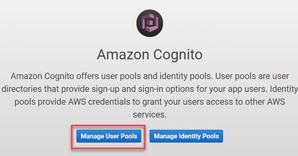

# Authenticating apps and services using AWS Cognito

Amazon Cognito provides authentication, authorization, and user management for your web and mobile apps. Your users can sign in directly with a user name and password, or through a third party such as Facebook, Amazon, Google or Apple. The two main components of Amazon Cognito are *user pools* and *identity pools*. User pools are user directories that provide sign-up and sign-in options for your app users. Identity pools enable you to grant your users access to other AWS services. You can use identity pools and user pools separately or together.

See the diagram for a common Amazon Cognito scenario. Here the goal is to authenticate your user, and then grant your user access to another AWS service.

1) In the first step your app user signs in through a *user pool* and receives user pool tokens after a successful authentication.
2) Next, your app exchanges the user pool tokens for AWS credentials through an *identity pool*.
3) Finally, your app user can then use those AWS credentials to access other AWS services such as Amazon S3 or DynamoDB.


### Regional Availability
Amazon Cognito is available in multiple AWS Regions worldwide. In each Region, Amazon Cognito is distributed across multiple Availability Zones. These Availability Zones are physically isolated from each other, but are united by private, low-latency, high-throughput, and highly redundant network connections. These Availability Zones enable AWS to provide services, including Amazon Cognito, with very high levels of availability and redundancy, while also minimizing latency.

## User pools
A user pool is a user directory in Amazon Cognito. With a user pool, your users can sign in to your web or mobile app through Amazon Cognito, or federate through a third-party identity provider (IdP). Whether your users sign in directly or through a third party, all members of the user pool have a directory profile that you can access through an SDK.

User pools provide:
* Sign-up and sign-in services.
* A built-in, customizable web UI to sign in users.
* Social sign-in with Facebook, Google, Login with Amazon, and Sign in with Apple, and through SAML and OIDC identity providers from your user pool.
* User directory management and user profiles.
* Security features such as multi-factor authentication (MFA), checks for compromised credentials, account takeover protection, and phone and email verification.
* Customized workflows and user migration through AWS Lambda triggers.

### Signing Up and Confirming User Accounts
User accounts are added to your user pool in one of the following ways:
* The user signs up in your user pool's client app, which can be a mobile or web app.
* You can import the user's account into your user pool. 
* You can create the user's account in your user pool and invite the user to sign in. 

Users who sign themselves up need to be confirmed before they can sign in. Imported and created users are already confirmed, but they need to create their password the first time they sign in. The following diagram illustrates the confirmation process:


### Groups in User Pool
Support for groups in Amazon Cognito user pools enables you to create and manage groups, add users to groups, and remove users from groups. Use groups to create collections of users to manage their permissions or to represent different types of users. You can assign an AWS Identity and Access Management (IAM) role to a group to define the permissions for members of a group.

User groups are subject to the following limitations:
* The number of groups you can create is limited by the Amazon Cognito service limits.
* Groups cannot be nested.
* You cannot search for users in a group.
* You cannot search for groups by name, but you can list groups.
* Only groups with no members can be deleted.

### Importing Users into a User Pool
There are two ways you can import or migrate users from your existing user directory or user database into Amazon Cognito User Pools. You can migrate users when they sign-in using Amazon Cognito for the first time with a user migration Lambda trigger. With this approach, users can continue using their existing passwords and will not have to reset them after the migration to your user pool. Alternatively, you can migrate users in bulk by uploading a CSV file containing the user profile attributes for all users. 

### Tokens with User Pools
After a successful authentication, Amazon Cognito returns user pool tokens to your app. You can use the tokens to grant your users access to your own server-side resources or to the Amazon API Gateway. Or you can exchange them for temporary AWS credentials to access other AWS services. 


Amazon Cognito user pools implements **ID token** , **access token**, and **refresh token** as defined by the OpenID Connect (OIDC) open standard:
#### ID Tokens
The *ID token* contains claims about the identity of the authenticated user such as name, email, and phone_number. You can use this identity information inside your application. The ID token can also be used to authenticate users to your resource servers or server applications. You can also use an ID token outside of the application with your web APIs. In those cases, you must verify the signature of the ID token before you can trust any claims inside the ID token. You can set the ID token expiration to any value between 5 minutes and 1 day. This value can be set per app client.
* **ID Token Header**: The header contains two pieces of information: the *key ID *(kid), and the *algorithm* (alg).
    ```json
    {
        "kid" : "1234example=",
        "alg" : "RS256"
    }
* **ID Token Payload** : It contains claims about the authenticated user.
    ```json
    {
      "sub": "aaaaaaaa-bbbb-cccc-dddd-eeeeeeeeeeee",
      "aud": "xxxxxxxxxxxxexample",
      "email_verified": true,
      "token_use": "id",
      "auth_time": 1500009400,
      "iss": "https://cognito-idp.us-east-1.amazonaws.com/us-east-1_example",
      "cognito:username": "janedoe",
      "exp": 1500013000,
      "given_name": "Jane",
      "iat": 1500009400,
      "email": "janedoe@example.com"
    }
    ```
* **ID Token Signature**: The signature of the ID token is calculated based on the header and payload of the JWT token. When used outside of an application in your web APIs, you must always verify this signature before accepting the token. 
#### Access Tokens
The *access token* contains scopes and groups and is used to grant access to authorized resources. The purpose of the access token is to authorize API operations in the context of the user in the user pool. You can also use the access token to make access control decisions and authorize operations for your users based on scopes or groups. The access token is represented as a JSON Web Token (JWT). The header for the access token has the same structure as the ID token. However, the key ID (kid) is different because different keys are used to sign ID tokens and access tokens. As with the ID token, you must first verify the signature of the access token in your web APIs before you can trust any of its claims. You can set the access token expiration to any value between 5 minutes and 1 day. 
* **Access Token Header**: The header contains two pieces of information: the *key ID* (kid), and the *algorithm* (alg).
    ```json
    {
        "kid" : "1234example=",
        "alg" : "RS256"
    }
    ```
* **Access Token Payload**
    ```json
    {
      "sub": "aaaaaaaa-bbbb-cccc-dddd-eeeeeeeeeeee",
      "device_key": "us-west-2_aaaaaaaa-bbbb-cccc-dddd-eeeeeeeeeeee",
      "cognito:groups": [
        "admin"
      ],
      "token_use": "access",
      "scope": "aws.cognito.signin.user.admin",
      "auth_time": 1562190524,
      "iss": "https://cognito-idp.us-west-2.amazonaws.com/us-west-2_example",
      "exp": 1562194124,
      "iat": 1562190524,
      "jti": "aaaaaaaa-bbbb-cccc-dddd-eeeeeeeeeeee",
      "client_id": "57cbishk4j24pabc1234567890",
      "username": "janedoe@example.com"
    }
    ```
* **Access Token Signature**: The signature of the access token is calculated based on the header and payload of the JWT token. When used outside of an application in your web APIs, you must always verify this signature before accepting the token. 

#### Refresh Tokens
The *refresh token* contains the information necessary to obtain a new *ID* or *access token*. By default, the refresh token expires 30 days after your app user signs in to your user pool. When you create an app for your user pool, you can set the app's refresh token expiration to any value between 60 minutes and 10 years.

The Mobile SDK for iOS and the Mobile SDK for Android automatically refresh your ID and access tokens if there is a valid (unexpired) refresh token present. The ID and access tokens have a minimum remaining validity of 5 minutes. If the refresh token is expired, your app user must reauthenticate by signing in again to your user pool. If the minimum for the access token and ID token is set to 5 minutes, and you are using the SDK, the refresh token will continually refresh. 

## Amazon Cognito Identity Pools (Federated Identities)
Amazon Cognito identity pools (federated identities) enable you to create unique identities for your users and federate them with identity providers. With an identity pool, you can obtain temporary, limited-privilege AWS credentials to access other AWS services. Identity pools support anonymous guest users, as well as the following identity providers that you can use to authenticate users for identity pools:
1) Amazon Cognito user pools
2) Social sign-in with Facebook, Google, Login with Amazon, and Sign in with Apple
3) OpenID Connect (OIDC) providers
4) SAML identity providers
5) Developer authenticated identities 

### Authenticated and unauthenticated identities
Amazon Cognito identity pools provide temporary AWS credentials for users who are guests (unauthenticated) and for users who have been authenticated and received a token. An identity pool is a store of user identity data specific to your account. *Authenticated identities* belong to users who are authenticated by any supported identity provider. *Unauthenticated identities* typically belong to guest users.

### Identity Pools (Federated Identities) Authentication Flow
1) External provided AuthFlow
2) Developer authenticated Identities (User Pool) AuthFlow
#### External Provider Authflow
A user authenticating with Amazon Cognito will go through a multi-step process to bootstrap their credentials. Amazon Cognito has two different flows for authentication with public providers: enhanced and basic.
##### Enhanced (Simplified) Authflow
1) GetId
2) GetCredentialsForIdentity


##### Basic (Classic) Authflow
1) GetId
2) GetOpenIdToken
3) AssumeRoleWithWebIdentity


#### Developer Authenticated Identities Authflow

When using Developer Authenticated Identities (Identity Pools), the client will use a different authflow that will include code outside of Amazon Cognito to validate the user in your own authentication system. Code outside of Amazon Cognito is indicated as such.
##### Enhanced Authflow
1) Login via Developer Provider (code outside of Amazon Cognito)
2) Validate the user's login (code outside of Amazon Cognito)
3) GetOpenIdTokenForDeveloperIdentity
4)  GetCredentialsForIdentity


##### Basic Authflow

1) Login via Developer Provider (code outside of Amazon Cognito)
2) Validate the user's login (code outside of Amazon Cognito)
3) GetOpenIdTokenForDeveloperIdentity
4) AssumeRoleWithWebIdentity


## Amazon Cognito Sync
Amazon Cognito Sync is an AWS service and client library that enables cross-device syncing of application-related user data. You can use it to synchronize user profile data across mobile devices and the web without requiring your own backend. The client libraries cache data locally so your app can read and write data regardless of device connectivity status. When the device is online, you can synchronize data, and if you set up push sync, notify other devices immediately that an update is available.

Amazon Cognito lets you save end user data in datasets containing key-value pairs. This data is associated with an Amazon Cognito identity, so that it can be accessed across logins and devices. To sync this data between the Amazon Cognito service and an end user’s devices, invoke the synchronize method. Each dataset can have a maximum size of 1 MB. You can associate up to 20 datasets with an identity.

The Amazon Cognito Sync client creates a local cache for the identity data. Your app talks to this local cache when it reads and writes keys. This guarantees that all of your changes made on the device are immediately available on the device, even when you are offline. When the synchronize method is called, changes from the service are pulled to the device, and any local changes are pushed to the service. At this point the changes are available to other devices to synchronize.

### Push Sync
Amazon Cognito automatically tracks the association between identity and devices. Using the push synchronization, or push sync, feature, you can ensure that every instance of a given identity is notified when identity data changes. Push sync ensures that, whenever the sync store data changes for a particular identity, all devices associated with that identity receive a silent push notification informing them of the change.
> [!NOTE]
> Push sync is not supported for JavaScript, Unity, or Xamarin.

### Amazon Cognito Streams 
Amazon Cognito Streams gives developers control and insight into their data stored in Amazon Cognito. Developers can now configure a Kinesis stream to receive events as data is updated and synchronized. Amazon Cognito can push each dataset change to a Kinesis stream you own in real time. Using Amazon Cognito Streams, you can move all of your Sync data to Kinesis, which can then be streamed to a data warehouse tool such as Amazon Redshift for further analysis.

### Amazon Cognito Events
Amazon Cognito Events allows you to execute an AWS Lambda function in response to important events in Amazon Cognito. Amazon Cognito raises the Sync Trigger event when a dataset is synchronized. You can use the Sync Trigger event to take an action when a user updates data. The function can evaluate and optionally manipulate the data before it is stored in the cloud and synchronized to the user's other devices. This is useful to validate data coming from the device before it is synchronized to the user's other devices, or to update other values in the dataset based on incoming data such as issuing an award when a player reaches a new level.

## Security
Amazon Cognito conforms to the AWS shared responsibility model, which includes regulations and guidelines for data protection. AWS is responsible for protecting the global infrastructure that runs all the AWS services. AWS maintains control over data hosted on this infrastructure, including the security configuration controls for handling customer content and personal data. AWS customers and APN partners, acting either as data controllers or data processors, are responsible for any personal data that they put in the AWS Cloud.

For data protection purposes, we recommend that you protect AWS account credentials and set up individual user accounts with *AWS Identity and Access Management (IAM)*, so that each user is given only the permissions necessary to fulfill their job duties. We also recommend that you secure your data in the following ways:
* Use multi-factor authentication (MFA) with each account.
* Use TLS to communicate with AWS resources.
* Set up API and user activity logging with AWS CloudTrail.
* Use AWS encryption solutions, along with all default security controls within AWS services.
* Use advanced managed security services such as Amazon Macie, which assists in discovering and securing personal data that is stored in Amazon S3.

### Data-Encryption
Data encryption typically falls into two categories: encryption at rest and encryption in transit.
* **Encryption at Rest**: Data within Cognito is encrypted at rest in accordance with industry standards.
* **Encryption in Transit**: All requests to Cognito must be made over the Transport Layer Security protocol (TLS). Clients must support Transport Layer Security (TLS) 1.0 or later. AWS recommend TLS 1.2 or later.
> [!NOTE]
> Amazon Cognito encrypts customer content internally and doesn't support customer provided keys.

## UserPool Authentication Flow methods
Modern authentication flows incorporate new challenge types, in addition to a password, to verify the identity of users. We generalize authentication into two common steps, which are implemented through two API operations: `InitiateAuth` and `RespondToAuthChallenge`. A user authenticates by answering successive challenges until authentication either fails or the user is issued tokens. With these two steps, which can be repeated to include different challenges, we can support any custom authentication flow. You can also use admin authentication flow for use on secure backend servers.


### Client-Side Authentication Flow
1) The user enters their user name and password into the app.
2) The app calls the InitiateAuth operation with the user's user name and SRP details. This method returns the authentication parameters.
3) The app calls the `RespondToAuthChallenge` operation. If the call succeeds, it returns the user's tokens, and the authentication flow is complete.
4) If another challenge is required (eg: password change required for user for first login), no tokens are returned. Instead, the call to `RespondToAuthChallenge` returns a session.
5) If `RespondToAuthChallenge` returns a session, the app calls `RespondToAuthChallenge` again, this time with the session and the challenge response (for example, MFA code).

### Server-Side Authentication Flow
If you don't have an end-user app, but instead you're using a Java, Ruby, or Node.js secure backend or server-side app, you can use the authenticated server-side API for Amazon Cognito user pools. For server-side apps, user pool authentication is similar to that for client-side apps, except for the following:
* The server-side app calls the `AdminInitiateAuth` API operation (instead of `InitiateAuth`). This operation requires `AWS admin credentials`. This operation returns the authentication parameters.
* Once it has the authentication parameters, the app calls the `AdminRespondToAuthChallenge` API operation (instead of `RespondToAuthChallenge`), which also requires AWS admin credentials.

The `AdminInitiateAuth` and `AdminRespondToAuthChallenge` operations can't accept `user-name` and `password` user credentials for admin sign-in, unless you explicitly enable them to do so by doing one of the following:
* Pass `ADMIN_USER_PASSWORD_AUTH` (formerly known as `ADMIN_NO_SRP_AUTH`) for the `ExplicitAuthFlow` parameter in your server-side app's call to `CreateUserPoolClient` or `UpdateUserPoolClient`.
* Choose Enable sign-in API for server-based authentication (`ADMIN_USER_PASSWORD_AUTH`) in the App clients tab in Create a user pool. 

## Creating a User Pool
1) Login to the Amazon Cognito console using your AWS credentials.
2) Choose `Manage User Pools`.
    
    

3) In the top-right corner of the page, choose `Create a user pool`.

    

4) Provide a `name` for your user pool, and choose `Review defaults` to save the name.
    
    

5) In the top-left corner of the page, choose `Attributes`, choose `Email address or phone number` and `Allow email addresses`, and then choose `Next` step to save.

    

6) In the left navigation menu, choose `Review`.
7) Review the user pool information and make any necessary changes. When the information is correct, choose `Create pool`.

## Add users to the user pool
1) In the Cognito console, select the user pool you have created in the previous demo. 
2) From the left pane select `Users and Groups`. Click on the `Create user` button.

    

3) In the `Create user` dialog box, fill the following details:
    * **Username**: A username for the user. You need to provide a valid email address for username field as we have selected email or phone number for username.
    * **Send an invitaion to new user** : Select email or password you want to use for receiving invitation.
    * **Temporary Password** : A temporary password for first login. This need to be reset in the initial login.
    * **Phone Number**: Phone number of the new user. Also select the checkbox for `Mark phone number as verified?`
    * **Email**: Email address of the new user. Also select the checkbox for `Mark email as verified?`

    

4) Click on `Create user` button.
5) After the users created, you will be able to see the list of users in the console.

    

## Securing .NET Core Web API using JWT tokens with Client-side user pool authentication flow
1) Open the Cognito console and select `Manage User Pool`.
2) Select the user pool you have created in the previos demo.
3) In the user pool configuration page, select `App Clients` from the left pane and click `create app client` button.
4) Specify the `App client name`. Uncheck the  `Generate client secret` checkbox. In the  `Auth Flows configuration` select only the `Enable SRP (secure remote password) protocol based authentication (ALLOW_USER_SRP_AUTH)` option and click `Create app client` button.

    

5) Create a .NET Core Web API project. Add the following nuget packages to the project.
    ```dotnetcli     
    dotnet add package Amazon.Extensions.CognitoAuthentication
    dotnet add package AWSSDK.CognitoIdentityProvider
    dotnet add package Microsoft.AspNetCore.Authentication.JwtBearer
    ```
6) Add the following configuration section to the `appsettings.json` file.
    ```JSON
    "AWS": {
        "UserPoolId": "--USER POOL ID HERE--",
        "ClientId": "--APP CLIENT ID HERE --",
        "Region": "--REGION HERE (eg: us-east-1)--"
    }
    ```
    * **UserPoolId** : Replace `--USER POOL ID HERE--` with the User pool ID. You can get it from the user pool `General Settings` section.
    * **ClientId**: Your newly created App Client Id.
    * **Region**: Region code of the location, where your user pool is created.

7) Open the `Startuo.cs` file and add the following code in the `ConfigureServices` method.

    ```csharp
    services.AddAuthentication("Bearer")
        .AddJwtBearer(options =>
        {
            var region = Configuration.GetSection("AWS")["Region"];
            var userPoolId = Configuration.GetSection("AWS")["UserPoolId"];
            options.Audience = Configuration.GetSection("AWS")["ClientId"];
            options.Authority = $"https://cognito-idp.{region}.amazonaws.com/{userPoolId}";
        });
    ```

8) Add the authentication and authorization middleware in the `Configure` method.
    ```csharp
    public void Configure(IApplicationBuilder app, IWebHostEnvironment env)
    {
        // other code here

        app.UseRouting();

        app.UseAuthentication();
        app.UseAuthorization();

        app.UseEndpoints(endpoints =>
        {
            endpoints.MapControllers();
        });
    }
    ```
9) Create a `Todo` model class in the `Models` folder with the following code.
    ```csharp
    public classTodo
    {
        public int Id { get; set; }
        public string Title { get; set; }
        public bool Completed { get; set; }
    }
    ```
10) Add `TodoController` class to the `Controllers` folder and add `[Authorize]` attribute to the controller.
    ```csharp
    [Route("api/todos")]
    [ApiController]
    [Authorize]
    public class TodoController : ControllerBase
    {
        [HttpGet]
        public ActionResult<List<Todo>> GetTodos()
        {
            return new List<Todo>()
            {
                new Todo{ Id=1, Title="Buy vegs", Completed= false},
                new Todo{ Id=2, Title = "Attend meeting", Completed = true}
            };
        }
    }
    ```
11) Now, we need to create signup and signin actions for the application. For that create a `User` model class in the `Models` folder with the following code.
    ```csharp
    public class User
    {
        public string Username { get; set; }
        public string Password { get; set; }
        public string Email { get; set; }
    }
    ```
12) Add a controller to the `Controllers` folder. Name the controller as `AuthenticationController`. Declare the following variables in the controller class.
    ```csharp
    [Route("api/auth")]
    [ApiController]
    public class AuthenticationController : ControllerBase
    {
        private string _clientId;
        private string _userPoolId;
        private readonly RegionEndpoint _region = RegionEndpoint.USEast1;
    }
    ```
13) Create a constructor in the controller class and inject the `IConfiguration` to the constructor. Add the following constructor code to the class.
    ```csharp
    public AuthenticationController(IConfiguration config)
    {
        _clientId = config.GetSection("AWS")["ClientId"];
        _userPoolId = config.GetSection("AWS")["UserPoolId"];
    }
    ```
14) Create an action `Register` for the signup activity. Add the following action method to the controller class.
    ```csharp
    [HttpPost("register")]
    public async Task<ActionResult<User>> Register(User user)
    {
        var provider = new AmazonCognitoIdentityProviderClient(_region);

        var request = new SignUpRequest
        {
            ClientId = _clientId,
            Password = user.Password,
            Username = user.Username
        };

        var emailAttribute = new AttributeType
        {
            Name = "email",
            Value = user.Email
        };
        request.UserAttributes.Add(emailAttribute);
        var response = await provider.SignUpAsync(request);
        return Created("",user);
    }
    ```

15) You also need to create an action for sign in. Add the following code to verify the user against the Cognito user pool and return the tokens.
    ```csharp
    [HttpPost("signin")]
    public async Task<ActionResult<AuthenticationResultType>> SignIn(User user)
    {
        var provider = new AmazonCognitoIdentityProviderClient(new AnonymousAWSCredentials(), _region);

        CognitoUserPool userPool = new CognitoUserPool(_userPoolId, _clientId, provider);
        CognitoUser cognitoUser = new CognitoUser(user.Username, _clientId, userPool, provider);

        var request = new InitiateSrpAuthRequest()
        {
            Password = user.Password
        };
        try
        {
            var response = await cognitoUser.StartWithSrpAuthAsync(request);
            if (response.ChallengeName == null)
            {
                return Ok(response.AuthenticationResult);
            }
            else
            {
                return Unauthorized("Invalid username or password");
            }
        }catch(Exception ex)
        {
            return Unauthorized(ex.Message);
        }
    }
    ```
16) Run the application and use `Postman` tool or `curl` to test the APIs. Make a `POST` reqeust to `https://localhost:<PORT>/api/auth/signin` url to generate the tokens for the user. The `signin` action returns the `id token`, `access token` and `refresh token`. 

    

17) You can make a `GET` request to the `https://localhost:<PORT>/api/todos` action to get the list of todos. Add the `id token` in the `Authorization` header of the reqeust. Specify the `Authorization` header value in `Bearer <id token>` format.

    


## Authenticating server-side applications using Server-side user pool authentication flow
1) Open the Cognito console and select `Manage User Pool`.
2) Select the user pool you have created in the previos demo.
3) In the user pool configuration page, select `App Clients` from the left pane and click `create app client` button.
4) Specify the `App client name`. Uncheck the  `Generate client secret` checkbox. In the  `Auth Flows configuration` select only the `Enable username password auth for admin APIs for authentication (ALLOW_ADMIN_USER_PASSWORD_AUTH)` option and click `Create app client` button.

    

5) Note the `Client Id` generated for the app client.
6) Create a new Dotnet core console application.  Add the following nuget package. 
    > AWSSDK.CognitoIdentityProvider
7) Declare the following variables in the *Program* class.    
    ```csharp
    static string _secretAccessKey = "--SECRET ACCESS KEY HERE --";
    static string _secretAccessKeyId = "-- ACCESS KEY ID HERE --";
    static string _clientId = "--APP CLIENT ID HERE--";
    static string _userPoolId = "--USER POOL ID HERE--";
    static string _username = "--USER POOL USER USERNAME HERE--";
    static string _password = "--USER POOL USER PASSWORD HERE--";
    ```
    * **_secretAccessKey** : Your IAM user's secret access key. To know about how to create Access keys visit [Managing Access Keys for IAM Users](https://docs.aws.amazon.com/IAM/latest/UserGuide/id_credentials_access-keys.html).
    * **_secretAccessKeyId**: Your IAM users secret access key Id.
    * **_clientId** : The client Id generated while creating the App client in user pool.
    * **_userPoolId** : The user pool ID in which you created the app client. You can get it from the user pool `General Settings` section.
    * **_username** : Your user pool user's username.
    * **_password** : Your user pool user's password.

8) Replace the `Main()` method of the `Program` class with the following.
    ```csharp
    static async Task Main(string[] args)
    {
        AWSCredentials credentials = new BasicAWSCredentials(_secretAccessKeyId, _secretAccessKey);
        AmazonCognitoIdentityProviderClient provider 
            = new AmazonCognitoIdentityProviderClient(credentials, RegionEndpoint.USEast1);

        Dictionary<string, string> authParams = new Dictionary<string, string>()
        {
            { "USERNAME", _username },
            { "PASSWORD", _password }
        };
        AdminInitiateAuthRequest authRequest = new AdminInitiateAuthRequest()
        {
            AuthFlow = AuthFlowType.ADMIN_NO_SRP_AUTH,
            ClientId = _clientId,
            UserPoolId = _userPoolId,
            AuthParameters = authParams               
        };

        AdminInitiateAuthResponse response = await provider.AdminInitiateAuthAsync(authRequest);
        Console.WriteLine($"Id token:{response.AuthenticationResult.IdToken}");
        Console.WriteLine("---------------------------------------------------------------------------");
        Console.WriteLine($"Access Token:{response.AuthenticationResult.AccessToken}");
        Console.WriteLine("---------------------------------------------------------------------------");
        Console.WriteLine($"Refresh Token:{response.AuthenticationResult.RefreshToken}");
    }
    ```
    > [!IMPORTANT]
    > You may need to update the `RegionEndpoint` value according to your user pool region. 

9) Run the application to see the `id token`, `access token` and `refresh token` values.

