# Amazon AWS DynamoDB
Amazon DynamoDB is a fully managed NoSQL database service that provides fast and predictable performance with seamless scalability. DynamoDB lets you offload the administrative burdens of operating and scaling a distributed database so that you don't have to worry about hardware provisioning, setup and configuration, replication, software patching, or cluster scaling. DynamoDB also offers encryption at rest, which eliminates the operational burden and complexity involved in protecting sensitive data. With DynamoDB, you can create database tables that can store and retrieve any amount of data and serve any level of request traffic. You can scale up or scale down your tables' throughput capacity without downtime or performance degradation.

## Core Components of Amazon DynamoDB
In DynamoDB, tables, items, and attributes are the core components that you work with. A table is a collection of items, and each item is a collection of attributes. DynamoDB uses primary keys to uniquely identify each item in a table and secondary indexes to provide more querying flexibility. 
* **Tables** – Similar to other database systems, DynamoDB stores data in tables. A table is a collection of data.
* **Items** – Each table contains zero or more items. An item is a group of attributes that is uniquely identifiable among all of the other items. Items in DynamoDB are similar in many ways to rows, records, or tuples in other database systems. In DynamoDB, there is no limit to the number of items you can store in a table.
* **Attributes** – Each item is composed of one or more attributes. An attribute is a fundamental data element, something that does not need to be broken down any further. Attributes in DynamoDB are similar in many ways to fields or columns in other database systems.

    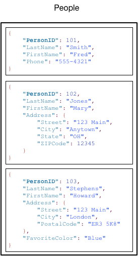

## Primary Key
When you create a table, in addition to the table name, you must specify the primary key of the table. The primary key uniquely identifies each item in the table, so that no two items can have the same key.

DynamoDB supports two different kinds of primary keys:
* **Partition key** – A simple primary key, composed of one attribute known as the partition key. DynamoDB uses the partition key's value as input to an internal hash function. The output from the hash function determines the partition (physical storage internal to DynamoDB) in which the item will be stored. In a table that has only a partition key, no two items can have the same partition key value.
* **Partition key and sort key** – Referred to as a composite primary key, this type of key is composed of two attributes. The first attribute is the partition key, and the second attribute is the sort key. DynamoDB uses the partition key value as input to an internal hash function. The output from the hash function determines the partition (physical storage internal to DynamoDB) in which the item will be stored. All items with the same partition key value are stored together, in sorted order by sort key value. In a table that has a partition key and a sort key, it's possible for two items to have the same partition key value. However, those two items must have different sort key values.

## Secondary Indexes
You can create one or more secondary indexes on a table. A secondary index lets you query the data in the table using an alternate key, in addition to queries against the primary key. DynamoDB doesn't require that you use indexes, but they give your applications more flexibility when querying your data. 

DynamoDB supports two kinds of indexes:
* **Global secondary index** – An index with a partition key and sort key that can be different from those on the table.
* **Local secondary index** – An index that has the same partition key as the table, but a different sort key.

Each table in DynamoDB has a quota of 20 global secondary indexes (default quota) and 5 local secondary indexes per table.

## High Availability and Durability
DynamoDB automatically spreads the data and traffic for your tables over a sufficient number of servers to handle your throughput and storage requirements, while maintaining consistent and fast performance. All of your data is stored on *solid-state disks (SSDs)* and is *automatically replicated across multiple Availability Zones in an AWS Region*, providing built-in high availability and data durability. You can use *global tables* to keep DynamoDB tables in sync across AWS Regions. 

## DynamoDB Streams
DynamoDB Streams is an optional feature that captures data modification events in DynamoDB tables. The data about these events appear in the stream in near-real time, and in the order that the events occurred. Each event is represented by a stream record. If you enable a stream on a table, DynamoDB Streams writes a stream record whenever one of the following events occurs:
* **A new item is added to the table**: The stream captures an image of the entire item, including all of its attributes.
* **An item is updated**: The stream captures the "before" and "after" image of any attributes that were modified in the item.
* **An item is deleted from the table**: The stream captures an image of the entire item before it was deleted.

Each stream record also contains the name of the table, the event timestamp, and other metadata. Stream records have a lifetime of 24 hours; after that, they are automatically removed from the stream. You can use DynamoDB Streams together with AWS Lambda to create a trigger—code that executes automatically whenever an event of interest appears in a stream.

   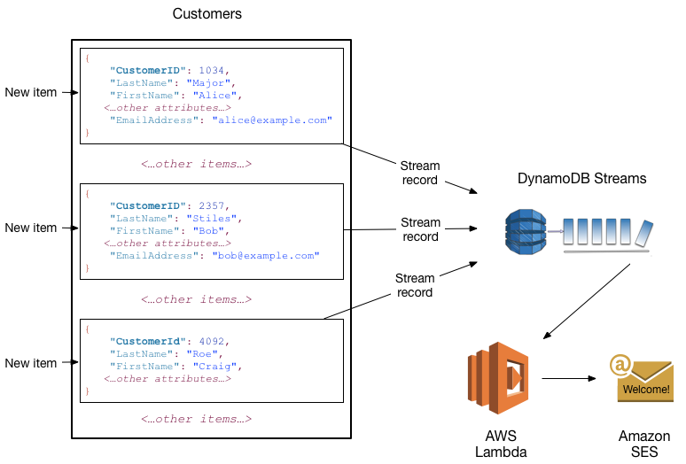

## Supported data types
DynamoDB supports many different data types for attributes within a table. They can be categorized as follows:
* **Scalar Types** – A scalar type can represent exactly one value. The scalar types are number, string, binary, Boolean, and null.
* **Document Types** – A document type can represent a complex structure with nested attributes, such as you would find in a JSON document. The document types are list and map.
* **Set Types** – A set type can represent multiple scalar values. The set types are string set, number set, and binary set.

When you create a table or a secondary index, you must specify the names and data types of each primary key attribute (partition key and sort key). Furthermore, each *primary key attribute must be defined as type string, number, or binary*.

## Read Consistency for DynamoDB 
Amazon DynamoDB is available in multiple AWS Regions around the world. Each Region is independent and isolated from other AWS Regions. For example, if you have a table called People in the us-east-2 Region and another table named People in the us-west-2 Region, these are considered two entirely separate tables.

Every AWS Region consists of multiple distinct locations called Availability Zones. Each Availability Zone is isolated from failures in other Availability Zones, and provides inexpensive, low-latency network connectivity to other Availability Zones in the same Region. This allows rapid replication of your data among multiple Availability Zones in a Region.

When your application writes data to a DynamoDB table and receives an HTTP 200 response (OK), the write has occurred and is durable. The data is eventually consistent across all storage locations, usually within one second or less. DynamoDB supports eventually consistent and strongly consistent reads.
### Eventually Consistent Reads
When you read data from a DynamoDB table, the response might not reflect the results of a recently completed write operation. The response might include some stale data. If you repeat your read request after a short time, the response should return the latest data.
### Strongly Consistent Reads
When you request a strongly consistent read, DynamoDB returns a response with the most up-to-date data, reflecting the updates from all prior write operations that were successful. However, this consistency comes with some disadvantages:
* A strongly consistent read might not be available if there is a network delay or outage. In this case, DynamoDB may return a server error (HTTP 500).
* Strongly consistent reads may have higher latency than eventually consistent reads.
* Strongly consistent reads are not supported on global secondary indexes.
* Strongly consistent reads use more throughput capacity than eventually consistent reads.

> [!NOTE]
> DynamoDB uses eventually consistent reads, unless you specify otherwise. Read operations (such as GetItem, Query, and Scan) provide a *ConsistentRead* parameter. If you set this parameter to *true*, DynamoDB uses strongly consistent reads during the operation.

## Read/Write Capacity Mode
The read/write capacity mode controls how you are charged for read and write throughput and how you manage capacity. You can set the read/write capacity mode when creating a table or you can change it later. Amazon DynamoDB has two read/write capacity modes for processing reads and writes on your tables:
* On-demand
* Provisioned (default, free-tier eligible)

### On-Demand Mode
Amazon DynamoDB on-demand is a flexible billing option capable of serving thousands of requests per second without capacity planning. DynamoDB on-demand offers pay-per-request pricing for read and write requests so that you pay only for what you use. On-demand mode is a good option if any of the following are true:
* You create new tables with unknown workloads.
* You have unpredictable application traffic.
* You prefer the ease of paying for only what you use.
### Provisioned Mode
If you choose provisioned mode, you specify the number of reads and writes per second that you require for your application. You can use auto scaling to adjust your table’s provisioned capacity automatically in response to traffic changes. This helps you govern your DynamoDB use to stay at or below a defined request rate in order to obtain cost predictability. Provisioned mode is a good option if any of the following are true:
* You have predictable application traffic.
* You run applications whose traffic is consistent or ramps gradually.
* You can forecast capacity requirements to control costs.

#### Read Capacity Units and Write Capacity Units
For provisioned mode tables, you specify throughput capacity in terms of read capacity units (RCUs) and write capacity units (WCUs):
* One *read capacity* unit represents one strongly consistent read per second, or two eventually consistent reads per second, for an item up to 4 KB in size. Transactional read requests require two read capacity units to perform one read per second for items up to 4 KB. If you need to read an item that is larger than 4 KB, DynamoDB must consume additional read capacity units. The total number of read capacity units required depends on the item size, and whether you want an eventually consistent or strongly consistent read. 
* One *write capacity* unit represents one write per second for an item up to 1 KB in size. If you need to write an item that is larger than 1 KB, DynamoDB must consume additional write capacity units. Transactional write requests require 2 write capacity units to perform one write per second for items up to 1 KB. The total number of write capacity units required depends on the item size.

Provisioned throughput is the maximum amount of capacity that an application can consume from a table or index. If your application exceeds your provisioned throughput capacity on a table or index, it is subject to *request throttling*. Throttling prevents your application from consuming too many capacity units. When a request is throttled, it fails with an *HTTP 400 code (Bad Request)* and a *ProvisionedThroughputExceededException*. The AWS SDKs have built-in support for retrying throttled requests, so you do not need to write this logic yourself.

#### DynamoDB autoscaling of capacity units
DynamoDB *auto scaling* actively manages throughput capacity for tables and global secondary indexes. With auto scaling, you define a range (upper and lower limits) for read and write capacity units. You also define a target utilization percentage within that range. DynamoDB auto scaling seeks to maintain your target utilization, even as your application workload increases or decreases. With DynamoDB auto scaling, a table or a global secondary index can increase its provisioned read and write capacity to handle sudden increases in traffic, without request throttling. When the workload decreases, DynamoDB auto scaling can decrease the throughput so that you don't pay for unused provisioned capacity.
#### Reserved Capacity
Reserved Capacity
As a DynamoDB customer, you can purchase reserved capacity in advance. With reserved capacity, you pay a one-time upfront fee and commit to a minimum provisioned usage level over a period of time. Your reserved capacity is billed at the hourly reserved capacity rate. By reserving your read and write capacity units ahead of time, you realize significant cost savings compared to on-demand provisioned throughput settings. Any capacity that you provision in excess of your reserved capacity is billed at standard provisioned capacity rates.
> [!NOTE]
> Reserved capacity is not available in on-demand mode.
## Partitions and Data Distribution
Amazon DynamoDB stores data in partitions. A partition is an allocation of storage for a table, backed by solid state drives (SSDs) and automatically replicated across multiple Availability Zones within an AWS Region. Partition management is handled entirely by DynamoDB—you never have to manage partitions yourself.
When you create a table, the initial status of the table is *CREATING*. During this phase, DynamoDB allocates sufficient partitions to the table so that it can handle your provisioned throughput requirements. You can begin writing and reading table data after the table status changes to *ACTIVE*.

DynamoDB allocates additional partitions to a table in the following situations:
* If you increase the table's provisioned throughput settings beyond what the existing partitions can support.
* If an existing partition fills to capacity and more storage space is required.

### Data distribution when only Partition key exists
If your table has a simple primary key (partition key only), DynamoDB stores and retrieves each item based on its partition key value.
* To write an item to the table, DynamoDB uses the value of the partition key as input to an internal hash function. The output value from the hash function determines the partition in which the item will be stored.
* To read an item from the table, you must specify the partition key value for the item. DynamoDB uses this value as input to its hash function, yielding the partition in which the item can be found.

### Data distribution when Partition Key and Sort Key exsits
If the table has a composite primary key (partition key and sort key), DynamoDB calculates the hash value of the partition key. However, it stores all the items with the same partition key value physically close together, ordered by sort key value.
* To write an item to the table, DynamoDB calculates the hash value of the partition key to determine which partition should contain the item. In that partition, several items could have the same partition key value. So DynamoDB stores the item among the others with the same partition key, in ascending order by sort key.
* To read an item from the table, you must specify its partition key value and sort key value. DynamoDB calculates the partition key's hash value, yielding the partition in which the item can be found.

## On-Demand Backup and Restore for DynamoDB
You can create on-demand backups for your Amazon DynamoDB tables or enable continuous backups with point-in-time recovery. You can use the DynamoDB on-demand backup capability to create full backups of your tables for long-term retention and archival for regulatory compliance needs. You can back up and restore your table data anytime with a single click on the AWS Management Console or with a single API call. Backup and restore actions execute with zero impact on table performance or availability.
### Backups
When you create an on-demand backup, a time marker of the request is cataloged. The backup is created asynchronously by applying all changes until the time of the request to the last full table snapshot. Backup requests are processed instantaneously and become available for restore within minutes. All backups in DynamoDB work without consuming any provisioned throughput on the table. 

While a backup is in progress, you can't do the following:
* Pause or cancel the backup operation.
* Delete the source table of the backup.
* Disable backups on a table if a backup for that table is in progress.

### Restores
You restore a table without consuming any provisioned throughput on the table. You can do a full table restore from your DynamoDB backup, or you can configure the destination table settings. When you do a restore, you can change the following table settings:
* Global secondary indexes (GSIs)
* Local secondary indexes (LSIs)
* Billing mode
* Provisioned read and write capacity
* Encryption settings

> [!NOTE]
> When you do a full table restore, the destination table is set with the same provisioned read capacity units and write capacity units as the source table, as recorded at the time the backup was requested. The restore process also restores the local secondary indexes and the global secondary indexes.

## Point-in-Time Recovery for DynamoDB
Point-in-time recovery helps protect your DynamoDB tables from accidental write or delete operations. With point-in-time recovery, you don't have to worry about creating, maintaining, or scheduling on-demand backups. With point-in-time recovery, you can restore that table to any point in time during the last 35 days. DynamoDB maintains incremental backups of your table.

When you restore using point-in-time recovery, DynamoDB restores your table data to the state based on the selected date and time (day:hour:minute:second) to a new table. You restore a table without consuming any provisioned throughput on the table. You can do a full table restore using point-in-time recovery, or you can configure the destination table settings. You can change the following table settings on the restored table:
* Global secondary indexes (GSIs)
* Local secondary indexes (LSIs)
* Billing mode
* Provisioned read and write capacity
* Encryption settings

## Multi-Region Replication with Global Tables
Amazon DynamoDB global tables provide a fully managed solution for deploying a multiregion, multi-master database, without having to build and maintain your own replication solution. With global tables you can specify the AWS Regions where you want the table to be available. DynamoDB performs all of the necessary tasks to create identical tables in these Regions and propagate ongoing data changes to all of them.

DynamoDB global tables are ideal for massively scaled applications with globally dispersed users. In such an environment, users expect very fast application performance. Global tables provide automatic multi-master replication to AWS Regions worldwide. They enable you to deliver low-latency data access to your users no matter where they are located.
### Global table versions
There are two versions of DynamoDB global tables available: **Version 2019.11.21 (Current)** and **Version 2017.11.29**.

* *Version 2019.11.21* enables you to dynamically add new replica tables from a table populated with data. *Version 2019.11.21 (Current)* is more efficient and consumes less write capacity than *Version 2017.11.29*. 
* Region support for global tables *Version 2017.11.29* is limited to US East (N. Virginia), US East (Ohio), US West (N. California), US West (Oregon), Europe (Ireland), Europe (London), Europe (Frankfurt), Asia Pacific (Singapore), Asia Pacific (Sydney), Asia Pacific (Tokyo), and Asia Pacific (Seoul).
* If you are using Version 2019.11.21 (Current) of global tables and you also use the Time to Live feature, DynamoDB replicates TTL deletes to all replica tables. The initial TTL delete does not consume write capacity in the region in which the TTL expiry occurs. However, the replicated TTL delete to the replica table(s) consumes a replicated write capacity unit when using provisioned capacity, or replicated write when using on-demand capacity mode, in each of the replica regions and applicable charges will apply
* Transactional operations provide atomicity, consistency, isolation, and durability (ACID) guarantees only within the region where the write is made originally. Transactions are not supported across regions in global tables.

## Querying vs Scanning
The `Query` operation finds items based on primary key values. You can query any table or secondary index that has a composite primary key (a partition key and a sort key). A `Query` operation will return all of the items from the table or index with the partition key value you provided. A `Query` operation always returns a result set. If no matching items are found, the result set will be empty. Query results are always sorted by the sort key value. If the data type of the sort key is Number, the results are returned in numeric order; otherwise, the results are returned in order of UTF-8 bytes.  A single `Query` operation can retrieve items up to a maximum data size of 1MB. You can query a table, a local secondary index, or a global secondary index. For a query on a table or on a local secondary index, you can set the `ConsistentRead` parameter to true and obtain a strongly consistent result. Global secondary indexes support eventually consistent reads only, so do not specify  `ConsistentRead` when querying a global secondary index. Query operations only support an equal operator evaluation of the Primary Key, but conditional (=, <, <=, >, >=, Between, Begin) on the Sort Key.

A Scan operation always scans the entire table or secondary index. It then filters out values to provide the result you want, essentially adding the extra step of removing data from the result set. If possible, you should avoid using a Scan operation on a large table or index with a filter that removes many results. Also, as a table or index grows, the Scan operation slows. The Scan operation examines every item for the requested values and can use up the provisioned throughput for a large table or index in a single operation.

## In-Memory Acceleration with DynamoDB Accelerator (DAX)
Amazon DynamoDB Accelerator (DAX) is a fully managed, highly available, in-memory cache for Amazon DynamoDB that delivers up to a 10 times performance improvement—from milliseconds to microseconds—even at millions of requests per second. DAX is a DynamoDB-compatible caching service that enables you to benefit from fast in-memory performance for demanding applications. DAX addresses three core scenarios:
* As an in-memory cache, DAX reduces the response times of eventually consistent read workloads by an order of magnitude from single-digit milliseconds to microseconds.
* DAX reduces operational and application complexity by providing a managed service that is API-compatible with DynamoDB. Therefore, it requires only minimal functional changes to use with an existing application.
* For read-heavy or bursty workloads, DAX provides increased throughput and potential operational cost savings by reducing the need to overprovision read capacity units. This is especially beneficial for applications that require repeated reads for individual keys.
### How DAX works?
A DAX cluster consists of one or more nodes. Each node runs its own instance of the DAX caching software. One of the nodes serves as the primary node for the cluster. Additional nodes (if present) serve as read replicas. You can launch a DAX cluster in your virtual network and control access to the cluster by using Amazon VPC security groups. To create a DAX cluster, you use the AWS Management Console. Unless you specify otherwise, your DAX cluster runs within your default VPC. To run your application, you launch an Amazon EC2 instance into your Amazon VPC. You then deploy your application (with the DAX client) on the EC2 instance. Your application can access DAX by specifying the endpoint for the DAX cluster.

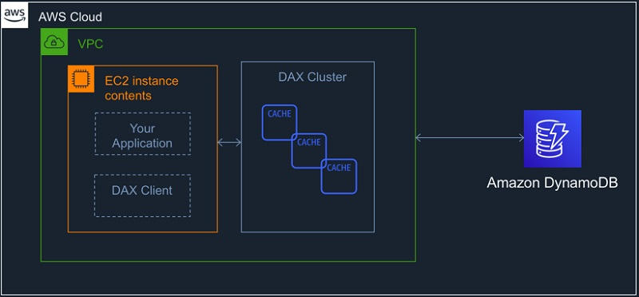

At runtime, the DAX client directs all of your application's DynamoDB API requests to the DAX cluster. If DAX can process one of these API requests directly, it does so. Otherwise, it passes the request through to DynamoDB. Finally, the DAX cluster returns the results to your application.

#### Read operation with DAX
If the request specifies *eventually consistent reads* (the default behavior), it tries to read the item from DAX:
* If DAX has the item available (a cache hit), DAX returns the item to the application without accessing DynamoDB.
* If DAX does not have the item available (a cache miss), DAX passes the request through to DynamoDB. When it receives the response from DynamoDB, DAX returns the results to the application. But it also writes the results to the cache on the primary node.

If the request specifies *strongly consistent reads*, DAX passes the request through to DynamoDB. The results from DynamoDB are not cached in DAX. Instead, they are simply returned to the application.

#### Write operations with DAX
When client application performs "write-through" operations (BatchWriteItem, UpdateItem, DeleteItem, PutItem), data is first written to the DynamoDB table, and then to the DAX cluster. The operation is successful only if the data is successfully written to both the table and to DAX.

## Creating Tables in DynamoDB using AWS management console
1) Open AWS management console and search for the DynamoDB service. In the DynamoDB dashboard click on the `Create table` button to create a new Table.
    
    

2) Specify the table name and primary key name. Optionally, you can add a sort key also. For this demo, we can give table name as `salesdata` and primary key as `region`. Select the checkbox for adding a sort key and specify the sort key name as `id`. Under the `Table settings` make sure the `Use default settings` checkbox is selected. Click `Create` button to create the table.

    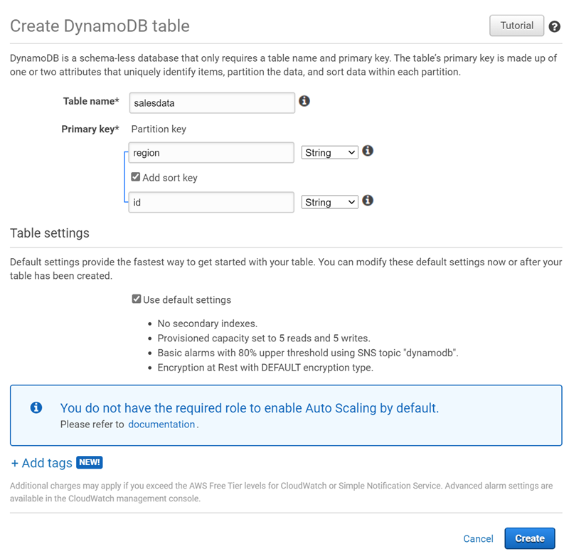

3) After the table is created, you can see the table configuration in the management console. Click on the `Items` tab to view the items of the table. You can add a new item to the table by clicking the `Create item` button.

    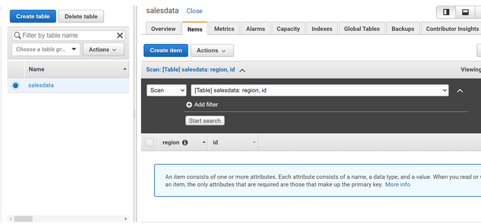

4) In the new item dialog box specify the `region` value and `id` value for the sales item. You can add additional attributes by clicking on the `+` icon below the `id` field. You can either append or insert attribute to the item. Click on the `Save` button to save the item.

    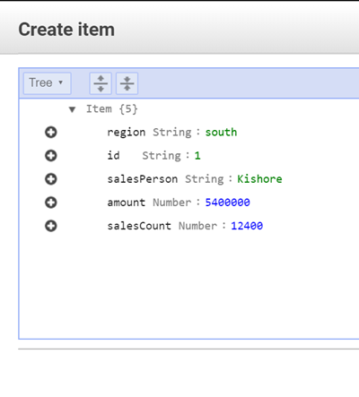

5) You can add as many items you want to the table. Each item can have variable list of attributes.

    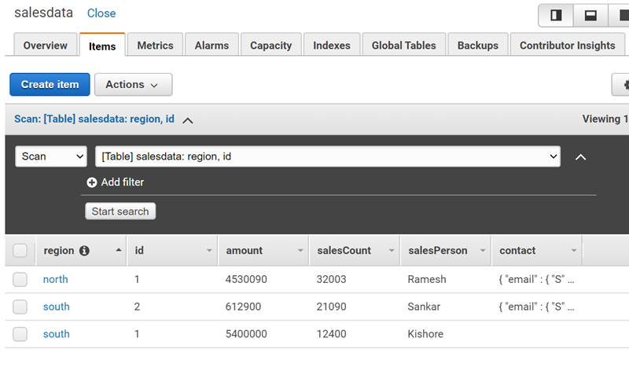

## Scaling read/write capacity
1) Open the DynamoDB management console and select the table. The console will show the details of the table. 
2) Select the `Capacity` tab. You can choose the capacity mode as `On-demand` or `Provisioned`. On-demand will provision the required capacity for read and write operations automatically based on the number of read and write requests.
    
    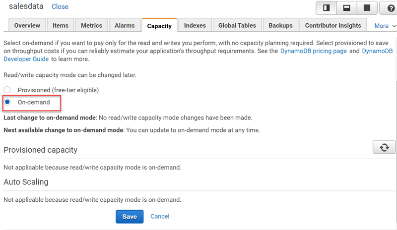

3) Select `Provisioned` for setting a specified capacity for read and write operations. Enable the `Read capacity` and `Write capacity` configurations under `Auto scaling` section to update the scale conditions and save the changes.

    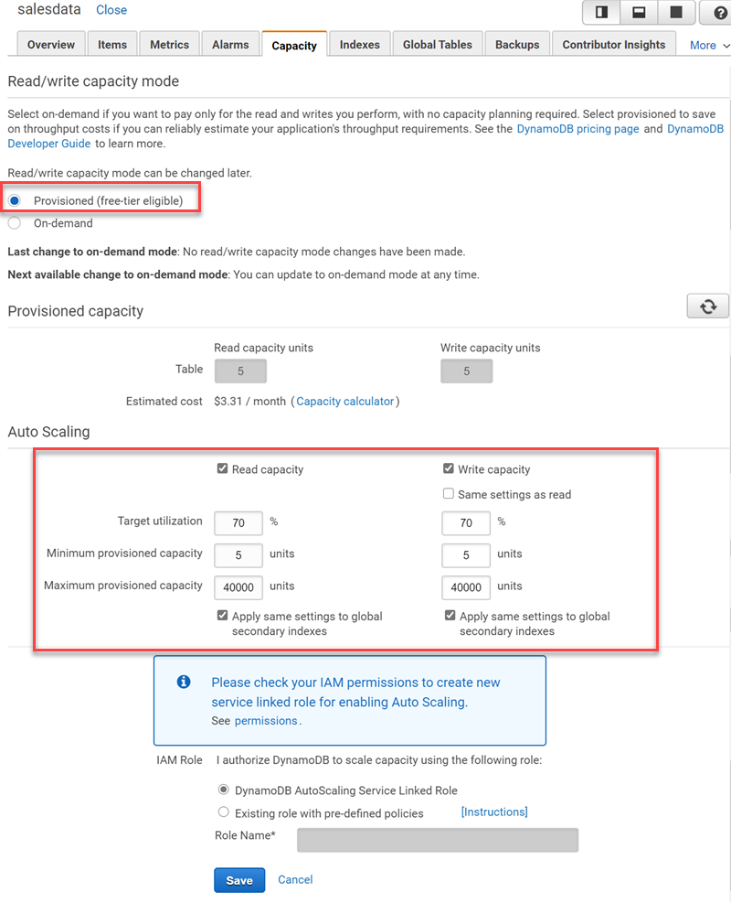

## Creating DAX clusters
1) Open the DynamoDB console at https://console.aws.amazon.com/dynamodb/.
2) In the navigation pane, under `DAX`, choose `Clusters`.
3) Choose `Create cluster`.

    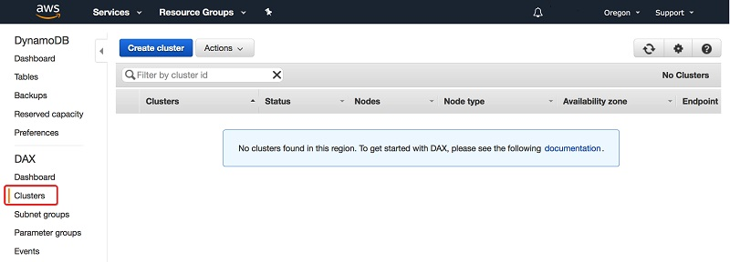

4)  In the `Create cluster` window, do the following:
    * **Cluster name** — Enter a short name for your DAX cluster.
    * **Cluster description** — Enter a description for the cluster.
    * **Node type** — Choose the node type for all of the nodes in the cluster.
    * **Cluster size** — Choose the number of nodes in the cluster. A cluster consists of one primary node and up to nine read replicas. If you want to create a single-node cluster, choose 1. Your cluster will consist of one primary node. If you want to create a multi-node cluster, choose a number between 3 (one primary and two read replicas) and 10 (one primary and nine read replicas).
    * **Encryption** — Choose enable encryption for your DAX cluster to help protect data at rest.
    * **IAM service role for DynamoDB access** — Choose Create new, and enter the following information:
        * **IAM role name** — Enter a name for an IAM role, for example, DAXServiceRole. The console creates a new IAM role, and your DAX cluster assumes this role at runtime.
        * **IAM policy name** — Enter a name for an IAM policy, for example, DAXServicePolicy. The console creates a new IAM policy and attaches the policy to the IAM role.
        * **IAM role policy** — Choose Read/Write. This allows the DAX cluster to perform read and write operations in DynamoDB.
        * **Target DynamoDB table** — Choose All tables.
    * **Subnet group** — Choose the subnet group that you created in the VPC.
    * **Security Groups** — Choose default.
    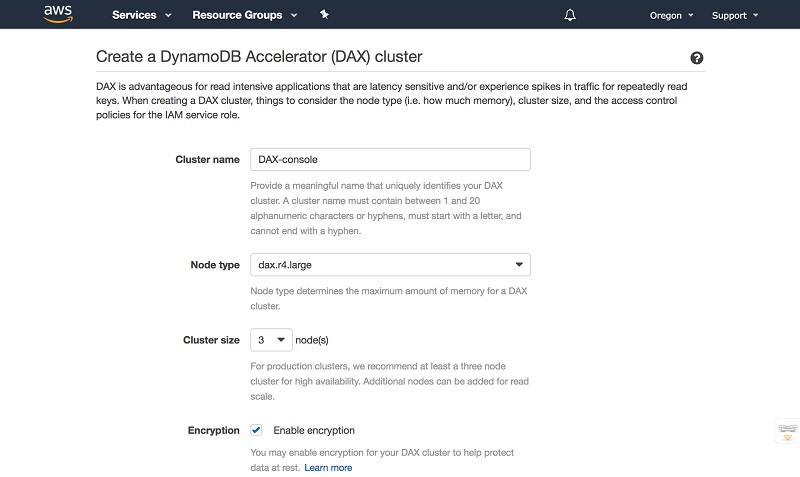
    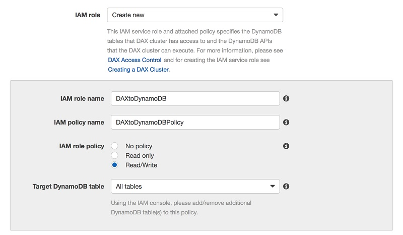
    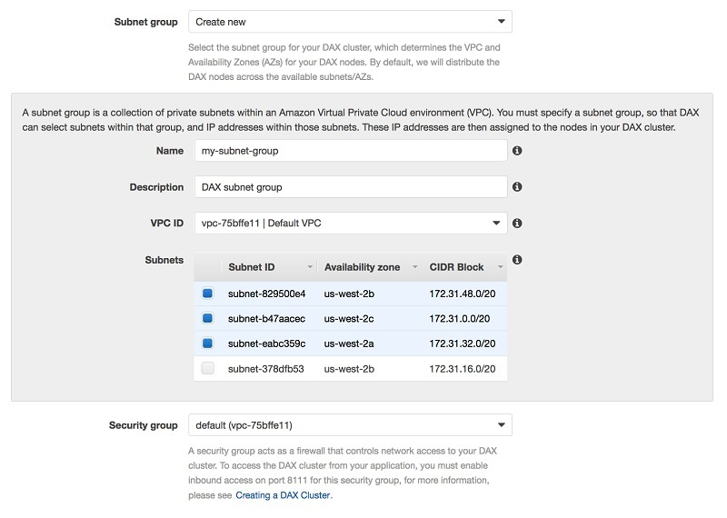
    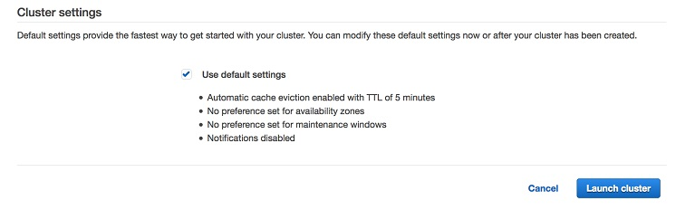
5) When the settings are as you want them, choose Launch cluster.
6) Creating the cluster will take several minutes. When the cluster is ready, its status changes to `Available`.
    
    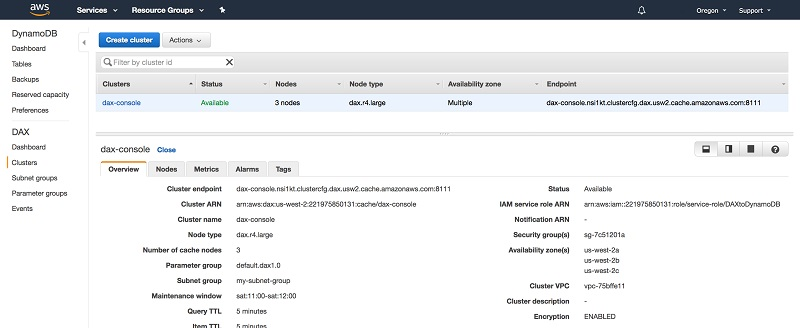

    
