# Creating and connecting EC2 instances

AWS EC2 is a compute service that allows you to create Virtual Machine instances in the AWS cloud. You can create Windows or Linux instances in AWS. The AWS marketplace provides different (Amazon Machine Images) AMIs including Windows Server, Suse Linux, Cent OS, Redhat Linux etc. AWS EC2 instances can be provisioned with different compute instance types. Each instance type defines the number of vCPU, Memory and Storage type for the instances. Some of the EC2 images and instance types are eligible for free tier which means no cost incurred for provisioning these instances. 

An EC2 instance will be deployed in a VPC. The VPC can be the default VPC or custom VPC. You can choose the subnet of the VPC where you want to deploy the instance. You can also attach a Security Group to configure the inbound traffic for the VM. It is necessary to create a Key pair for the VM instance that need to be used to generate the login password for the Administrator user. You need to keep the key pair for the admin user securely because without the key pair you will not be able to generate the password for admin user and it can not be regenerated.

This tutorial is a continuation of the [Creating and configuring VPC](aws-vpc.md) turorial where we have created the VPC and intenet gateway. In this tutorials we will be creating and configuring the Security Group for the EC2 instance and a Windows EC2 instance itself and connect to it using RDP.

## Create and configure Security Group for VM 
1) You can now create a new Security Group for the VM. This Security group contains the inbound rules for allowing RDP, HTTP and HTTPS access to the VM and blocks other connections. To create a new security group, choose `Security Groups` under security section from the left pane. This will show the list of available security groups including the default security group for VPC. Click on the `Create security group` button to create it.
2) Specify the security group name as `MyVM-sg` and a description. Also select the VPC from the list in the VPC field. You can also add inbound rules to allow traffic to the VPC. For that click on the `Add rule` button and select rule type as `RDP` and source as `Custom` and ip range as `0.0.0.0\0` Optionally you can give a description to the rule. Add another rule to allow `HTTP` also. By default, all outbound traffics are allowed. Click `Create security group` to create the Security group.
    
    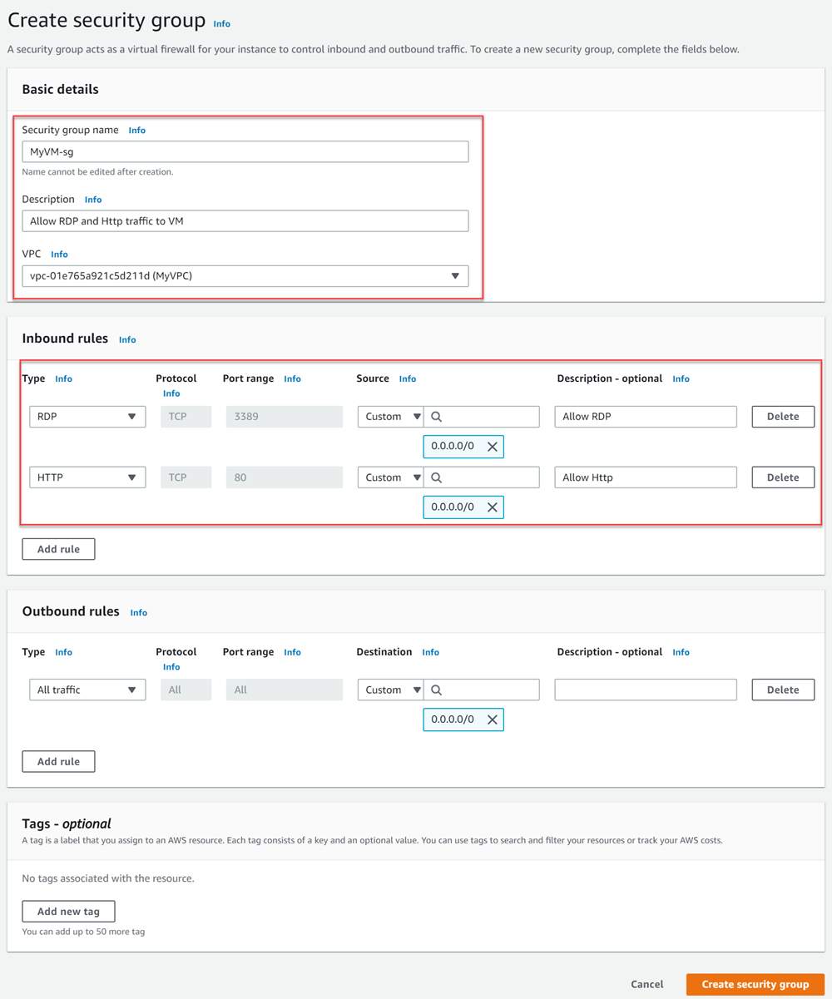

3) Once the Security Group is created, navigate to the Security groups list. Identify the security group created and update the name tag of the security group by clicking on the edit icon in the name column. Update the name value as `MyVM-SG`.

    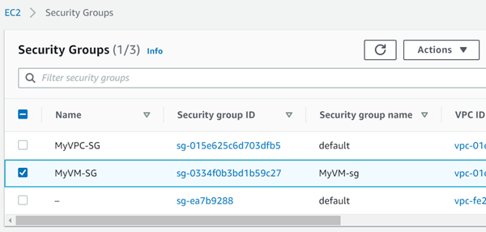

## Create and connect EC2 instance
1) Open the EC2 console. For that click on the `Services` menu and search for `EC2`. In the EC2 console click on `Instances` menu from the Instances section in left pane. Click on the `Launch instance` button to start creating a new EC2 instance.
2) In the `Step 1: Choose an Amazon Machine Image (AMI)` page, search for the image `Microsoft Windows Server 2019 Base`. Make sure  the image is marked as `Free tier eligible`. Click on the `Select` button to move forward.

    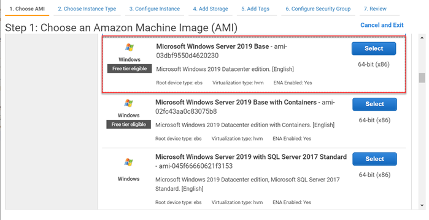

3) In `Step 2: Choose an Instance Type` page, select `t2.micro`. Ensure the instance type is eligible for free tier. Click on `Next:Configure Instance Details`.

    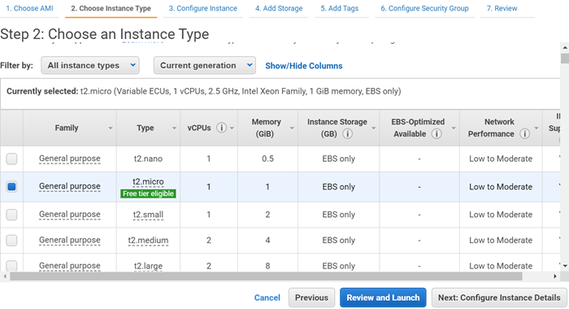

4) In `Step 3: Configure Instance Details` page, specify the number of instances as 1. For the network, select `MyVPC` from the dropdown list and select `Frontend` as the subnet value. Set `auto assign public IP` value as `Enable` and leave other values as default. Click `Next:Add Storage` to continue.

    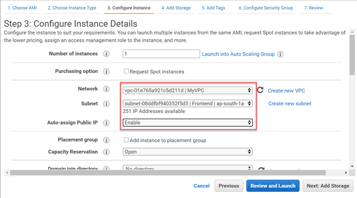

5) In `Step 4: Add Storage` page, you can add storage disk for your VMs. The instance comes with a default storage of 30GB. Click on the `Next: Add Tags` to continue.
6) In `Step 5: Add Tags` page, you can add user defined tags for your EC2 instance. Click `Next:Configure Security Group` to continue.
7) In `Step 6: Configure Security Groups` page, select the `Select and existing security group` option and choose the `MyVM-SG` security group from the list of security groups. Ensure the `RDP` and `HTTP` inbound rules are enabled for the security group. Click on `Review and Launch` button.

    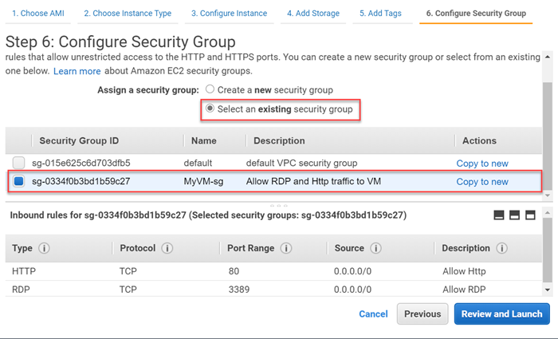

8) In `Step 7: Review Instance Launch` page, review the configurations of the instance and click on the `Launch` button. When you click the button, you will be asked to create or select a key-pair for the VM login. Select `Create a new key pair` and provide the name for the key pair. Click on the `Download key pair` button to download the keys for EC2 instnace login. After you download the key pair, the `Launch instance` button will be enabled. Click the button to create the instance.

    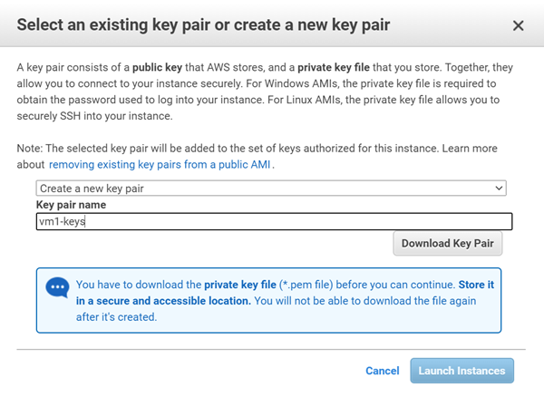

9) You can navigate to the instances list by clicking the `view instance` button in the status page. While the instance is getting created the `Status checks` column value will be `Initializing`. When it turns into `2/2 checks passed`, you can connect to the instance. You can optionally update the name tag value of the VM. Edit the name column of the VM and update it as `MyVM`.

    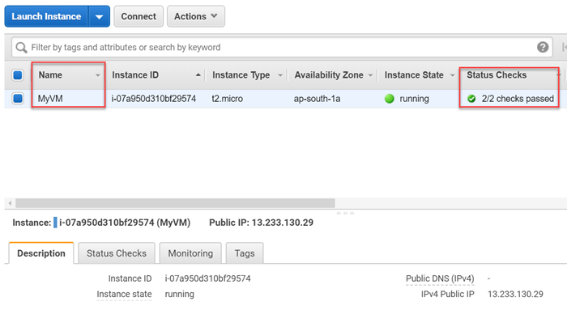

10) To connect the instance through RDP, click on the `Connect` button and download the RDP. 

    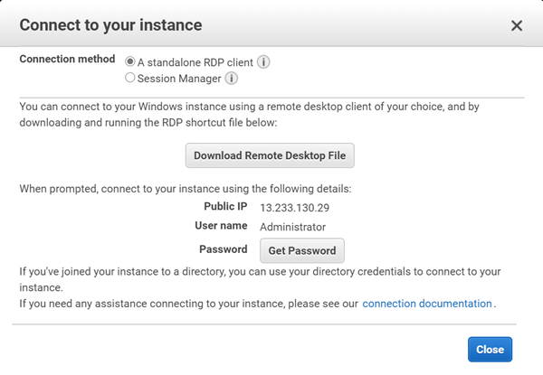

11) To get the login password for the user `Administrator`, click on the `Get Password` button and upload the key pair file you have downloaded in the above step. 

    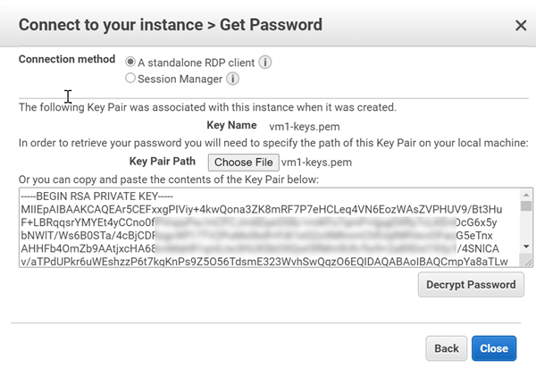

12) Click on the `Decrypt password` button to decrypt the keys and show the password. Copy the password for the user `Administrator` and login via RDP client.

    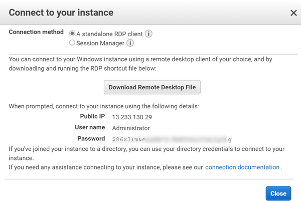

13) You will be able to connect to the EC2 instance using the Administrator user and the decrypted password. 
    
    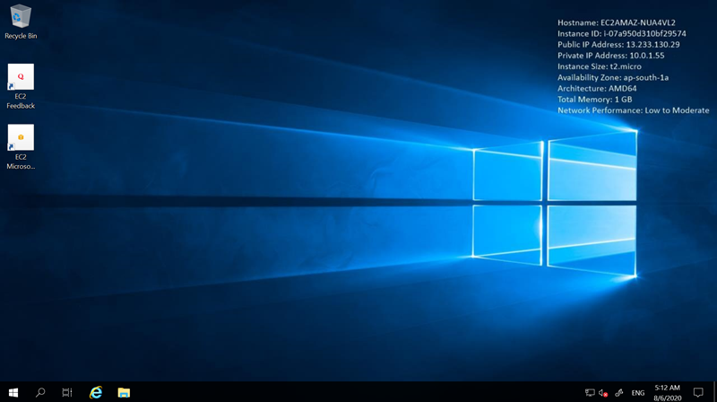