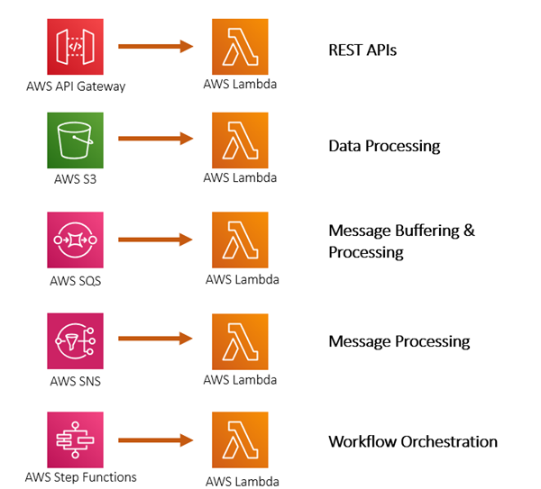
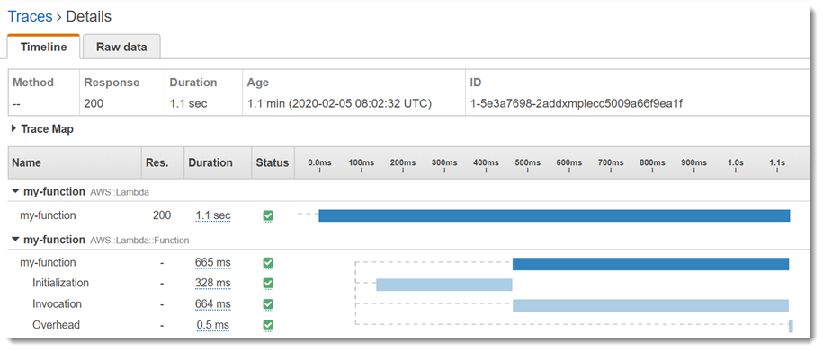
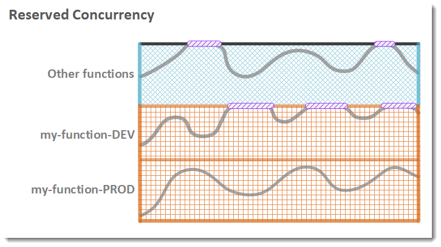
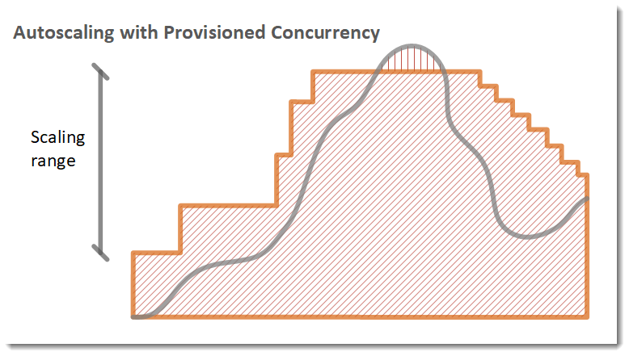
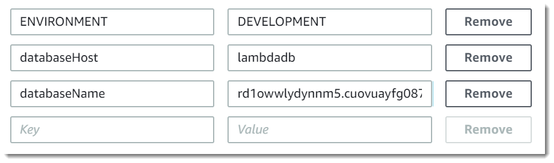
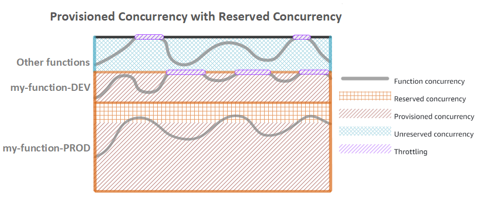
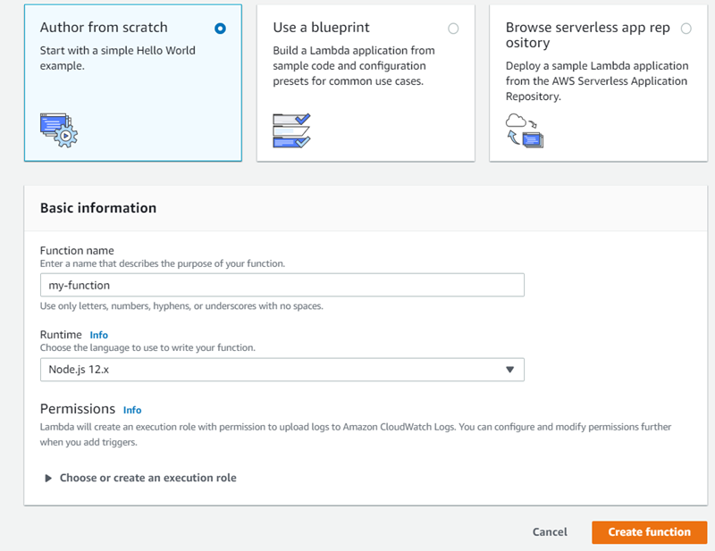
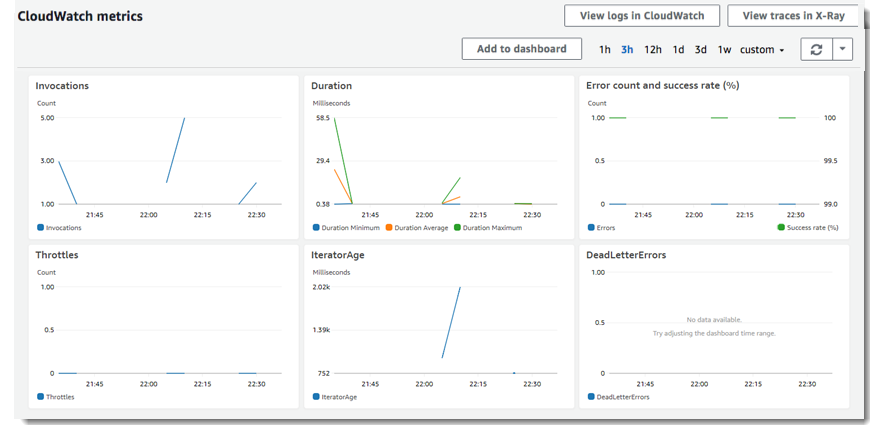

## Serverless applications using AWS Lambda
*AWS Lambda* is a compute service that lets you run code without provisioning or managing servers. *AWS Lambda* executes your code only when needed and scales automatically, from a few requests per day to thousands per second. You pay only for the compute time you consume - there is no charge when your code is not running. With *AWS Lambda*, you can run code for virtually any type of application or backend service - all with zero administration. *AWS Lambda* runs your code on a high-availability compute infrastructure and performs all of the administration of the compute resources, including server and operating system maintenance, capacity provisioning and automatic scaling, code monitoring and logging.

You can use AWS Lambda to run your code in response to events, such as changes to data in an Amazon S3 bucket or an Amazon DynamoDB table; to run your code in response to HTTP requests using Amazon API Gateway; or invoke your code using API calls made using AWS SDKs. With these capabilities, you can use Lambda to easily build data processing triggers for AWS services like Amazon S3 and Amazon DynamoDB, process streaming data stored in Kinesis, or create your own back end that operates at AWS scale, performance, and security.

## Usecases of Lambda functions


## AWS Lambda features
AWS Lambda provides a management console and API for managing and invoking functions. It provides runtimes that support a standard set of features so that you can easily switch between languages and frameworks, depending on your needs. In addition to functions, you can also create versions, aliases, layers, and custom runtimes. The main features of AWS Lambda are following:
### Programming model
Authoring specifics vary between runtimes, but all runtimes share a common programming model that defines the interface between your code and the runtime code. `Handler` in the function configuration tells th runtime which method to run and the runtime runs that method. The runtime passes in objects to the handler that contain the invocation `event` and the `context`, such as the function `name` and `request ID`. Function's class stays in memory, when one event finished execution runtime sends another. It reuses the variables and clients declared outside the handler in the `initialization code`. Initialization is billed as part of the duration for the first invocation processed by an instance of your function. When X-Ray tracing is enabled, the runtime records separate subsegments for initialization and execution.


Your function also has access to local storage in the `/tmp` directory. Instances of your function that are serving requests remain active for a few hours before being recycled. The runtime captures logging output from your function and sends it to Amazon CloudWatch Logs.
### Deployment package
Your function's code consists of scripts or compiled programs and their dependencies. When you author functions in the Lambda console or a toolkit, the client creates a ZIP archive of your code called a `deployment package`. The client then sends the package to the Lambda service. When you manage functions with the Lambda API, command line tools, or SDKs, you create the deployment package. You also need to create a deployment package manually for compiled languages and to add dependencies to your function.
### Layers
Lambda layers are a distribution mechanism for libraries, custom runtimes, and other function dependencies. Layers let you manage your in-development function code independently from the unchanging code and resources that it uses. You can configure your function to use layers that you create, layers provided by AWS, or layers from other AWS customers.
### Scaling
Lambda manages the infrastructure that runs your code, and scales automatically in response to incoming requests. When your function is invoked more quickly than a single instance of your function can process events, Lambda scales up by running additional instances. When traffic subsides, inactive instances are frozen or stopped. You only pay for the time that your function is initializing or processing events.
### Concurrency controls
Use concurrency settings to ensure that your production applications are highly available and highly responsive. To prevent a function from using too much concurrency, and to reserve a portion of your account's available concurrency for a function, use `reserved concurrency`. *Reserved concurrency* splits the pool of available concurrency into subsets. A function with reserved concurrency only uses concurrency from its dedicated pool.



To enable functions to scale without fluctuations in latency, use provisioned concurrency. For functions that take a long time to initialize, or require extremely low latency for all invocations, provisioned concurrency enables you to pre-initialize instances of your function and keep them running at all times. Lambda integrates with Application Auto Scaling to support autoscaling for provisioned concurrency based on utilization.



### Asynchronous invocation
When you invoke a function, you can choose to invoke it `synchronously` or `asynchronously`. With `synchronous` invocation, you wait for the function to process the event and return a response. With `asynchronous` invocation, Lambda queues the event for processing and returns a response immediately. For asynchronous invocations, Lambda handles retries if the function returns an error or is throttled. To customize this behavior, you can configure error handling settings on a function, version, or alias. You can also configure Lambda to send events that failed processing to a dead-letter queue, or to send a record of any invocation to a destination.
### Event source mappings
To process items from a stream or queue, you can create an `event source mapping`. An event source mapping is a resource in Lambda that reads items from an Amazon SQS queue, an Amazon Kinesis stream, or an Amazon DynamoDB stream, and sends them to your function in batches. Each event that your function processes can contain hundreds or thousands of items. Event source mappings maintain a local queue of unprocessed items, and handle retries if the function returns an error or is throttled. You can configure an event source mapping to customize batching behavior and error handling, or to send a record of items that fail processing to a destination.


### Destination
A `destination` is an AWS resource that receives invocation records for a function. For asynchronous invocation, you can configure Lambda to send invocation records to a queue, topic, function, or event bus. You can configure separate destinations for successful invocations and events that failed processing. The invocation record contains details about the event, the function's response, and the reason that the record was sent. For event source mappings that read from streams, you can configure Lambda to send a record of batches that failed processing to a queue or topic. A failure record for an event source mapping contains metadata about the batch, and it points to the items in the stream.


### Function blueprints
When you create a function in the Lambda console, you can choose to start from scratch, use a blueprint, or deploy an application from the AWS Serverless Application Repository. A blueprint provides sample code that shows how to use Lambda with an AWS service or a popular third-party application. Blueprints include sample code and function configuration presets for Node.js and Python runtimes. Blueprints are provided for use under the Creative Commons Zero license. They are only available in the Lambda console.
### Application templates
You can use the Lambda console to create an application with a continuous delivery pipeline. Application templates in the Lambda console include code for one or more functions, an application template that defines functions and supporting AWS resources, and an infrastructure template that defines an AWS CodePipeline pipeline. The pipeline has build and deploy stages that run every time you push changes to the included Git repository. Application templates are provided for use under the MIT No Attribution license. They are only available in the Lambda console.

## AWS Lambda quotas
AWS Lambda sets quotas for the amount of compute and storage resources that you can use to run and store functions. The following quotas apply per-region and can be increased. To request an increase, use the Support Center console.

|Resource	                       |Default quota |Can Be Increased Up To|
|----------------------------------|--------------|----------------------|
|Concurrent executions             |1,000         |Hundreds of thousands |
|Function and layer storage        |75 GB         |Terabytes             |
|Elastic network interfaces per VPC|250           |Hundreds              |

The following quotas apply to function configuration, deployments, and execution. They cannot be changed

|Resource	                            |Quota                     |
|---------------------------------------|--------------------------|
|Function memory allocation             |128 MB to 3,008 MB, in 64 MB increments.|
|Function timeout                       |900 seconds (15 minutes)    |
|Function environment variables         |4 KB                        |
|Function resource-based policy         |20 KB                       |
|Function layers                        |5 layers                    |
|Function burst concurrency             |500 - 3000 (varies per region)|
|Invocation payload (request and response)|6 MB (synchronous) <br>256 KB (asynchronous)|
|Deployment package size                |50 MB (zipped, for direct upload) <br>250 MB (unzipped, including layers) <br>3 MB (console editor)|
|Test events (console editor)           |10                          |
|`/tmp` directory storage                 |512 MB                      |
|File descriptors                       |1,024                       |
|Execution processes/threads            |1,024                       |

## Function configuration in AWS Lambda console
You can use the Lambda console to configure function settings, add triggers and destinations, and update and test your code.The designer shows an overview of your function and its upstream and downstream resources. You can use it to configure triggers, layers, and destinations.
* **Triggers** – Triggers are services and resources that you have configured to invoke your function. Choose Add trigger to create a Lambda event source mapping or to configure a trigger in another service that the Lambda console integrates with. For details about these services and others, see Using AWS Lambda with other services.
* **Layers** – Choose the Layers node to add layers to your application. A layer is a ZIP archive that contains libraries, a custom runtime, or other dependencies.
* **Destinations** – Add a destination to your function to send details about invocation results to another service. You can send invocation records when your function is invoked asynchronously, or by an event source mapping that reads from a stream.

With the function node selected in the designer, you can modify the following settings.

* **Code** – The code and dependencies of your function. For scripting languages, you can edit your function code in the embedded editor. To add libraries, or for languages that the editor doesn't support, upload a deployment package. If your deployment package is larger than 50 MB, choose Upload a file from Amazon S3.
* **Runtime** – The Lambda runtime that executes your function.
* **Handler** – The method that the runtime executes when your function is invoked, such as index.handler. The first value is the name of the file or module. The second value is the name of the method.
* **Environment variables** – Key-value pairs that Lambda sets in the execution environment. Use environment variables to extend your function's configuration outside of code.
* **Tags** – Key-value pairs that Lambda attaches to your function resource. Use tags to organize Lambda functions into groups for cost reporting and filtering in the Lambda console. Tags apply to the entire function, including all versions and aliases.
* **Execution role** – The IAM role that AWS Lambda assumes when it executes your function.
* **Description** – A description of the function.
* **Memory**– The amount of memory available to the function during execution. Choose an amount between 128 MB and 3,008 MB in 64-MB increments. Lambda allocates CPU power linearly in proportion to the amount of memory configured. At 1,792 MB, a function has the equivalent of one full vCPU (one vCPU-second of credits per second).
* **Timeout** – The amount of time that Lambda allows a function to run before stopping it. The default is 3 seconds. The maximum allowed value is 900 seconds.
* **Virtual private cloud (VPC)** – If your function needs network access to resources that are not available over the internet, configure it to connect to a VPC.
* **Database proxies** – Create a database proxy for functions that use an Amazon RDS DB instance or cluster.
* **Active tracing** – Sample incoming requests and trace sampled requests with AWS X-Ray.
* **Concurrency** – Reserve concurrency for a function to set the maximum number of simultaneous executions for a function. Provision concurrency to ensure that a function can scale without fluctuations in latency. Reserved concurrency applies to the entire function, including all versions and aliases.
* **Asynchronous invocation** – Configure error handling behavior to reduce the number of retries that Lambda attempts, or the amount of time that unprocessed events stay queued before Lambda discards them. Configure a dead-letter queue to retain discarded events. You can configure error handling settings on a function, version, or alias.

Except as noted in the preceding list, you can only change function settings on the *unpublished* version of a function. When you publish a version, code and most settings are locked to ensure a consistent experience for users of that version. Use *aliases* to propagate configuration changes in a controlled manner.

## AWS Lambda environment variables
You can use environment variables to adjust your function's behavior without updating code. An environment variable is a pair of strings that are stored in a function's version-specific configuration. The Lambda runtime makes environment variables available to your code and sets additional environment variables that contain information about the function and invocation request. You set environment variables on the unpublished version of your function by specifying a key and value. When you publish a version, the environment variables are locked for that version along with other version-specific configuration.

Use environment variables to pass environment-specific settings to your code. For example, you can have two functions with the same code but different configuration. One function connects to a test database, and the other connects to a production database. In this situation, you use environment variables to tell the function the hostname and other connection details for the database. You might also set an environment variable to configure your test environment to use more verbose logging or more detailed tracing.



To retrieve environment variables in your function code, use the standard method for your programming language.

**C#**
```csharp
string region = Environment.GetEnvironmentVariable("AWS_REGION");
```
**Node.JS**
```nodejs
let region = process.env.AWS_REGION
```
**Python**
```python
import os
region = os.environ['AWS_REGION']
```
**Java**
```java
String region = System.getenv("AWS_REGION");
```
## Versions in AWS Lambda
You can use versions to manage the deployment of your functions. For example, you can publish a new version of a function for beta testing without affecting users of the stable production version. Lambda creates a new version of your function each time that you publish the function. The new version is a copy of the unpublished version of the function.

A function version includes the following information:

* The function code and all associated dependencies.
* The Lambda runtime that invokes the function.
* All of the function settings, including the environment variables.
* A unique Amazon Resource Name (ARN) to identify the specific version of the function.

## Alias for AWS Lambda 
You can create one or more aliases for your Lambda function. A Lambda alias is like a pointer to a specific function version. Users can access the function version using the alias Amazon Resource Name (ARN). Each alias has a unique ARN. An alias can point only to a function version, not to another alias. You can update an alias to point to a new version of the function.

In a resource policy, you can grant permissions for event sources to use your Lambda function. If you specify an alias ARN in the policy, you don't need to update the policy when the function version changes.

## Layers in AWS Lambda
You can configure your Lambda function to pull in additional code and content in the form of layers. A layer is a ZIP archive that contains libraries, a custom runtime, or other dependencies. With layers, you can use libraries in your function without needing to include them in your deployment package. Layers let you keep your deployment package small, which makes development easier. You can avoid errors that can occur when you install and package dependencies with your function code. For Node.js, Python, and Ruby functions, you can develop your function code in the Lambda console as long as you keep your deployment package under 3 MB.
> [!NOTE]
> A function can use up to 5 layers at a time. The total unzipped size of the function and all layers can't exceed the unzipped deployment package size limit of 250 MB. 

You can create layers, or use layers published by AWS and other AWS customers. Layers are extracted to the /opt directory in the function execution environment. Each runtime looks for libraries in a different location under /opt, depending on the language.

## Concurrency of AWS Lambda functions
Concurrency is the number of requests that your function is serving at any given time. When your function is invoked, Lambda allocates an instance of it to process the event. When the function code finishes running, it can handle another request. If the function is invoked again while a request is still being processed, another instance is allocated, which increases the function's concurrency.

Concurrency is subject to a Regional quota that is shared by all functions in a Region. To ensure that a function can always reach a certain level of concurrency, you can configure the function with reserved concurrency. When a function has reserved concurrency, no other function can use that concurrency. Reserved concurrency also limits the maximum concurrency for the function, and applies to the function as a whole, including versions and aliases.

 *Reserved Concurrency* is a single numerical value that may be assigned to a Lambda function's configuration, either through the web console, or via the SDK / CLI. This configuration value has two effects if set:
* It limits the number of instances of your Lambda function that can be instantiated at any time to the value specified.
* It makes sure there is always at least enough concurrency capability available in the account to run the number of instances requested.
If you set the reserved concurrency vale to 20, it means that at most 20 instances of my Lambda will run at any given time.

To enable your function to scale without fluctuations in latency, use `provisioned concurrency`. By allocating provisioned concurrency before an increase in invocations, you can ensure that all requests are served by initialized instances with very low latency. You can configure provisioned concurrency on a version of a function, or on an alias.

When you invoke a Lambda function, the invocation is routed to an execution environment to process the request. When a function has not been used for some time, when you need to process more concurrent invocations, or when you update a function, new execution environments are created. The creation of an execution environment takes care of installing the function code and starting the runtime. Depending on the size of your deployment package, and the initialization time of the runtime and of your code, this can introduce latency for the invocations that are routed to a new execution environment. This latency is usually referred to as a “cold start”. For most applications this additional latency is not a problem. For some applications, however, this latency may not be acceptable. When you enable Provisioned Concurrency for a function, the Lambda service will initialize the requested number of execution environments so they can be ready to respond to invocations.



## Create a Lambda function with the console
In this demo you create a Lambda function using the AWS Lambda console. Next, you manually invoke the Lambda function using sample event data. AWS Lambda executes the Lambda function and returns results. You then verify execution results, including the logs that your Lambda function created and various CloudWatch metrics. 

1) Open the AWS Lambda console by navigating to [https://console.aws.amazon.com/lambda/home](https://console.aws.amazon.com/lambda/home).
2) Choose `Create a function`.
3) Select `Author from scratch` option and provide function name as `my-function`.

    

4) Choose `Create function`. Lambda creates a Node.js function and an execution role that grants the function permission to upload logs. Lambda assumes the execution role when you invoke your function, and uses it to create credentials for the AWS SDK and to read data from event sources.
5) In the upper right corner, choose `Test`.
6) In the `Configure test event` page, choose `Create new test event` and in `Event template`, leave the default `Hello World` option. Enter an `Event name` and update the sample data as follows:
    ```JSON
    {
      "name": "Sonu Sathyadas",
      "email": "sonusathyadas@gmail.com"
    }
    ```
7) Click on the `Save` button. You can create multiple test event data, by selecting `Configure event data` from the dropdown list, adjucent to the `Test` button.
8) Update the code in the code editor. Replace the content of the `index.js` with the following code:
    ```nodejs
    exports.handler = async (event) => {
        const response = {
            statusCode: 200,
            body: `Welcome ${event.name}, we will send a notification mail to ${event.email}`
        };
        return response;
    };
    ```
9) Click on the `Save` button above the editor window. Click on the `Test` button. 
10) You will see the output in the `Execution Result` page.
11) Run the Lambda function a few times to gather some metrics that you can view in the next step.
12) From the tabs near the top of the page, choose Monitoring. This page shows graphs for the metrics that Lambda sends to CloudWatch.

    

