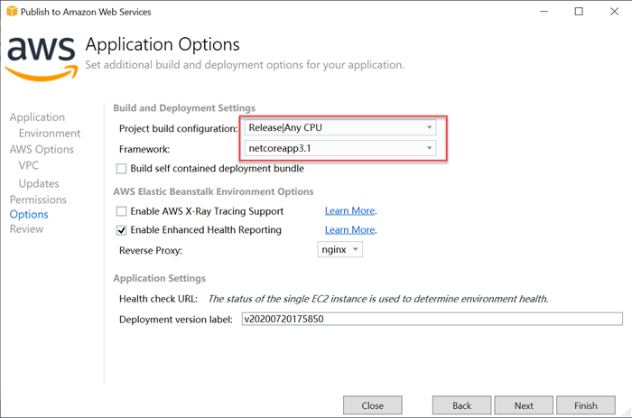

## Building Bots with Amazon Lex, .NET Core and Amazon Elastic Beanstalk

In this tutorial, we will be creating a simple chat bot service using the Amazon Lex and ASP.NET Core 3.1. We will be deploying the chat bot application in Amazon Elastic Beanstalk. To complete this tutorial you need the following things in your machine.
1) [.NET Core 3.1 SDK](https://dotnet.microsoft.com/download/dotnet-core/3.1)
2) [AWS CLI Version 2](https://awscli.amazonaws.com/AWSCLIV2.msi)
3) [Visual Studio 2019](https://visualstudio.microsoft.com/vs/)
4) [Amazon toolkit for Visual Studio 2019](https://aws.amazon.com/visualstudio/)
5) Amazon subscription

### Amazon Lex
*Amazon Lex* is an AWS service for building conversational interfaces for applications using voice and text. With *Amazon Lex*, the same conversational engine that powers *Amazon Alexa* is now available to any developer, enabling you to build sophisticated, natural language chatbots into your new and existing applications. *Amazon Lex* provides the deep functionality and flexibility of *Natural Language Understanding (NLU)* and *Automatic Speech Recognition (ASR)*. *Amazon Lex* provides pre-built integration with *AWS Lambda*, and you can easily integrate with many other services on the AWS platform, including *Amazon Cognito*, *AWS Mobile Hub*, *Amazon CloudWatch*, and *Amazon DynamoDB*.


#### Amazon Lex terminology
* **Bot** – A bot performs automated tasks such as ordering food, booking a hotel, booking flight ticket, and so on.  Amazon Lex bots can understand user input provided with text or speech and converse in natural language. You can create Lambda functions and add them as code hooks in your intent configuration to perform user data validation and fulfillment tasks.
* **Intent** – An intent represents an action that the user wants to perform. You create a bot to support one or more related intents. For each intent, you provide the following required information:
    * *Intent name*– A descriptive name for the intent. For example, OrderFood, Greeting etc.
    * *Sample utterances* – How a user might convey the intent. For example, a user might say "I would like to order food" or "I want to order a pizza".
    * *How to fulfill the intent* – How you want to fulfill the intent after the user provides the necessary information. We can create a Lambda function to fulfill the intent.
* **Slot** – An intent can require zero or more slots or parameters. You add slots as part of the intent configuration. At runtime, Amazon Lex prompts the user for specific slot values. The user must provide values for all required slots before Amazon Lex can fulfil the intent.
* **Slot type** – Each slot has a type. You can create your custom slot types or use built-in slot types.

### Amazon Cognito
*Amazon Cognito* provides authentication, authorization, and user management for your web and mobile apps. The two main components of *Amazon Cognito* are user pools and identity pools. User pools are user directories that provide sign-up and sign-in options for your app users. Identity pools enable you to grant your users access to other AWS services. You need to create an identity pool that gives permissions for your client application to access and operate Amazon Lex actions.


### AWS Elastic Beanstalk
With *Elastic Beanstalk*, you can quickly deploy and manage applications in the AWS Cloud without having to learn about the infrastructure that runs those applications. *Elastic Beanstalk* reduces management complexity without restricting choice or control. You simply upload your application, and *Elastic Beanstalk* automatically handles the details of capacity provisioning, load balancing, scaling, and application health monitoring.

*Elastic Beanstalk* supports applications developed in Go, Java, .NET, Node.js, PHP, Python, and Ruby. When you deploy your application, *Elastic Beanstalk* builds the selected supported platform version and provisions one or more AWS resources, such as *Amazon EC2* instances, to run your application.


## Create FoodOrder Lex Bot 
1) Open Amazon console by navigating to [https://console.aws.amazon.com/console/home?region=us-east-1](https://console.aws.amazon.com/console/home?region=us-east-1). Login with your administrator credentials.
2) Click on the `Services` from the navigation bar and search for `Lex`. Choose `Amazon Lex` from the search result. You will be redirected to the `Amazon Lex` dashboard.
3) From the `Amazon Lex` dashboard, select `Bot` tab and click on `Create`.

    

4) Select `Custom Bot` from the window and provide a bot name as `FoodOrderBot` and output voice as `Salli`. You can also set a session timeout value, Sentiment analysis required or not, COPPA (Children Online Privacy Protection Act) value. Click on `Create` to create the bot.

    

5) When the `FoodOrderBot` is created, click on the `Create Intent` button to add a new intent to the bot. 
    
    

6) Select `Create intent` from the dialog box and provide a name for the Intent. Enter `Greeting` as the intent name and click `Add` button.
7) In the `Greeting` intent page your can enter some sample utterances for the intent. You can provide sample utterances like `hi`, `hello`, `hey`, `whatsup` etc.
    
    

8) Scroll down to bottom and under `Response` section, you can provide a set of response text for the greeting intent. Your bot will randomly select and return one of the response message from this group when user sends a greeting text as chat text. Click on `Save Intent` to save the changes.
    
    

9) Add a new intent by clicking on the '+' symbol on the `Intents` section from the left pane. Provide the intent name as `OrderFood`.
10) You can provide a set of sample utterances under `OrderFood` intent for ordering food. But before creating sample utterances for `OrderFood` intent add `Slots` required to fulfil the intent. In the `Slots` section create a new slot with the name `FoodItem` and set Slot type as `AMAZON.Food`. Also provide a prompt for the `FoodItem`. eg: `Which food item you want to order?`. Create one more slot for accepting the quantity of the food item. Provide the name as `Quantity` and set the type as `AMAZON.NUMBER`. Set the prompt for the `Quantity` slot as `How many {FoodItem} you wish to order?`. Make sure both the slots `required` checkbox is select because both the values are required to fulfill the order.

    

10) Now, you can add some sample utterances to the `OrderFood` intent. The utterances can contain the slots also. Provide some sample utterances such as:
    * Place order
    * I would like to order food
    * I would like to order {Quantity} {FoodItem}
    * I want to place order for {FoodItem}
    * I want to place food order

    

11) You can also add a confirmation prompt for the `OrderFood` intent. This will be prompting a confirmation message to user so that user can confirm his order by entering `yes` or `no`. If he enter `yes` your intent will be fulfilled and its state will be set as `Fulfilled`. If the input is `no` you can send an acknowledgement for cancelling the order. Expand the `Confirmation prompt` below the `Slots` and provide the confirm text value as `Are you sure to place this order?` and cancel text value as `Okay, Your order will not be placed.`. Click on `Save Intent` to save the changes.

    

12) You, can now build and test the bot. Click on the `Build` button on the top and wait for the build process to complete. Once the build process is completed, you will see a `Test bot` panel on the right side. You can test your bot by entering the chat messages.

    

13) If you want to use your bot in client applications, you need to publish your bot first. You can click on the `Publish` button on top right side and create and alias name for the bot. Enter the alias name as `prod` and click Publish.
    
    

14) After the bot is published successfully, it will display a confirmation dialog box with the publish details. Your bot is now ready for integration. In the next step we will use a .NET core web application to use the FoodOrderBot.

## Configure the AWS Cognito
1) Open AWS console, click on services and search for `Cognito`. From the search results select `Cognito` to goto the `Cognito` console.
2) In the `Cognito` console, click on the `Manage Identity Pool` button.

    

3) In the `Cognito Federated Identities` dashboard, click on the `Create new identity pool` button.

    

4) In the `Create identity pool` page, provide a valid name for the identity pool. Here, you can use `ChatBotPool` as the pool name. Select the checkbox for `Enable access to unauthenticated identities`. and click `Create pool` button.

    

5) In the next page, you will see an option to Identify the IAM roles to use with your new identity pool. You can expand and see the `Hide details` section to see the role name that will be created for your identity pool. Click on the `Allow` button to continue.

    

6) Once the identity pool is created successfully, it shows the pool credentials created. Copy the `Identity pool ID` in to a text file which we need to use in the client applications.
    
    

7) Now, you need to add Lex permissions to the roles created with the identity pool. To assign permissions for the roles, you can use the `IAM` service. Select `Services` from the navigation bar and search for `IAM`. Choose `IAM` from the search result. You will be navigated to the `IAM` console.

8) Click on the `Roles` from the left pane. Type `Cognito_ChatBotPool` in the search text box to filter the roles created for the `ChatBotPool` identity pool.

    

8) Click on the `Cognito_ChatBotPoolAuth_Role` role. In the summary page click on the `Attach policies` button. 

    

9) Search for the `AmazonLexRunBotsOnly` and `AmazonPollyReadOnlyAccess ` permissions. Select and attach permissions to the role. Perform the same for `Cognito_ChatBotPoolUnauth_Role` role also.

    

    

10) Your identity pool have now two roles created and you have assigned sufficient permissions to call the Lex bot service.

## Building bot client using .NET Core web application
1) Clone the [AWS Tutorials](https://github.com/sonusathyadas/aws-tutorials) git repository and extract it. Extract and open the `FoodOrderBot` .NET Core project from the `Resources` directory.
2) Make sure the AWS toolkit for Visual Studio 2019 is installed in your machine. Open the downloaded project in Visual Studio.
3) Open the `appsettings.json` file and update the `AWSConfiguration` section with the corresponding values. 
    ```
    "AWSConfiguration": {
        "CognitoPoolID": "YOUR_COGNITO_IDENTITY_POOL_ID",
        "LexBotName": "YOUR_LEX_BOT_NAME",
        "LexRole": "",
        "LexBotAlias": "BOT_ALIAS_NAME",
        "BotRegion": "BOT_LOCATION"
    }
    ```
    You can replace the *YOUR_COGNITO_IDENTITY_POOL_ID* with the Cognito pool ID which you have copied and saved in the text file. Replace the *YOUR_LEX_BOT_NAME* with your bot name (ie: FoodOrderBot). Replace the *BOT_ALIAS_NAME* with the alias name used during bot publish (ie: prod). Update the *BOT_LOCATION* with the location identifier of the bot location (ie: us-east-1).

4) Now, your bot application is ready for testing. Press F5 to run the application. In the home page you will see the chat window and you can start chat with your bot application.

    

5) You can now publish your bot into Amazon Elastic Beanstalk. For that open the AWS console and search for `Elastic Beanstalk` in services.
6) In the `Beanstalk` console, select `Environments` from the left pane and click on `Create a new environment` button.
7) In the `Select environment tier` widnow, choose `Web Server environment` and click `Select`.

    

8) In the `Create a web server environment` section provide an environemnt name. Enter `ChatBotApp` as the environment name. Under the `Environment information` section enter a valid domain name such as `foodorderchatbot` and click on `Check availability` to check the availability of the domain name. If the domain name is not available try with a different value else continue and choose the `.NET Core on Linux` from the `Platform` section. In the `Application code` section choose `sample application` and click on `Create environment`.

    

9) Once the Application environment is created, you can now go back to your Visual Studio application and start publishing it. Before continuing for deployment, ensure you have logged into the AWS console usig the AWS CLI and created a default profile for it.

10) Right click on the project in the solution explorer window of Visual Studio and select `Publish to AWS Elastic Beanstalk`. This will open a dialog box with the logged in user profile, region and available list of Beanstalk application environment. Select the `chatbotapp-env` under the `ChatBotApp` environment and click on `Next` button. 

    

11) In the `Application Options`, select the `Project build configuration` as `Release|Any CPU` and framework version as `.NET Core 3.1`. Click on the `Finish` button to start deploying the application.

    

12) Once the deployment is completed, click on the URL of your application in the deployment status window.

    

13) The application will be opened in the browser window and you can start converse with the chat bot.

    