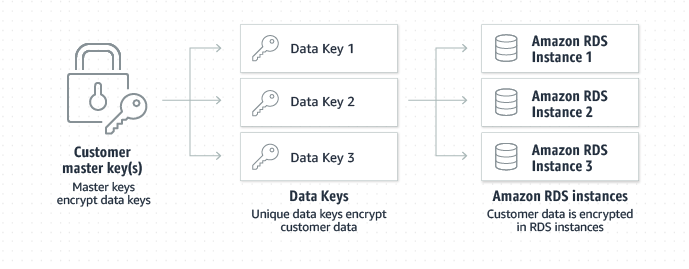
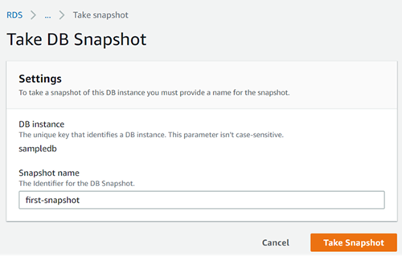

# Relational Database services using Amazon RDS
Amazon Relational Database Service (Amazon RDS) is a web service that makes it easier to set up, operate, and scale a relational database in the AWS Cloud. It provides cost-efficient, resizable capacity for an industry-standard relational database and manages common database administration tasks.

### Features of Amazon RDS
* You can use the database products you are already familiar with: MySQL, MariaDB, PostgreSQL, Oracle, Microsoft SQL Server.
* Independently scale CPU, memory and storage for you database instances. 
* Amazon RDS manages backups, software patching, automatic failure detection, and recovery.
* Amazon RDS doesn't provide shell access to DB instances. It also restricts access to certain system procedures and tables that require advanced privileges.
* You can have automated backups performed when you need them, or manually create your own backup snapshot. You can use these backups to restore a database. 
* You can get high availability with a primary instance and a synchronous secondary instance that you can fail over to when problems occur. You can also use MySQL, MariaDB, or PostgreSQL read replicas to increase read scaling.
* In addition to the security in your database package, you can control access to RDS databases by using AWS Identity and Access Management (IAM) to define users and permissions. You can also help protect your databases by putting them in a virtual private cloud.

## DB Instances
A DB instance is an isolated database environment in the AWS Cloud. Your DB instance can contain multiple user-created databases. You can access your DB instance by using the same tools and applications that you use with a standalone database instance. You can create and modify a DB instance by using the AWS Command Line Interface, the Amazon RDS API, or the AWS Management Console.

Each DB instance runs a DB engine. Amazon RDS currently supports the MySQL, MariaDB, PostgreSQL, Oracle, and Microsoft SQL Server DB engines. Each DB engine has its own supported features, and each version of a DB engine may include specific features. The computation and memory capacity of a DB instance is determined by its DB instance class. 

DB instance storage comes in three types: *Magnetic*, *General Purpose (SSD)*, and *Provisioned IOPS (PIOPS)*. They differ in performance characteristics and price, allowing you to tailor your storage performance and cost to the needs of your database. Each DB instance has minimum and maximum storage requirements depending on the storage type and the database engine it supports.

You can run a DB instance on a virtual private cloud (VPC) using the Amazon Virtual Private Cloud (Amazon VPC) service. When you use a VPC, you have control over your virtual networking environment. You can choose your own IP address range, create subnets, and configure routing and access control lists.

You can have up to 40 Amazon RDS DB instances, with the following limitations:
* 10 for each SQL Server edition (Enterprise, Standard, Web, and Express) under the "license-included" model
* 10 for Oracle under the "license-included" model
* 40 for MySQL, MariaDB, or PostgreSQL
* 40 for Oracle under the "bring-your-own-license" (BYOL) licensing model

### DB Instance Classes
The DB instance class determines the computation and memory capacity of an Amazon RDS DB instance. Amazon RDS supports three types of instance classes: *Standard*, *Memory Optimized*, and *Burstable Performance*.
#### Standard DB instance classes
* **Preview db.m6g** – Newest-generation general-purpose instance classes powered by AWS Graviton2 processors. These deliver balanced compute, memory, and networking for a broad range a general purpose workloads. Currently it is in *Preview*, so not reccommended for production databases.
* **db.m5** – Latest-generation general-purpose instance classes that provide a balance of compute, memory, and network resources, and are a good choice for many applications. The db.m5 instance classes provide more computing capacity than the previous db.m4 instance classes. They are powered by the AWS Nitro System, a combination of dedicated hardware and lightweight hypervisor.
* **db.m4** – Current-generation general-purpose instance classes that provide more computing capacity than the previous db.m3 instance classes.
* **db.m3** – Previous-generation general-purpose instance classes that provide more computing capacity than the previous db.m1 instance classes.
* **db.m1** – Previous-generation general-purpose instance classes.
#### Memory Optimized DB instance classes
* **db.z1d** – Latest-generation instance classes optimized for memory-intensive applications. These offer both high compute capacity and a high memory footprint. High frequency z1d instances deliver a sustained all core frequency of up to 4.0 GHz.
* **db.x1e** – Latest-generation instance classes optimized for memory-intensive applications. These offer one of the lowest price per GiB of RAM among the DB instance classes and up to 3,904 GiB of DRAM-based instance memory. The db.x1e instance classes are available only in the following regions: US East (N. Virginia), US West (Oregon), Europe (Ireland), Asia Pacific (Tokyo), and Asia Pacific (Sydney).
* **db.x1** – Current-generation instance classes optimized for memory-intensive applications. These offer one of the lowest price per GiB of RAM among the DB instance classes and up to 1,952 GiB of DRAM-based instance memory.
* **Preview db.r6g** – Newest-generation instance classes powered by AWS Graviton2 processors. These are ideal for running memory-intensive workloads in open-source databases such as MySQL and PostgreSQL. Currently it is in *Preview*, so not reccommended for production databases.
* **db.r5** – Latest-generation instance classes optimized for memory-intensive applications. These offer improved networking and Amazon Elastic Block Store (Amazon EBS) performance. They are powered by the AWS Nitro System, a combination of dedicated hardware and lightweight hypervisor.
* **db.r4** – Current-generation instance classes optimized for memory-intensive applications. These offer improved networking and Amazon EBS performance.
* **db.r3** – Previous-generation instance classes that provide memory optimization. The db.r3 instances classes are not available in the Europe (Paris) region and the South America (São Paulo) region.
* **db.m2** – Previous-generation memory-optimized instance classes.
#### Burstable Performance DB instance classes
* **db.t3** – Latest-generation instance classes that provide a baseline performance level, with the ability to burst to full CPU usage. These instance classes provide more computing capacity than the previous db.t2 instance classes. They are powered by the AWS Nitro System, a combination of dedicated hardware and lightweight hypervisor.
* **db.t2** – Current-generation instance classes that provide a baseline performance level, with the ability to burst to full CPU usage.

You can change the CPU and memory available to a DB instance by changing its DB instance class. Some instance classes require that your DB instance is in a VPC. If your current DB instance isn't in a VPC, and you want to use an instance class that requires one, first move your DB instance into a VPC. 

#### Configuring the Processor
In most cases, you can find a DB instance class that has a combination of memory and number of vCPUs to suit your workloads. However, you can also specify the following processor features to optimize your DB instance for specific workloads or business needs:
* **Number of CPU cores** – You can customize the number of CPU cores for the DB instance. You might do this to potentially optimize the licensing costs of your software with a DB instance that has sufficient amounts of RAM for memory-intensive workloads but fewer CPU cores.
* **Threads per core** – You can disable Intel Hyper-Threading Technology by specifying a single thread per CPU core. You might do this for certain workloads, such as high-performance computing (HPC) workloads.

### DB Instance Storage
DB instances for Amazon RDS for MySQL, MariaDB, PostgreSQL, Oracle, and Microsoft SQL Server use *Amazon Elastic Block Store (Amazon EBS)* volumes for database and log storage. Depending on the amount of storage requested, Amazon RDS automatically stripes across multiple Amazon EBS volumes to enhance performance.
#### Storage Types
* **General Purpose SSD** – General Purpose SSD volumes offer cost-effective storage that is ideal for a broad range of workloads. These volumes deliver single-digit millisecond latencies and the ability to burst to 3,000 IOPS for extended periods of time. Baseline performance for these volumes is determined by the volume's size.
* **Provisioned IOPS** – Provisioned IOPS storage is designed to meet the needs of I/O-intensive workloads, particularly database workloads, that require low I/O latency and consistent I/O throughput.
* **Magnetic** – Amazon RDS also supports magnetic storage for backward compatibility. We recommend that you use General Purpose SSD or Provisioned IOPS for any new storage needs. The maximum amount of storage allowed for DB instances on magnetic storage is less than that of the other storage types. 

## High Availability for RDS
AWS RDS instances can be deployed in to an AWS Region you like. Each AWS Region is a separate geographic area. Each AWS Region has multiple, isolated locations known as Availability Zones.By using Local Zones, you can place resources, such as compute and storage, in multiple locations closer to your users. Amazon RDS enables you to place resources, such as DB instances, and data in multiple locations. Resources aren't replicated across AWS Regions unless you do so specifically.

#### AWS Regions
Each AWS Region is designed to be isolated from the other AWS Regions. This design achieves the greatest possible fault tolerance and stability. When you view your resources, you see only the resources that are tied to the AWS Region that you specified. This is because AWS Regions are isolated from each other, and AWS does not automatically replicate resources across AWS Regions.

#### Availability Zones
When you create a DB instance, you can choose an Availability Zone or have AWS choose one for you. An Availability Zone is represented by an AWS Region code followed by a letter identifier (for example, us-east-1a).In some cases, you might distribute your DB instances across multiple Availability Zones in a Multi-AZ deployment. In such cases, if one DB instance fails, you can design your application so that a DB instance in another Availability Zone can handle requests.

####  Local Zones
A Local Zone is an extension of an AWS Region that is geographically close to your users. You can extend any VPC from the parent AWS Region into Local Zones by creating a new subnet and assigning it to the AWS Local Zone. When you create a subnet in a Local Zone, your VPC is extended to that Local Zone. The subnet in the Local Zone operates the same as other subnets in your VPC. When you create a DB instance, you can choose a subnet in a Local Zone. Local Zones have their own connections to the internet and support AWS Direct Connect. Thus, resources created in a Local Zone can serve local users with very low-latency communications. 

### High Availability options
Amazon RDS provides high availability and failover support for DB instances using *Multi-AZ* deployments. Amazon RDS uses several different technologies to provide failover support. *Multi-AZ* deployments for *MariaDB, MySQL, Oracle, and PostgreSQL DB* instances use Amazon's failover technology. *SQL Server* DB instances use *SQL Server Database Mirroring (DBM)* or *Always On Availability Groups (AGs)*.

In a Multi-AZ deployment, Amazon RDS automatically provisions and maintains a synchronous standby replica in a different Availability Zone. The primary DB instance is synchronously replicated across Availability Zones to a standby replica to provide data redundancy, eliminate I/O freezes, and minimize latency spikes during system backups.

### Failover Process for Amazon RDS
In the event of a planned or unplanned outage of your DB instance, Amazon RDS automatically switches to a standby replica in another Availability Zone if you have enabled Multi-AZ. The time it takes for the failover to complete depends on the database activity and other conditions at the time the primary DB instance became unavailable. Failover times are typically 60–120 seconds. However, large transactions or a lengthy recovery process can increase failover time. When the failover is complete, it can take additional time for the RDS console to reflect the new Availability Zone.

The primary DB instance switches over automatically to the standby replica if any of the following conditions occur:
* An Availability Zone outage
* The primary DB instance fails
* The DB instance's server type is changed
* The operating system of the DB instance is undergoing software patching
* A manual failover of the DB instance was initiated using Reboot with failover

## Pricing for AWS RDS
Amazon RDS instances are billed based on the following components:
* **DB instance hours (per hour)** – Based on the DB instance class of the DB instance (for example, db.t2.small or db.m4.large). Pricing is listed on a per-hour basis, but bills are calculated down to the second and show times in decimal form. RDS usage is billed in one second increments, with a minimum of 10 minutes.
* **Storage (per GiB per month)** – Storage capacity that you have provisioned to your DB instance. If you scale your provisioned storage capacity within the month, your bill is pro-rated. 
* **I/O requests (per 1 million requests per month)** – Total number of storage I/O requests that you have made in a billing cycle, for Amazon RDS magnetic storage only.
* **Provisioned IOPS (per IOPS per month)** – Provisioned IOPS rate, regardless of IOPS consumed, for Amazon RDS Provisioned IOPS (SSD) storage only. Provisioned storage for EBS volumes are billed in one second increments, with a minimum of 10 minutes.
* **Backup storage (per GiB per month)** – Backup storage is the storage that is associated with automated database backups and any active database snapshots that you have taken. Increasing your backup retention period or taking additional database snapshots increases the backup storage consumed by your database. Per second billing doesn't apply to backup storage (metered in GB-month).
* **Data transfer (per GB)** – Data transfer in and out of your DB instance from or to the internet and other AWS Regions.

### Purchasing options
Amazon RDS provides the following purchasing options to enable you to optimize your costs based on your needs:
* **On-Demand Instances** – Pay by the hour for the DB instance hours that you use. Pricing is listed on a per-hour basis, but bills are calculated down to the second and show times in decimal form. RDS usage is now billed in one second increments, with a minimum of 10 minutes.
* **Reserved Instances** – Reserve a DB instance for a one-year or three-year term and get a significant discount compared to the on-demand DB instance pricing. With Reserved Instance usage, you can launch, delete, start, or stop multiple instances within an hour and get the Reserved Instance benefit for all of the instances.

## Security 
Amazon RDS is a managed relational database service that provides you six familiar database engines to choose from, including Amazon Aurora, MySQL, MariaDB, Oracle, Microsoft SQL Server, and PostgreSQL. Amazon RDS and *Amazon Aurora* provide a set of features to ensure that your data is securely stored and accessed. Run your database in *Amazon Virtual Private Cloud (VPC)* for network-level isolation. Use security groups to control what IP addresses or Amazon EC2 instances can connect to your databases. This built-in firewall prevents any database access except through rules you specify.

Use AWS Identity and Access Management (IAM) policies to assign permissions that determine who is allowed to manage RDS resources. Use the security features of your database engine to control who can log in to the databases, just as you do if the database was on your local network. You can also map database users to IAM roles for federated access.

Use Secure Socket Layer / Transport Layer Security (SSL/TLS) connections to encrypt data in transit. Encrypt your database storage and backups at rest using Amazon Key Management Service (KMS). Monitor database activity and integrate with partner database security applications with Database Activity Streams.

### Encryption of Data at Rest
Amazon RDS encrypts your databases using keys you manage with the AWS Key Management Service (KMS). On a database instance running with Amazon RDS encryption, data stored at rest in the underlying storage is encrypted, as are its automated backups, read replicas, and snapshots. RDS encryption uses the industry standard AES-256 encryption algorithm to encrypt your data on the server that hosts your RDS instance. Amazon RDS also supports Transparent Data Encryption (TDE) for SQL Server (SQL Server Enterprise Edition) and Oracle (Oracle Advanced Security option in Oracle Enterprise Edition). With TDE, the database server automatically encrypts data before it is written to storage and automatically decrypts data when it is read from storage.Transparent Data Encryption in Oracle is integrated with AWS CloudHSM, which allows you to securely generate, store, and manage your cryptographic keys in single-tenant Hardware Security Module (HSM) appliances within the AWS cloud.

### Encryption of Data in Transit
Encrypt communications between your application and your DB Instance using *SSL/TLS*. Amazon RDS creates an SSL certificate and installs the certificate on the DB instance when the instance is provisioned. For MySQL, you launch the mysql client using the *--ssl_ca* parameter to reference the public key in order to encrypt connections. For SQL Server, download the public key and import the certificate into your Windows operating system. RDS for Oracle uses Oracle native network encryption with a DB instance. You simply add the native network encryption option to an option group and associate that option group with the DB instance. Once an encrypted connection is established, data transferred between the DB Instance and your application will be encrypted during transfer. You can also require your DB instance to only accept encrypted connections.

### Access Control
Amazon RDS is integrated with AWS Identity and Access Management (IAM) and provides you the ability to control the actions that your AWS IAM users and groups can take on specific resources (e.g., DB Instances, DB Snapshots, DB Parameter Groups, DB Event Subscriptions, DB Options Groups). In addition, you can tag your resources, and control the actions that your IAM users and groups can take on groups of resources that have the same tag (and tag value).

When you first create a DB Instance within Amazon RDS, you will create a master user account, which is used only within the context of Amazon RDS to control access to your DB Instance(s). The master user account is a native database user account that allows you to log on to your DB Instance with all database privileges. You can specify the master user name and password you want associated with each DB Instance when you create the DB Instance. Once you have created your DB Instance, you can connect to the database using the master user credentials. Subsequently, you can create additional user accounts so that you can restrict who can access your DB Instance.

### Network Isolation and Database Firewall
Using Amazon Virtual Private Cloud (VPC), you can isolate your DB Instances in your own virtual network, and connect to your existing IT infrastructure using industry-standard encrypted IPSec VPN. Amazon VPC enables you to isolate your DB Instances by specifying the IP range you wish to use, and connect to your existing IT infrastructure through industry-standard encrypted IPsec VPN. Running Amazon RDS in a VPC enables you to have a DB instance within a private subnet.DB Instances deployed within an Amazon VPC can be accessed from the Internet or from Amazon EC2 Instances outside the VPC via VPN or bastion hosts that you can launch in your public subnet. In addition, network traffic entering and exiting each subnet can be allowed or denied via network ACLs. All network traffic entering or exiting your Amazon VPC via your IPsec VPN connection can be inspected by your on-premises security infrastructure, including network firewalls and intrusion detection systems.

## Create SQL Server database instance using AWS management console
1) Open the AWS management console by navigating to [https://console.aws.amazon.com](https://console.aws.amazon.com)..Click on the `Services` menu and search for `RDS`. From the search result choose `RDS`.
2) In the RDS console, click on the `Create database` button to start creating a new database instance.
3) In the create database wizard, choose `Standard create` from the `choose a database creation method` section. 

    

4) Also select `Microsoft SQL Server` from the `Engine options` section. Select SQL server edition as `SQL Server Express edition` and select latest version of SQL Server database engine. 

    

5) In the `Templates` section choose `Free tier`.

    

6) In the `Settings` section, you can specify the DB instance name, user name and password for the admin user.

    

7) For `DB instance size` and `Storage` you can go ahead with the default vaules specified.
    
    

8) For the `Connectivity` option, select the default VPC available in the region. To enable public accessibility from outside VPC you need to enable public access for the DB isntance. For that, expand the `Additional connectivity configuration` and choose `public accessible` value to `Yes`. You can also select the `Availability Zone` where you want to deploy the DB instance. If not specified, AWS will select an availaiblity zone for you.

    

9) You can optionally enable the Backup, performance insights, collation, monitoring, deletion protection options also under `Additional configuration`. Click on the `Create database` button to create the database instance.
10) After the DB instance has been created, you can view the instance created  in the RDS console. If the database is in creation phase, you can see the notification on top. You can also view the credentials for connecting to DB instance by clicking the `View credential details` button.

    

> [!IMPORTANT]
> Make sure the Security group associated with the VPC configured for the RDS DB instance contains the Inbound security rules for allowing connections for SQL Server. Same is applicable for PostgreSQL, MySQL and Oracle database instances.
## Connect using SQL Server Management Studio
1) After the DB instance is successfully created, navigate to the database summary page by clicking on the database name. Under the `Connectivity and Security` section, you will be able to find the database connection endpoint. Copy the endpoint value.

    

2) Click on the `Configuration` tab to see the database storage and instance configurations. In the `Availability` section will will be able to find the `Master username` for the database instance.

    

3) Open the SQL Server Management Studio (SSMS) and provide the server name as the endpoint value you copied in step one, username as the master username and password as the master password you provided at the time of creating the database.

    

4) You will be able to see the databse in the `Database explorer` of SSMS.

    

## Take snapshot of RDS database
1) You can take snapshot of the RDS db instance. For that select the DB instance from the list and in the DB summary page, click on the `Actions` button and select `Take snapshot`.

    

2) In the snapshot configuration page, specify the name of the database snapshot and click `Take snapshot` button.

    