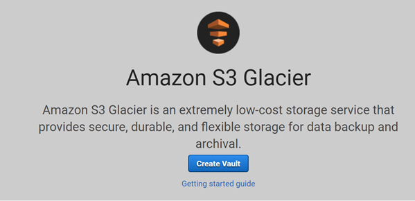
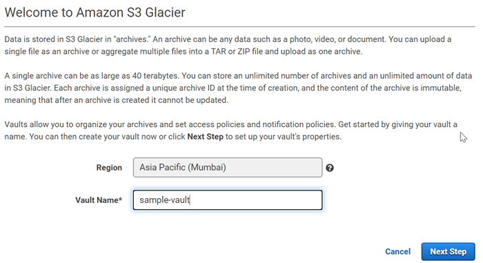
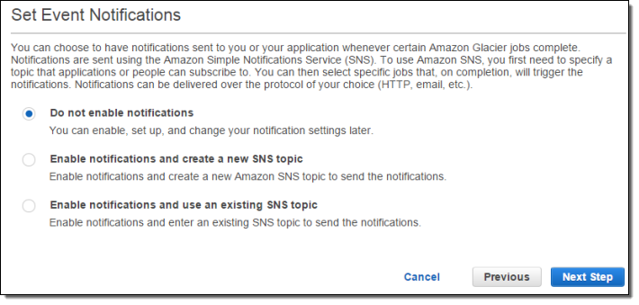
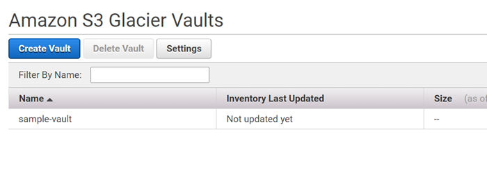

# Amazon AWS S3 Glacier
Amazon S3 Glacier is a secure, durable, and extremely low-cost Amazon S3 storage class for data archiving and long-term backup. With S3 Glacier, customers can store their data cost effectively for months, years, or even decades. S3 Glacier is one of the many different storage classes for Amazon S3. 
> [!IMPORTANT]
> S3 Glacier provides a console, which you can use to create and delete vaults. However, all other interactions with S3 Glacier require that you use the AWS Command Line Interface (AWS CLI) or write code. For example, to upload data, such as photos, videos, and other documents, you must either use the AWS CLI or write code to make requests, by using either the REST API directly or by using the AWS SDKs. 

## Amazon S3 Glacier Data Model
The Amazon S3 Glacier (S3 Glacier) data model core concepts include vaults and archives. S3 Glacier is a REST-based web service. In terms of REST, vaults and archives are the resources. In addition, the S3 Glacier data model includes job and notification-configuration resources. Below listed resources complement the Glacier core services:

### Vault
In S3 Glacier, a vault is a container for storing archives. When you create a vault, you specify a name and choose an AWS Region where you want to create the vault. An AWS account can create up to 1,000 vaults per AWS Region. Each vault resource has a unique address. The general form is:
    
    https://<region-specific endpoint>/<account-id>/vaults/<vaultname>
When you create a vault, you must provide a vault name. The following are the vault naming requirements:
* Names can be between 1 and 255 characters long.
* Allowed characters are a–z, A–Z, 0–9, '_' (underscore), '-' (hyphen), and '.' (period).

Within a Region, an account must use unique vault names. An AWS account can create same-named vaults in different Regions. You can store an unlimited number of archives in a vault. Depending on your business or application needs, you can store these archives in one vault or multiple vaults.

### Archive
An archive can be any data such as a photo, video, or document and is a base unit of storage in S3 Glacier. Each archive has a unique ID and an optional description. Note that you can only specify the optional description during the upload of an archive. S3 Glacier assigns the archive an ID, which is unique in the AWS Region in which it is stored. Each archive has a unique address. You can store an unlimited number of archives in a vault. The general form is as follows:
    
    https://<region-specific endpoint>/<account-id>/vaults/<vault-name>/archives/<archive-id>

### Job
S3 Glacier jobs can perform a select query on an archive, retrieve an archive, or get an inventory of a vault. When performing a query on an archive, you initiate a job providing a SQL query and list of S3 Glacier archive objects. S3 Glacier Select runs the query in place and writes the output results to Amazon S3. Retrieving an archive and vault inventory (list of archives) are asynchronous operations in S3 Glacier in which you first initiate a job, and then download the job output after S3 Glacier completes the job.

To initiate a vault inventory job, you provide a vault name. Select and archive retrieval jobs require that both the vault name and the archive ID. You can also provide an optional job description to help identify the jobs. For each job, S3 Glacier maintains information such as job type, description, creation date, completion date, and job status. You can obtain information about a specific job or obtain a list of all your jobs associated with a vault. The list of jobs that S3 Glacier returns includes all the in-progress and recently finished jobs.

### Notification Configuration
Because jobs take time to complete, S3 Glacier supports a notification mechanism to notify you when a job is complete. You can configure a vault to send notification to an Amazon Simple Notification Service (Amazon SNS) topic when jobs complete. You can specify one SNS topic per vault in the notification configuration. S3 Glacier stores the notification configuration as a JSON document. The following is an example vault notification configuration:

    {
       "Topic": "arn:aws:sns:us-west-2:111122223333:mytopic", 
       "Events": ["ArchiveRetrievalCompleted", "InventoryRetrievalCompleted"] 
    }

## Working with S3 Glacier
Amazon S3 Glacier (S3 Glacier) is a RESTful web service that uses HTTP and HTTPS as a transport and JavaScript Object Notation (JSON) as a message serialization format. Your application code can make requests directly to the S3 Glacier web service API. When using the REST API directly, you must write the necessary code to sign and authenticate your requests. Alternatively, you can simplify application development by using the AWS SDKs that wrap the S3 Glacier REST API calls. You provide your credentials, and these libraries take care of authentication and request signing. 

S3 Glacier also provides a console. You can use the console to create and delete vaults. However, all the archive and job operations require you to write code and make requests using either the REST API directly or the AWS SDK wrapper libraries. 

### Creating vaults
1) Sign into the AWS Management Console and open the S3 Glacier console at https://console.aws.amazon.com/glacier/.
2) Select an AWS Region from the Region selector.
3) Click `Create Vault` button to create your vault.
    
    

4) Specify the name of the vault in the vault name text box and click on the `Next step` button.

    

5) Select `Do not enable notifications`. For this demo, we will not configure notifications for the vault.

    

6) In the Review page click on the `Submit` button to create the vault.
7) Once the vault is successfully created, you will be able to see the vaults list.
    
    