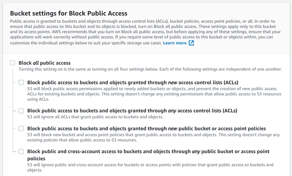

# Storage service on AWS - Simple Storage Service (S3)

Amazon S3 has a simple web services interface that you can use to store and retrieve any amount of data, at any time, from anywhere on the web.Following are some of the advantages of using Amazon S3:
* **Creating buckets** – Create and name a bucket that stores data. Buckets are the fundamental containers in Amazon S3 for data storage.
* **Storing data** – Store an infinite amount of data in a bucket. Upload as many objects as you like into an Amazon S3 bucket. Each object can contain up to 5 TB of data. Each object is stored and retrieved using a unique developer-assigned key.
* **Downloading data** – Download your data or enable others to do so. Download your data anytime you like, or allow others to do the same.
* **Permissions** – Grant or deny access to others who want to upload or download data into your Amazon S3 bucket. Grant upload and download permissions to three types of users. Authentication mechanisms can help keep data secure from unauthorized access.
* **Standard interfaces** – Use standards-based REST and SOAP interfaces designed to work with any internet-development toolkit. New Amazon S3 features will not be supported for SOAP. We recommend that you use either the REST API or the AWS SDKs.

## AWS S3 concepts
* **Buckets** : A *bucket* is a container for objects stored in Amazon S3. Every object is contained in a bucket. For example, if the object named *photos/puppy.jpg* is stored in the *awsexamplebucket1* bucket in the US West (Oregon) Region, then it is addressable using the URL *https://awsexamplebucket1.s3.us-west-2.amazonaws.com/photos/puppy.jpg*. Buckets serve several purposes including
    * They organize the Amazon S3 namespace at the highest level.
    * They identify the account responsible for storage and data transfer charges.
    * They play a role in access control.
    * They serve as the unit of aggregation for usage reporting.
* **Objects** : Objects are the fundamental entities stored in Amazon S3. Objects consist of object data and metadata. The data portion is opaque to Amazon S3. The metadata is a set of name-value pairs that describe the object. These include some default metadata, such as the date last modified, and standard HTTP metadata, such as Content-Type. You can also specify custom metadata at the time the object is stored. An object is uniquely identified within a bucket by a key (name) and a version ID. 
* **Keys** : A key is the unique identifier for an object within a bucket. Every object in a bucket has exactly one key. The combination of a bucket, key, and version ID uniquely identify each object. So you can think of Amazon S3 as a basic data map between "bucket + key + version" and the object itself. 
* **Regions** : You can choose the geographical AWS Region where Amazon S3 will store the buckets that you create. You might choose a Region to optimize latency, minimize costs, or address regulatory requirements. Objects stored in a Region never leave the Region unless you explicitly transfer them to another Region.
* **Data consistency model** : Amazon S3 provides read-after-write consistency for PUTS of new objects in your S3 bucket in all Regions with one caveat. The caveat is that if you make a HEAD or GET request to a key name before the object is created, then create the object shortly after that, a subsequent GET might not return the object due to eventual consistency. Amazon S3 offers eventual consistency for overwrite PUTS and DELETES in all Regions. Amazon S3 achieves high availability by replicating data across multiple servers within AWS data centers. If a PUT request is successful, your data is safely stored. However, information about the changes must replicate across Amazon S3, which can take some time, and so you might observe the following behaviors:
    * A process writes a new object to Amazon S3 and immediately lists keys within its bucket. Until the change is fully propagated, the object might not appear in the list.
    * A process replaces an existing object and immediately tries to read it. Until the change is fully propagated, Amazon S3 might return the previous data.
    * A process deletes an existing object and immediately tries to read it. Until the deletion is fully propagated, Amazon S3 might return the deleted data.
    * A process deletes an existing object and immediately lists keys within its bucket. Until the deletion is fully propagated, Amazon S3 might list the deleted object.

## Storage classes
Amazon S3 offers a range of storage classes designed for different use cases. These include :
* **S3 Standard**  for general-purpose storage of frequently accessed data
* **S3 Intelligent-Tiering** for data with unknown or changing access patterns
* **S3 Standard-Infrequent Access (S3 Standard-IA)** and **S3 One Zone-Infrequent Access (S3 One Zone-IA)** for long-lived, but less frequently accessed data
* **Amazon S3 Glacier (S3 Glacier)** and **Amazon S3 Glacier Deep Archive (S3 Glacier Deep Archive)** for long-term archive and digital preservation. 

Amazon S3 also offers capabilities to manage your data throughout its lifecycle. Once an *S3 Lifecycle policy* is set, your data will automatically transfer to a different storage class without any changes to your application.  
#### Amazon S3 Standard (S3 Standard)
S3 Standard offers high durability, availability, and performance object storage for frequently accessed data. Because it delivers low latency and high throughput, S3 Standard is appropriate for a wide variety of use cases, including cloud applications, dynamic websites, content distribution, mobile and gaming applications, and big data analytics. S3 Storage Classes can be configured at the object level and a single bucket can contain objects stored across S3 Standard, S3 Intelligent-Tiering, S3 Standard-IA, and S3 One Zone-IA. 
Key Features:
* Low latency and high throughput performance
* Designed for durability of 99.999999999% of objects across multiple Availability Zones
* Resilient against events that impact an entire Availability Zone
* Designed for 99.99% availability over a given year
* Backed with the Amazon S3 Service Level Agreement for availability
* Supports SSL for data in transit and encryption of data at rest
* S3 Lifecycle management for automatic migration of objects to other S3 Storage Classes  
#### Amazon S3 Intelligent-Tiering (S3 Intelligent-Tiering)
The S3 Intelligent-Tiering storage class is designed to optimize costs by automatically moving data to the most cost-effective access tier, without performance impact or operational overhead. It works by storing objects in two access tiers: one tier that is optimized for frequent access and another lower-cost tier that is optimized for infrequent access. For a small monthly monitoring and automation fee per object, Amazon S3 monitors access patterns of the objects in S3 Intelligent-Tiering, and moves the ones that have not been accessed for 30 consecutive days to the infrequent access tier. If an object in the infrequent access tier is accessed, it is automatically moved back to the frequent access tier. There are no retrieval fees when using the S3 Intelligent-Tiering storage class, and no additional tiering fees when objects are moved between access tiers.
Key Features:
* Same low latency and high throughput performance of S3 Standard
* Small monthly monitoring and auto-tiering fee
* Automatically moves objects between two access tiers based on changing access patterns
* Designed for durability of 99.999999999% of objects across multiple Availability Zones
* Resilient against events that impact an entire Availability Zone
* Designed for 99.9% availability over a given year
* Backed with the Amazon S3 Service Level Agreement for availability
* Supports SSL for data in transit and encryption of data at rest
* S3 Lifecycle management for automatic migration of objects to other S3 Storage Classes
#### Amazon S3 Standard-Infrequent Access (S3 Standard-IA)
S3 Standard-IA is for data that is accessed less frequently, but requires rapid access when needed. S3 Standard-IA offers the high durability, high throughput, and low latency of S3 Standard, with a low per GB storage price and per GB retrieval fee. This combination of low cost and high performance make S3 Standard-IA ideal for long-term storage, backups, and as a data store for disaster recovery files.
Key Features:
* Same low latency and high throughput performance of S3 Standard
* Designed for durability of 99.999999999% of objects across multiple Availability Zones
* Resilient against events that impact an entire Availability Zone
* Data is resilient in the event of one entire Availability Zone destruction
* Designed for 99.9% availability over a given year
* Backed with the Amazon S3 Service Level Agreement for availability
* Supports SSL for data in transit and encryption of data at rest
* S3 Lifecycle management for automatic migration of objects to other S3 Storage Classes
#### Amazon S3 One Zone-Infrequent Access (S3 One Zone-IA)
S3 One Zone-IA is for data that is accessed less frequently, but requires rapid access when needed. Unlike other S3 Storage Classes which store data in a minimum of three Availability Zones (AZs), S3 One Zone-IA stores data in a single AZ and costs 20% less than S3 Standard-IA. S3 One Zone-IA is ideal for customers who want a lower-cost option for infrequently accessed data but do not require the availability and resilience of S3 Standard or S3 Standard-IA. It’s a good choice for storing secondary backup copies of on-premises data or easily re-creatable data. S3 One Zone-IA offers the same high durability†, high throughput, and low latency of S3 Standard.
Key Features:
* Same low latency and high throughput performance of S3 Standard
* Designed for durability of 99.999999999% of objects in a single Availability Zone†
* Designed for 99.5% availability over a given year
* Backed with the Amazon S3 Service Level Agreement for availability
* Supports SSL for data in transit and encryption of data at rest
* S3 Lifecycle management for automatic migration of objects to other S3 Storage Classes
#### Amazon S3 Glacier (S3 Glacier)
S3 Glacier is a secure, durable, and low-cost storage class for data archiving. You can reliably store any amount of data at costs that are competitive with or cheaper than on-premises solutions. To keep costs low yet suitable for varying needs, S3 Glacier provides three retrieval options that range from a few minutes to hours.
Key Features:
* Designed for durability of 99.999999999% of objects across multiple Availability Zones
* Data is resilient in the event of one entire Availability Zone destruction
* Supports SSL for data in transit and encryption of data at rest
* Low-cost design is ideal for long-term archive
* Configurable retrieval times, from minutes to hours
* S3 PUT API for direct uploads to S3 Glacier, and S3 Lifecycle management for automatic migration of objects
#### Amazon S3 Glacier Deep Archive (S3 Glacier Deep Archive)
S3 Glacier Deep Archive is Amazon S3’s lowest-cost storage class and supports long-term retention and digital preservation for data that may be accessed once or twice in a year. It is designed for customers — particularly those in highly-regulated industries, such as the Financial Services, Healthcare, and Public Sectors — that retain data sets for 7-10 years or longer to meet regulatory compliance requirements. S3 Glacier Deep Archive can also be used for backup and disaster recovery use cases, and is a cost-effective and easy-to-manage alternative to magnetic tape systems, whether they are on-premises libraries or off-premises services.  All objects stored in S3 Glacier Deep Archive are replicated and stored across at least three geographically-dispersed Availability Zones, protected by 99.999999999% of durability, and can be restored within 12 hours.
Key Features:
* Designed for durability of 99.999999999% of objects across multiple Availability Zones
* Lowest cost storage class designed for long-term retention of data that will be retained for 7-10 years
* Ideal alternative to magnetic tape libraries
* Retrieval time within 12 hours
* S3 PUT API for direct uploads to S3 Glacier Deep Archive, and S3 Lifecycle management for automatic migration of objects

|	|S3 Standard|S3 Intelligent-Tiering|S3 Standard-IA|S3 One Zone-IA|S3 Glacier|S3 Glacier Deep Archive|
|---|-----------|----------------------|--------------|--------------|----------|-----------------------|
|Designed for durability|99.999999999% (11 9’s) |99.999999999% (11 9’s)	|99.999999999% (11 9’s)	| 99.999999999% (11 9’s) | 99.999999999% (11 9’s)|99.999999999% (11 9’s) |
|Designed for availability|99.99%	|99.9%	|99.9%	|99.5%	|99.99%	|99.99%|
|Availability SLA	      |99.9%	|99%	|99%	|99%	|99.9%  |99.9% |
|Availability Zones	      |≥3	    |≥3	    |≥3	    |1	    |≥3	    |≥3    |
|Minimum capacity charge per object	|N/A	|N/A	|128KB	|128KB	|40KB	|40KB|
|Minimum storage duration charge	|N/A	|30 days|30 days|30 days|90 days|180 days|
|Retrieval fee	          |N/A      |N/A    |per GB retrieved|per GB retrieved	|per GB retrieved |per GB retrieved|
|First byte latency	|milliseconds	|milliseconds	|milliseconds	|milliseconds	|select minutes or hours|select hours|
|Storage type	    |Object	|Object	|Object	|Object	|Object	|Object|
|Lifecycle transitions	|Yes	|Yes	|Yes	|Yes	|Yes	|Yes    |
## Accessing S3 buckets
Public access is granted to buckets and objects through access control lists (ACLs), bucket policies, or both. Bucket policies provide centralized access control to buckets and objects based on a variety of conditions, including Amazon S3 operations, requesters, resources, and aspects of the request (for example, IP address). The policies are expressed in the access policy language and enable centralized management of permissions. The permissions attached to a bucket apply to all of the objects in that bucket. To help you manage public access to Amazon S3 resources, Amazon S3 provides block public access settings. Amazon S3 block public access settings can override ACLs and bucket policies so that you can enforce uniform limits on public access to these resources. You can apply block public access settings to individual buckets or to all buckets in your account.
## Pricing
Pricing for Amazon S3 is designed so that you don't have to plan for the storage requirements of your application. Amazon S3 charges you only for what you actually use, with no hidden fees and no overage charges. This gives developers a variable-cost service that can grow with their business while enjoying the cost advantages of the AWS infrastructure.
## Naming conventions for buckets
Rules for bucket naming
* The following rules apply for naming S3 buckets:
* Bucket names must be between 3 and 63 characters long.
* Bucket names can consist only of lowercase letters, numbers, dots (.), and hyphens (-).
* Bucket names must begin and end with a letter or number.
* Bucket names must not be formatted as an IP address (for example, 192.168.5.4).
* Bucket names can't begin with xn-- (for buckets created after February 2020).
* Bucket names must be unique within a partition. A partition is a grouping of Regions. AWS currently has three partitions: aws (Standard Regions), aws-cn (China Regions), and aws-us-gov (AWS GovCloud [US] Regions)
* Buckets used with Amazon S3 Transfer Acceleration can't have dots (.) in their names. 
## Replication
Replication enables automatic, asynchronous copying of objects across Amazon S3 buckets. Buckets that are configured for object replication can be owned by the same AWS account or by different accounts. You can copy objects between different AWS Regions or within the same Region.

To enable object replication, you add a replication configuration to your source bucket. The minimum configuration must provide the following:
* The destination bucket where you want Amazon S3 to replicate objects
* An AWS Identity and Access Management (IAM) role that Amazon S3 can assume to replicate objects on your behalf
### Types of object replication
You can replicate objects between different AWS Regions or within the same AWS Region.
* **Cross-Region replication (CRR)** is used to copy objects across Amazon S3 buckets in different AWS Regions.
* **Same-Region replication (SRR)** is used to copy objects across Amazon S3 buckets in the same AWS Region.
### Why use replication
Replication can help you do the following:
* **Replicate objects while retaining metadata**  - You can use replication to make copies of your objects that retain all metadata, such as the original object creation time and version IDs. This capability is important if you need to ensure that your replica is identical to the source object
* **Replicate objects into different storage classes** — You can use replication to directly put objects into *S3 Glacier*, *S3 Glacier Deep Archive*, or another storage class in the destination bucket. You can also replicate your data to the same storage class and use *lifecycle policies* on the destination bucket to move your objects to a colder storage class as it ages.
* **Maintain object copies under different ownership** — Regardless of who owns the source object, you can tell Amazon S3 to change replica ownership to the AWS account that owns the destination bucket. This is referred to as the owner override option.
* **Replicate objects within 15 minutes** — You can use S3 Replication Time Control (S3 RTC) to replicate your data in the same AWS Region or across different Regions in a predictable time frame. S3 RTC replicates 99.99 percent of new objects stored in Amazon S3 within 15 minutes.

## Security
Security is a shared responsibility between AWS and you. Amazon S3 provides a highly durable storage infrastructure designed for mission-critical and primary data storage. Objects are redundantly stored on multiple devices across multiple facilities in an Amazon S3 Region.
Amazon S3 standard storage offers the following features:
* Backed with the Amazon S3 Service Level Agreement
* Designed to provide 99.999999999% durability and 99.99% availability of objects over a given year
* Designed to sustain the concurrent loss of data in two facilities

Amazon S3 further protects your data using versioning. You can use versioning to preserve, retrieve, and restore every version of every object that is stored in your Amazon S3 bucket. With versioning, you can easily recover from both unintended user actions and application failures. By default, requests retrieve the most recently written version. You can retrieve older versions of an object by specifying a version of the object in a request.
### Encryption
Data protection refers to protecting data while in-transit (as it travels to and from Amazon S3) and at rest (while it is stored on disks in Amazon S3 data centers). You can protect data in transit using Secure Socket Layer/Transport Layer Security (SSL/TLS) or client-side encryption. You have the following options for protecting data at rest in Amazon S3:
* **Server-Side Encryption** – Request Amazon S3 to encrypt your object before saving it on disks in its data centers and then decrypt it when you download the objects.
* **Client-Side Encryption** – Encrypt data client-side and upload the encrypted data to Amazon S3. In this case, you manage the encryption process, the encryption keys, and related tools.

#### Server-side encryption
You have three mutually exclusive options, depending on how you choose to manage the encryption keys.
* **Server-Side Encryption with Amazon S3-Managed Keys (SSE-S3)**: When you use Server-Side Encryption with Amazon S3-Managed Keys (SSE-S3), each object is encrypted with a unique key. As an additional safeguard, it encrypts the key itself with a master key that it regularly rotates. Amazon S3 server-side encryption uses one of the strongest block ciphers available, 256-bit Advanced Encryption Standard (AES-256), to encrypt your data.
* **Server-Side Encryption with Customer Master Keys (CMKs) Stored in AWS Key Management Service (SSE-KMS)**: Server-Side Encryption with Customer Master Keys (CMKs) Stored in AWS Key Management Service (SSE-KMS) is similar to SSE-S3, but with some additional benefits and charges for using this service. There are separate permissions for the use of a CMK that provides added protection against unauthorized access of your objects in Amazon S3. SSE-KMS also provides you with an audit trail that shows when your CMK was used and by whom. Additionally, you can create and manage customer managed CMKs or use AWS managed CMKs that are unique to you, your service, and your Region. 
* **Server-Side Encryption with Customer-Provided Keys (SSE-C)**:  With Server-Side Encryption with Customer-Provided Keys (SSE-C), you manage the encryption keys and Amazon S3 manages the encryption, as it writes to disks, and decryption, when you access your objects.
### Identity and Access Management
By default, all Amazon S3 resources—buckets, objects, and related subresources —are private: only the resource owner, an AWS account that created it, can access the resource. The resource owner can optionally grant access permissions to others by writing an access policy.

Amazon S3 offers access policy options broadly categorized as resource-based policies and user policies. Access policies you attach to your resources (buckets and objects) are referred to as resource-based policies.

## Amazon S3 Transfer Acceleration
Amazon S3 Transfer Acceleration can speed up content transfers to and from Amazon S3 by as much as 50-500% for long-distance transfer of larger objects. Customers who have either web or mobile applications with widespread users or applications hosted far away from their S3 bucket can experience long and variable upload and download speeds over the Internet. S3 Transfer Acceleration (S3TA) reduces the variability in Internet routing, congestion and speeds that can affect transfers, and logically shortens the distance to S3 for remote applications. S3TA improves transfer performance by routing traffic through Amazon CloudFront’s globally distributed Edge Locations and over AWS backbone networks, and by using network protocol optimizations.
#### Requirements for using Amazon S3 Transfer Acceleration
* Transfer Acceleration is only supported on virtual-hosted style requests. Hnow more about [Virtual-hosted style requests](https://docs.aws.amazon.com/AmazonS3/latest/dev/VirtualHosting.html#virtual-hosted-style-access)
* The name of the bucket used for Transfer Acceleration must be DNS-compliant and must not contain periods (".").
* Transfer Acceleration must be enabled on the bucket. After enabling Transfer Acceleration on a bucket it might take up to 20 minutes before the data transfer speed to the bucket increases.
* To access the bucket that is enabled for Transfer Acceleration, you must use the endpoint `bucketname.s3-accelerate.amazonaws.com`. or the dual-stack endpoint `bucketname.s3-accelerate.dualstack.amazonaws.com` to connect to the enabled bucket over IPv6.
* You must be the bucket owner to set the transfer acceleration state. The bucket owner can assign permissions to other users to allow them to set the acceleration state on a bucket. 
## Versioning
Versioning is a means of keeping multiple variants of an object in the same bucket. You can use versioning to preserve, retrieve, and restore every version of every object stored in your Amazon S3 bucket. With versioning, you can easily recover from both unintended user actions and application failures. When you enable versioning for a bucket, if Amazon S3 receives multiple write requests for the same object simultaneously, it stores all of the objects.

If you enable versioning for a bucket, Amazon S3 automatically generates a unique version ID for the object being stored. In one bucket, for example, you can have two objects with the same key, but different version IDs, such as photo.gif (version 111111) and photo.gif (version 121212).
> [!WARNING]
> Once you version-enable a bucket, it can never return to an unversioned state. You can, however, suspend versioning on that bucket. 

The versioning state applies to all (never some) of the objects in that bucket. The first time you enable a bucket for versioning, objects in it are thereafter always versioned and given a unique version ID. Objects stored in your bucket before you set the versioning state have a version ID of null. When you enable versioning, existing objects in your bucket do not change. The bucket owner (or any user with appropriate permissions) can suspend versioning to stop accruing object versions. When you suspend versioning, existing objects in your bucket do not change.

## Object lifecycle management
To manage your objects so that they are stored cost effectively throughout their lifecycle, configure their Amazon S3 Lifecycle. An S3 Lifecycle configuration is a set of rules that define actions that Amazon S3 applies to a group of objects. There are two types of actions:

* **Transition actions** — Define when objects transition to another storage class. For example, you might choose to transition objects to the S3 Standard-IA storage class 30 days after you created them, or archive objects to the S3 Glacier storage class one year after creating them. There are costs associated with the lifecycle transition requests. 
 * **Expiration actions** — Define when objects expire. Amazon S3 deletes expired objects on your behalf.  The lifecycle expiration costs depend on when you choose to expire objects.

### Use cases
* If you upload periodic logs to a bucket, your application might need them for a week or a month. After that, you might want to delete them.
* Some documents are frequently accessed for a limited period of time. After that, they are infrequently accessed. At some point, you might not need real-time access to them, but your organization or regulations might require you to archive them for a specific period. After that, you can delete them.
* You might upload some types of data to Amazon S3 primarily for archival purposes. For example, you might archive digital media, financial and healthcare records, raw genomics sequence data, long-term database backups, and data that must be retained for regulatory compliance.
### How to configure a lifecycle?
1) An S3 Lifecycle configuration (an XML file), consists of a set of rules with predefined actions that you want Amazon S3 to perform on objects during their lifetime.
2) Amazon S3 provides a set of API operations for managing lifecycle configuration on a bucket. Amazon S3 stores the configuration as a lifecycle subresource that is attached to your bucket. You can make the REST API calls directly to invoke the APIs.
    * PUT Bucket lifecycle
    * GET Bucket lifecycle
    * DELETE Bucket lifecycle
3) You can also configure the lifecycle by using the Amazon S3 console or programmatically by using the AWS SDK wrapper libraries. 
## Creating and configuring S3 buckets
1) Open AWS management console by navigating to [https://console.aws.amazon.com](https://console.aws.amazon.com). Login with your credentials that have privilleges to create and manage S3 service.
2) Click on the `Search` menu and search for `S3`. Choose S3 from the search result and navigate to the S3 console.    
3) You will see all the existing buckets in the console. You can create a new bucket by clicking on the `Create bucket` button.

    

4) In the `General configuration` section, specify a unique name for the S3 bucket and choose a region where you want to create the bucket.

    

5) In the `Bucket settings for Block public access` section you can either block all public access or optionally choose appropriate public access policies for your bucket. In this demo we are allowing all users to access the bucket. Do not select any checkboxes for Blocking public access.

    

6) In the `Default encryption` section enable `Server-side encryption` option and choose `Amazon S3 key` for using AWS managed encryption key. Click on the `Create` button to create the S3 bucket.

    

7) To upload the files in to the bucket, click on the bucket name and click the `Upload` button to upload files into the bucket.

    

8) In the dialog box opened, you can drag and drop files to it or click `Add files` button to add files for uploading. After you select the files for upload, click on the `Next` button to set the object permissions.

    

9) By default, owner has give full permission on objects. You can add additional users with read and write permissions. Click `Next` to set the object propeties.

    

10) Set the storage class for your objects. By default S3 standard is configured. You change it to any other storage class offered by S3.

    

11) Scroll down to configure the encryption policy for objects. By default no encryption is enabled. You can choose the `Amazon S3 master-key` option to encrypt the objects using AWS managed key. Click next to review the configurations. 
    
    

12) In the review page click on the `Upload` button to upload the selected files. Once the upload operation is completed, you will be able to see the uploaded files in the bucket.

    

## Read objects from buckets 
1) Click on the uploaded file. This will show the details of the object in the bucket. You can see the URL for accessing the object in the bottom of the overview page.

    

2) If you try to access the object using the URL it will deny the access to the object. Because the read access for anonymous users are denied by default. To set the public access permission for object, click on the `Permissions` tab and select `Everyone` under the `Public access` section. In the popped dialog box select the checkbox for `Read object` and save the changes.

    

3) After the permissions are set, you can navigate to the object URL and access the files anonymously using the object URL.

## Setting Public access for multiple objects
1) Open the bucket console and choose all the files you want to set the public access and select `Make public` option from the `Actions` menu.

    

2) You can now access any objects in the buckets anonymously using the object URL.

## Change Storage class of objects
1) Open the bucket console and choose all the files you want to change the storage class. Click on the `Actions` button and choose `Change storage class`.

    

2) Select the appropriate storage class which S3 offers and click `Save` button.

    

## Replicate bucket/objects
You can replicate your entire bucket or selected objects to another S3 bucket in your current account or a different account. You can replicate in the same region or different region. It is also possible to change the storage class and ownership while replicating the objects.
1) Open the S3 bucket console and click on the `Management` tab. Select `Replication` option and click on the `Add rule` button to create a new replication rule. 

    

2) In the replication rule configuration dialog box, you can configure which of the objects need to be replicated. You can specify this by replicating entire bucket or selected object which has specific name prefix or tag value. Select `Entire bucket` and click `Next`.

    

3) In the next page, you can choose the destination bucket name. You can either create a new bucket or select an existing bucket. This buckets can be from same account or different accounts. Also you can enable option for changing the storage class for the replica. Select the `Change the storage class for the replicated objects` checkbox and choose appropriate storage class for replica bucket. You can also change the ownership of the bucket. Click `Next` to continue.

    

4) In the `Configure rule options` page you can select and existing IAM role or create a new IAM role to perform the replication process. Also specify the replication rule name and click `Next`.

    

5) Review the configurations and click on the `Save` button to create the replication rule. You will be able to see the newly created replication rule in the console.
    
    

6) Upload new files to the source bucket. It will be replicated to the target bucket immediately. 
> [!NOTE]
> When you enable replication for an existing bucket which has objects in it, it will not replicate those existing objects to the target bucket. Instead only the newly uploaded files will be replicated to the target bucket.

## Replicating existing objects 
To enable existing object replication for your account, you must contact AWS Support and create a technical support case (service: Amazon S3). This is required to ensure that replication is configured correctly. To prevent your request from being delayed, give your AWS Support case the subject “Replication for Existing Objects” and be sure to include the following information:
* Source bucket
* Destination bucket
* Estimated storage volume to replicate (in terabytes)
* Estimated storage object count to replicate

Once the support ticket is created, AWS Support will work with the S3 team and whitelist your bucket for existing object replication. Also, remember to review the requirements before enabling replication. This includes ensuring that both the source and destination buckets have versioning enabled. Once your source bucket has been whitelisted, you can configure a replication rule as follows:
1) Sign in to the *AWS Management Console* and open the *Amazon S3 console*.
2) In the Bucket name list, choose the source bucket that has been whitelisted for existing object replication.
3) Navigate to the Management tab of the bucket and choose Replication. This is where you create a replication rule to migrate the existing objects.
4) Choose Add rule. Creating this rule also enables standard CRR or SRR on the bucket.
5) In the Replication rule wizard, under Set source, choose Entire bucket to copy the all existing objects and new objects.
6) To replicate existing objects, under Replication criteria, check the Replicate existing objects box, which enables S3 replication for existing objects. Note that if you do not see the Replicate existing objects box, your source bucket has not yet been whitelisted.
    
    

     