## Decoupling appliations with AWS Simple Queue Service (SQS)
Amazon Simple Queue Service (SQS) is a fully managed message queuing service that enables you to decouple and scale microservices, distributed systems, and serverless applications. SQS eliminates the complexity and overhead associated with managing and operating message oriented middleware, and empowers developers to focus on differentiating work. Using SQS, you can send, store, and receive messages between software components at any volume, without losing messages or requiring other services to be available.

Amazon SQS supports both **standard** and **FIFO** queues. 
### Standard Queues
* **Unlimited Throughput** – Standard queues support a nearly unlimited number of API calls per second, per API action (SendMessage, ReceiveMessage, or DeleteMessage).
* **At-Least-Once Delivery** – A message is delivered at least once, but occasionally more than one copy of a message is delivered.
* **Best-Effort Ordering** – Occasionally, messages might be delivered in an order different from which they were sent.

Send data between applications when the throughput is important, for example:
* Decouple live user requests from intensive background work: let users upload media while resizing or encoding it.
* Allocate tasks to multiple worker nodes: process a high number of credit card validation requests.
* Batch messages for future processing: schedule multiple entries to be added to a database.

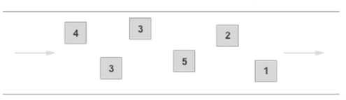
### FIFO Queues
FIFO (First-In-First-Out) queues are designed to enhance messaging between applications when the order of operations and events is critical, or where duplicates can't be tolerated. FIFO queues also provide exactly-once processing but have a limited number of transactions per second (TPS). If you use batching, FIFO queues support up to 3,000 transactions per second. Without batching, FIFO queues support up to 300 API calls per second. The name of a FIFO queue must end with the *.fifo* suffix.

* **High Throughput** – If you use batching, FIFO queues support up to 3,000 transactions per second, per API method (SendMessageBatch, ReceiveMessage, or DeleteMessageBatch). The 3000 transactions represent 300 API calls, each with a batch of 10 messages. To request a quota increase, submit a support request. Without batching, FIFO queues support up to 300 API calls per second, per API method (SendMessage, ReceiveMessage, or DeleteMessage).
* **Exactly-Once Processing** – A message is delivered once and remains available until a consumer processes and deletes it. Duplicates aren't introduced into the queue.
* **First-In-First-Out Delivery** – The order in which messages are sent and received is strictly preserved.

Send data between applications when the order of events is important, for example:
* Ensure that user-entered commands are executed in the right order.
* Display the correct product price by sending price modifications in the right order.
* Prevent a student from enrolling in a course before registering for an account.

### Benefits of Amazon SQS
* **Security** – You control who can send messages to and receive messages from an Amazon SQS queue.
* **Server-side encryption (SSE)** lets you transmit sensitive data by protecting the contents of messages in queues using keys managed in AWS Key Management Service (AWS KMS).
* **Durability** – To ensure the safety of your messages, Amazon SQS stores them on multiple servers. Standard queues support at-least-once message delivery, and FIFO queues support exactly-once message processing.
* **Availability** – Amazon SQS uses redundant infrastructure to provide highly-concurrent access to messages and high availability for producing and consuming messages.
* **Scalability** – Amazon SQS can process each buffered request independently, scaling transparently to handle any load increases or spikes without any provisioning instructions.
* **Reliability** – Amazon SQS locks your messages during processing, so that multiple producers can send and multiple consumers can receive messages at the same time.
* **Customization** – Your queues don't have to be exactly alike—for example, you can set a default delay on a queue. You can store the contents of messages larger than 256 KB using Amazon Simple Storage Service (Amazon S3) or Amazon DynamoDB, with Amazon SQS holding a pointer to the Amazon S3 object, or you can split a large message into smaller messages.

## Message Lifecycle
The following diagram shows the message lifecycle:

1) A producer (component 1) sends message A to a queue, and the message is distributed across the Amazon SQS servers redundantly.
2) When a consumer (component 2) is ready to process messages, it consumes messages from the queue, and message A is returned. While message A is being processed, it remains in the queue and isn't returned to subsequent receive requests for the duration of the visibility timeout.
3) The consumer (component 2) deletes message A from the queue to prevent the message from being received and processed again when the visibility timeout expires.

## Short polling and Long Polling
Amazon SQS provides short polling and long polling to receive messages from a queue. By default, queues use short polling.
### Short polling
With *short polling*, the ReceiveMessage request queries only a subset of the servers (based on a weighted random distribution) to find messages that are available to include in the response. Amazon SQS sends the response right away, even if the query found no messages. The following diagram shows the short-polling behavior of messages returned from a standard queue after one of your system components makes a receive request. Amazon SQS samples several of its servers (in gray) and returns messages A, C, D, and B from these servers. Message E isn't returned for this request, but is returned for a subsequent request.

Short polling occurs when the *WaitTimeSeconds* parameter of a *ReceiveMessage* request is set to 0 in one of two ways:
* The ReceiveMessage call sets *WaitTimeSeconds* to 0.
* The ReceiveMessage call doesn’t set *WaitTimeSeconds*, but the queue attribute *ReceiveMessageWaitTimeSeconds* is set to 0.
### Long Polling
With *long polling*, the *ReceiveMessage* request queries all of the servers for messages. Amazon SQS sends a response after it collects at least one available message, up to the maximum number of messages specified in the request. Amazon SQS sends an empty response only if the polling wait time expires.

## Create Queue using AWS management console
1) Open the AWS management console by navigating to [https://console.aws.amazon.com](https://console.aws.amazon.com). Search for `SQS` in the `Services`. In the `SQS` console, click on the `Create queue` button to create a new queue.

    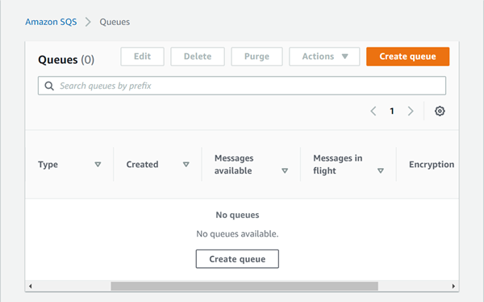

2) In the `Create queue` page, select the queue type, you want to create. Select `Standard` for this demo. Specify the name of the queue in the text box for queue name.

    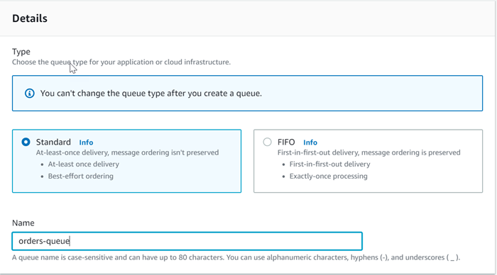

3) In the `Configuration` section, you can configure the queue and message properties. You can update the visibility timeout, message retention period, maximum message size and more.

    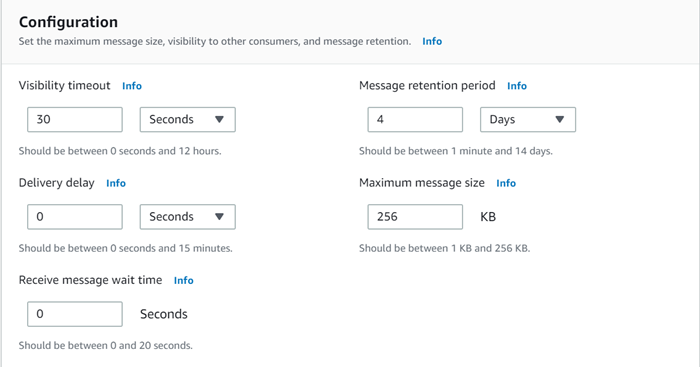

4) In the `Access policy` section, you can configure the user accounts who can send or receive the messages to and from the queue. For this demo, we will go with the `Only the queue owner` option which allows only the queue owner to send and receive messages to the queue.

    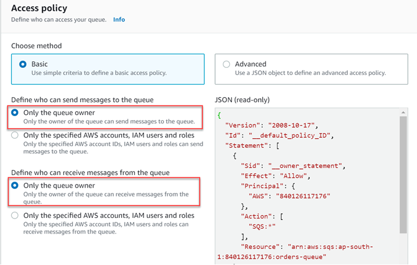

5) You can optionally enable encryption for messages in the `Encryption` section and dead-letter queue for undelivered messages in the `Dead-letter queue` section. Click on the `Create queue` button to create the queue.
6) After the queue is created successfully, you will see the configuration details of the newly created queue.

    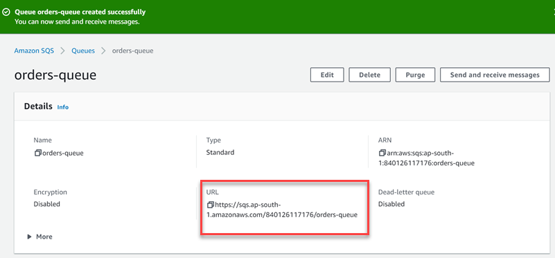

## Send and receive messages
1) In the queue details page, click on the `Send and receive messages` button. You will be redirected to a page where you can send messages to the queue and receive message from the queue. In the `Send message` section type the message you want to send to the queue in the `Message body` textbox. Optionaly you can configure the message attributes. Click on the `Send message` button.

    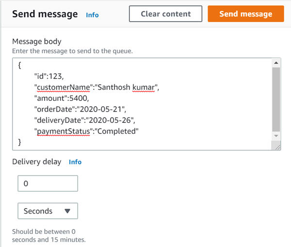

2) You can see the available messages count and polling configurations in the `Receive messages` section.

    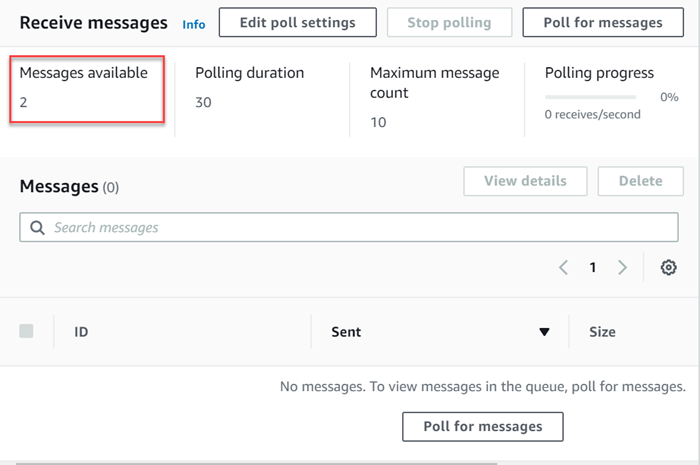

3) Click on the `Poll for messages` button to poll the messages. You will see the messages in the below section.

    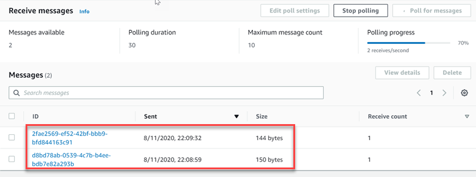

4) Click on the message ID to view the message body and details. It will show a dialog box with the message body and message properties.

    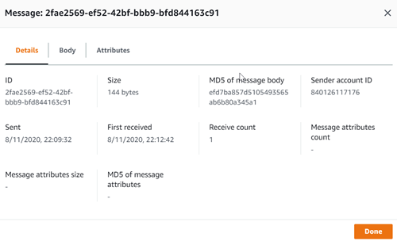
    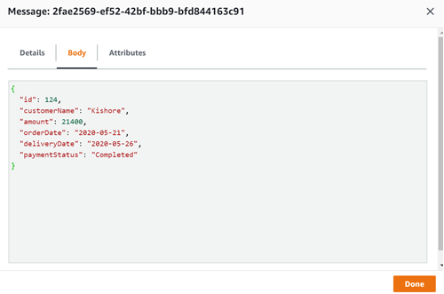

