# Creating and configuring Amazon AWS VPC
Amazon AWS Virtual Private Cloud (VPC) is an AWS service that allow you to create a virtual private network in the AWS cloud. You can create one or more VPC in an AWS region. VPC allows you to deploy your resources in a network and access then securely over network. You can allow or deny the access to the resources from the internet. To allow access to the resources deployed in VPC subnet, you need to provision an Intenet Gateway. A default VPC is created in every AWS region which can be used to deploy resources that you create. A default Route Table associated with the VPC contains the routes configuration for the network traffic. Whenever you create a custom VPC a Security Group is also created along with the VPC. The security group can be customized by configuring inbound and outbound rules that allow or deny access to the VPC.

In this tutorial we will be creating a custom VPC, an Internet Gateway and updating the default Route Table to use the Internet Gateway for external internet access. 

## Amazon VPC
1) Open AWS console by navigating to https://console.aws.amazon.com/. You can login as a root user or an IAM user.
2) In the dashboard, click on `Services` menu and search for `VPC`. You will be navigated to the VPC dashboard.

    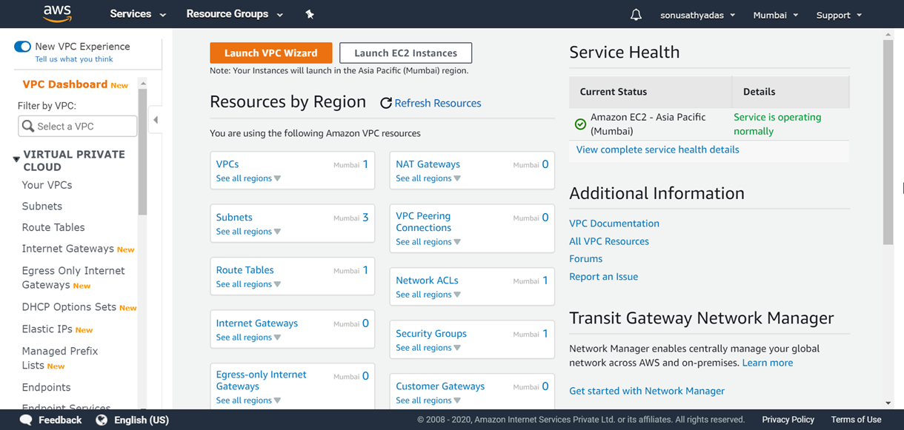

3) Click on `Your VPC's` from left pane, or `VPCs` from the `Resources by region` section.
4) Click on the `Create VPC` button on top. This will show the `Create VPC` wizard. Provide a name, IPv4 CIDR block value and `Default` as the tenancy value. Enter the VPC name as `MyVPC` and IPv4 CIDR value as `10.0.0.0/16`. Click `create` button to create the VPC.

    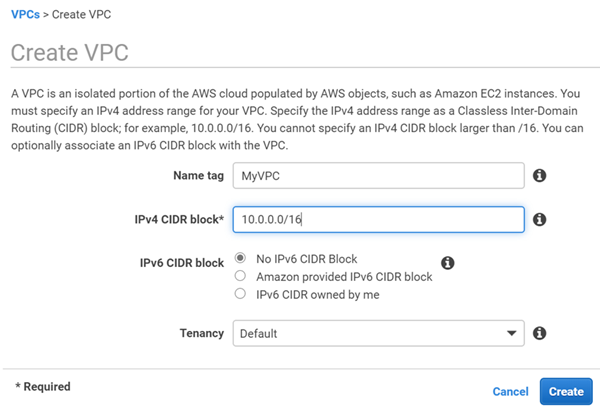

4) Now, we need to create subnets for our VPC. To create subnets for the VPC, select `Subnets` from the left pane of the VPC dashboard. This will show the default subnets list. You can clickon the `Create subnet` button to create a new subnet. In the create subnet wizard, provide the Name tag value as `Frontend`, VPC as the `MyVPC` and IPv4 CIDR block as `10.0.1.0/24`. Click create button to create the new subnet.

    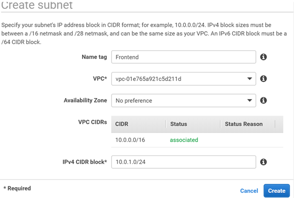

5) Follow the same steps to create another subnet with the name tag `Backend` and IPv4 CIDR block value as `10.0.2.0/24`.
6) After creating the subnets, you will be able to see the subnets under the subnets list.

    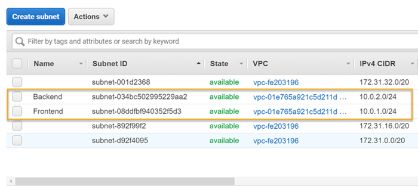

7) When you create a VPC it creates a set of AWS services along with it, you will be able to see a new `Route Table` created for the new VPC in the Route tables list. Also, it creates a default `Security Group` for the VPC in the `Security Group` list. For the convenience, you can provide a friendly name tag for the Route table resource and Security Group. Open the Route Tables list and update the name tag of the Route table associated with the new VNET. Confirm the correct Route Table by looking the name of associated VNET ID. Click on the pen icon under the `Name` column for the Route table to update the name.

    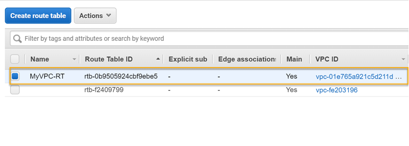

8) Update the name of the default security group also. Open the security groups list and click on the pen icon in the Name column of the security group resource created for your VPC. Update with a friendly name and save.

    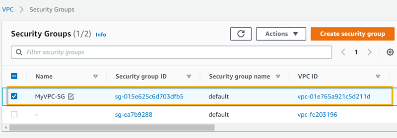

## Configuring Internet Gateway for VPC
1) In the VPC dashboard, select `Internet Gateways` from the left pane. This will show the list of existing Internet gateways if exist. You can click on the `Create Intenet gateway` button to create a new gateway. Provide the name tag value as `igw-MyVPC` and click `Create Internet Gateway` button.

    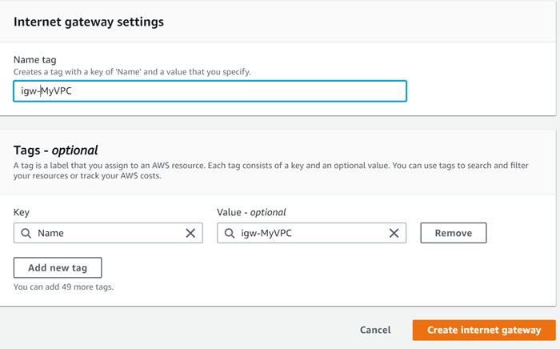

2) After the internet gateway is created, it will show the details of the newly created gateway. From the `Actions` button dropdown menu choose `Attach to VPC`.

    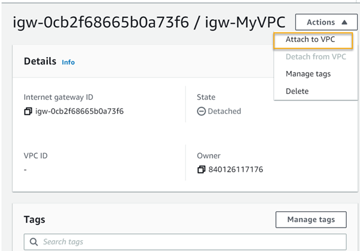

3) In the `Attach to VPC` page specify the VPC ID in the text box and click `Attach Intenet Gateway` button

    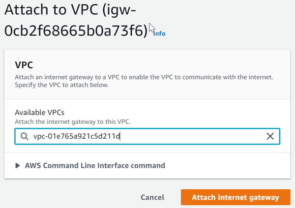

## Update the Route Table routes 
1) To route the traffic from VPC to intenet you need to update the routes of your Route table. For this select the route table `MyVPC-RT` from the Route tables list and click on the `Routes` tab from the Route table properties. By default, you will see an entry `local` that allows traffic within the VPC. 

    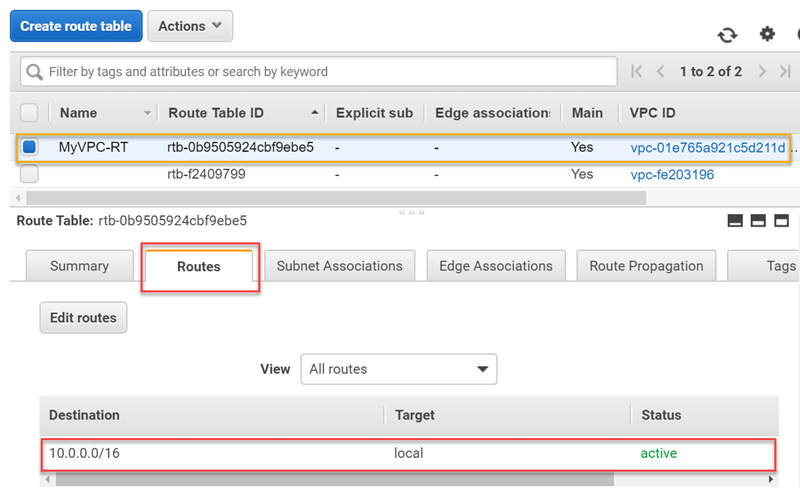

2) Click on the `Edit routes` button and add a new entry that allows traffic to internet using the internet gateway you have created. For that, click on `Add route` button and specify the `Destination` value as `0.0.0.0/0` and `Target` value as `Intenet gateway`. When you select the Intenet gateways as the target type, it will list the available Intenet gateways. Choose the Internet gateway (igw-myVPC) from the list and click on `Save routes`. You will see the new routes updated in the `Routes` list.

    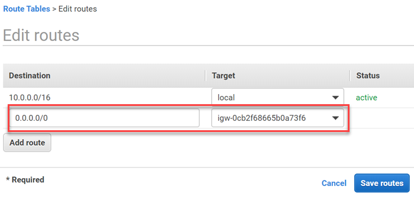

